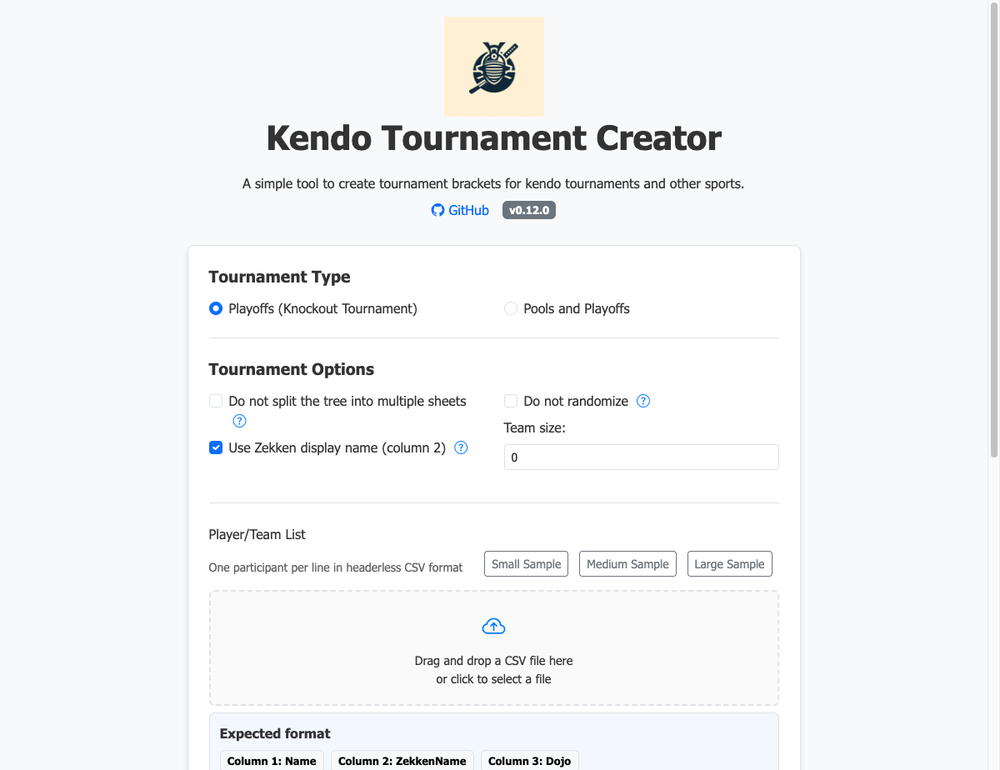
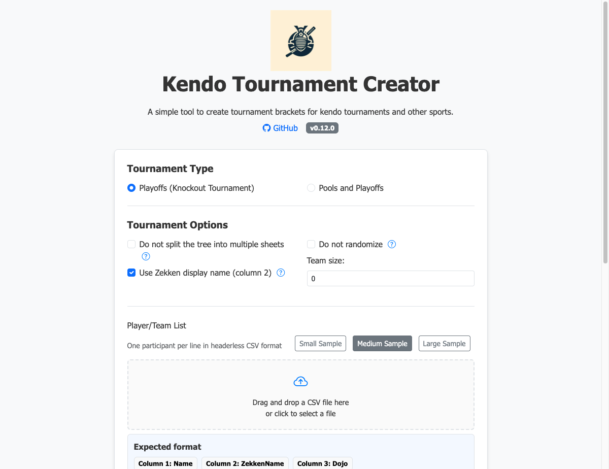
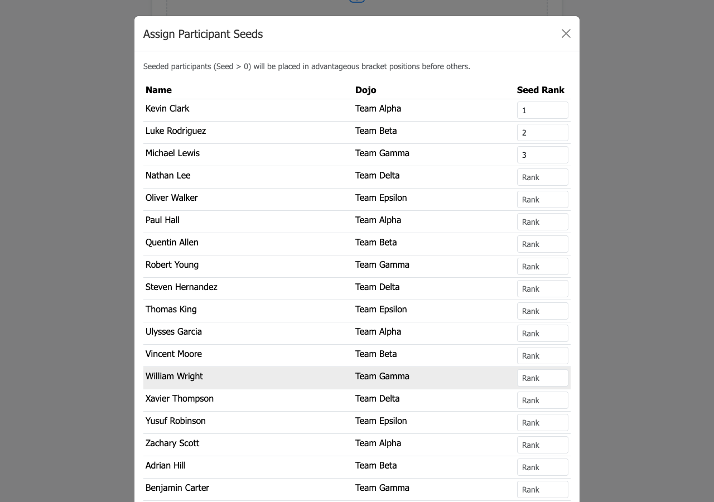
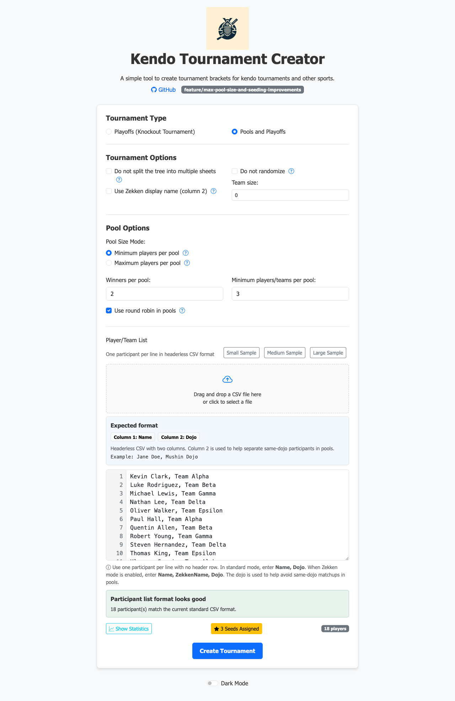

<!-- BEGIN __DO_NOT_INCLUDE__ -->
<p align="center"></p>
<!-- END __DO_NOT_INCLUDE__ -->
<h1 align="center"> bracket-creator</h1>

<p align="center">
  <a href="https://github.com/gitrgoliveira/bracket-creator/releases" rel="nofollow">
    
  </a>

  <a href="https://github.com/gitrgoliveira/bracket-creator/actions/workflows/release.yaml" rel="nofollow">
    
  </a>

  <a href="https://pkg.go.dev/github.com/gitrgoliveira/bracket-creator" rel="nofollow">
    
  </a>

  <a href="https://github.com/gojp/goreportcard/blob/master/LICENSE" rel="nofollow">
    
  </a>

  <br/>

  <a href="https://codecov.io/gh/gitrgoliveira/bracket-creator" >
    
  </a>

  <a href="https://github.com/gitrgoliveira/bracket-creator/actions/workflows/codeql.yaml" rel="nofollow">
    
  </a>

  <a href="https://goreportcard.com/report/github.com/gitrgoliveira/bracket-creator" rel="nofollow">
    
  </a>
</p>
<br/>

A CLI to create kendo tournament brackets

<!-- BEGIN __DO_NOT_INCLUDE__ -->

## Web UI

Start the web server and open your browser at http://localhost:8080:
```bash
bracket-creator serve
```

With Docker:
```bash
docker run -p 8080:8080 ghcr.io/gitrgoliveira/bracket-creator/bracket-creator:latest
```

or with docker-compose:
```bash
docker-compose up -d
```

### Quickstart Demo

The images below show the full workflow: entering participants, seeding past winners, and generating the bracket file.




### Using the Form

| Section | Description |
|---|---|
| **Tournament Type** | Choose *Playoffs (Knockout Tournament)* for a straight knockout, or *Pools and Playoffs* for a round-robin pool stage followed by a knockout. |
| **Pool Size Mode** | When generating pools, choose whether the number you enter is the **minimum** players per pool (extra players are added to existing pools when totals don't divide evenly) or the **maximum** (extra pools are created so no pool exceeds the limit). |
| **Single Tree Format** | Render all participants on one bracket sheet instead of splitting across multiple pages. (CLI: `--single-tree`) |
| **Title Prefix** | Prefix to prepend to tournament sheet titles. (CLI: `--title-prefix`) |
| **Do not randomize** | Preserve the input order instead of shuffling participants. |
| **Column 2 is Zekken name** | Enable to use the second column of the input CSV as the participant's display name on the zekken. |
| **Team Matches** | Number of players per team. Set to `0` for individual matches. |
| **Number of Shiaijo (courts)** | Number of courts to use. Must be between **1 and 26** (Shiaijo are labelled A–Z). For pool tournaments, pools are split evenly across courts and each column in the Pool Matches sheet is labelled "Shiaijo A", "Shiaijo B", etc. For both tournament types, each tree sheet is labelled with the matching Shiaijo name. (CLI: `--courts`, default `2`) |
| **Player/Team List** | Enter one participant per line in plain or CSV format (`Name, Dojo`). You can also drag-and-drop a CSV file or use the **Small / Medium / Large Sample** buttons. Duplicate entries are rejected with an error — each line must be unique. |

> **About Dojo**: In pool tournaments, the `Dojo` field is used to ensure participants from the same dojo are not placed in the same pool.

### Seeding Participants (Web UI)

Click the **☆ Seed Participants** button to open the seeding modal. This lets you lock past tournament winners into advantageous bracket positions before the draw.



In the modal:
- Each participant is listed with their dojo and a **Seed Rank** input field.
- Enter a **positive integer** to seed a participant (e.g., `1` = top seed, `2` = second seed).
- Leave a field empty to place the participant in the unseeded pool.
- Seed ranks must be **unique** — duplicate ranks will be rejected with an error.
- Seeded participants are **strictly validated**: every seeded name must exactly match a name in the participant list (case-sensitive). If a name does not match, the bracket generation will fail with a clear error.

After saving, the button label changes to **★ N Seeds Assigned** (highlighted in amber) and the seeds are submitted with the form.



There's also a CLI. To learn how to use the CLI run:
```bash
bracket-creator --help
bracket-creator create-pools --help
bracket-creator create-playoffs --help
```

Example to build the tool from source:
```bash
make go/build
```

### Input file format

The input file can be a simple list of names or a CSV formatted file.
For example:
```csv
First_Name Last_Name, Dojo
```
For teams, it should be just one team per line.

When using the CSV formatted style, `Dojo` is only used to try to ensure players/teams don't meet someone of the same dojo **when doing pools.**

### Customizing the web server
To set the listen address and port run:
```bash
bracket-creator serve --bind 0.0.0.0 --port 8080
```

You can also use the environment variables (the flags above take precedence):
```bash
export BIND_ADDRESS=0.0.0.0
export PORT=8080
bracket-creator serve
```


### CLI Parameters to create Pools
Example command line to create pools with 5 players and 3 winners per pool:
```bash
bracket-creator create-pools -z -p 5 -w 3 -f ./test-data/mock_data_medium.csv -o ./pools-example.xlsx
```

* `-d` / `-determined` - Do not shuffle the names read from the input file
* `-f` / `-file` - Path to the CSV file containing the players/teams in `Name, Dojo` format. `Dojo` is a field to ensure players/teams don't endup fighting someone of the same dojo
* `-h` / `-help` - Show help
* `-o` / `-output` - Path to write the output excel file
* `-p` / `-players` - **Minimum** number of players/teams per pool. Extra players are added to existing pools if there are more than expected. The default is 3. Mutually exclusive with `--max-players`.
* `-m` / `-max-players` - **Maximum** number of players/teams per pool. Extra pools are created so no pool exceeds this size. Mutually exclusive with `--players`.
* `-w` / `-pool-winners` - Number of players/teams that can qualify from each pool. The default is 2
* `-r` / `-round-robin` - Round robin, to ensure that in a pool of 4 or more, everyone would fight everyone. Otherwise, everyone fights only twice in their pool. The default is False
* `-z` / `-with-zekken-name` - Use the second column of the input CSV as the participant's display name on the zekken. If empty, falls back to a sanitized name.
* `-t` / `-team-matches` - Create team matches with x players per team. Default is 0, which means these are not team matches
* `-c` / `--courts` - Number of Shiaijo (courts) to distribute pools across. Must be between 1 and 26. Pools are split evenly and the Pool Matches sheet gains one labelled column per court ("Shiaijo A", "Shiaijo B", …). Each tree sheet is labelled with the matching Shiaijo name. Default is 2.
* `-n` / `--number-prefix` - Assign consecutive numbers with this letter prefix (e.g. `K` produces K1, K2, …)
* `--title-prefix` - Title prefix for the tournament (default "")
* `--single-tree` - Create a single tree instead of dividing into multiple sheets

### CLI Parameters to create Playoffs
Example command line to create team playoffs with 5 players per team:
```bash
bracket-creator create-playoffs -t 5 -f ./test-data/mock_data_small.csv -o ./playoffs-example.xlsx
```

* `-d` / `-determined` - Do not shuffle the names read from the input file
* `-f` / `-file` - Path to the CSV file containing the players/teams in `Name, Dojo` format. `Dojo` is a field to ensure players/teams don't endup fighting someone of the same dojo
* `-h` / `-help` - Show help
* `-o` / `-output` - Path to write the output excel file
* `-z` / `-with-zekken-name` - Use the second column of the input CSV as the participant's display name on the zekken. If empty, falls back to a sanitized name.
* `-t` / `-team-matches` - Create team matches with x players per team. Default is 0, which means these are not team matches
* `-c` / `--courts` - Number of Shiaijo (courts). Must be between 1 and 26. Each tree sheet is labelled with the matching Shiaijo name ("Shiaijo A", "Shiaijo B", …). Default is 2.
* `-n` / `--number-prefix` - Assign consecutive numbers with this letter prefix (e.g. `K` produces K1, K2, …)
* `--seeds` - Path to a CSV file mapping exact participant names to their initial seed rank (see [Seeding via CLI](#seeding-via-cli))
* `--title-prefix` - Title prefix for the tournament (default "")
* `--single-tree` - Create a single tree instead of dividing into multiple sheets

### Seeding via CLI

Seeding assigns past tournament winners to favourable positions in the bracket so they don't meet each other in the early rounds.

Prepare a seeds CSV file with the following format (header required):

```csv
Rank,Name
1,Alice Dupont
2,Bob Martinez
3,Charlie Chen
```

Then pass it to the command with `--seeds`:

```bash
bracket-creator create-playoffs -f ./test-data/players.csv -o ./playoffs.xlsx --seeds ./test-data/winners.csv
```

**Important rules:**
- Names must match **exactly** (case-sensitive) to a name in the main participant list.
- A name that cannot be matched will cause the command to fail with a descriptive error.
- Seed ranks must be unique — duplicate ranks are rejected.
- Seeded participants are placed first in the bracket, following standard bracket distribution (e.g., seeds 1 and 2 placed on opposite halves). Unseeded participants fill the remaining slots.


### Examples
See also the example files created by the Makefile:
- [playoffs-example-small.xlsx](playoffs-example-small.xlsx)
- [playoffs-example-medium.xlsx](playoffs-example-medium.xlsx)
- [playoffs-example-medium-seeded.xlsx](playoffs-example-medium-seeded.xlsx)
- [playoffs-example-large.xlsx](playoffs-example-large.xlsx)
- [playoffs-example-large-seeded.xlsx](playoffs-example-large-seeded.xlsx)
- [pools-example-small.xlsx](pools-example-small.xlsx)
- [pools-example-medium.xlsx](pools-example-medium.xlsx)
- [pools-example-medium-seeded.xlsx](pools-example-medium-seeded.xlsx)
- [pools-example-large-teams.xlsx](pools-example-large-teams.xlsx)
- [pools-example-large-teams-max-size.xlsx](pools-example-large-teams-max-size.xlsx)
- [pools-example-large-max-size.xlsx](pools-example-large-max-size.xlsx)
- [pools-example-large-seeded.xlsx](pools-example-large-seeded.xlsx)

**Individual pool player tournament**

With 4 players and 2 winners per pool with sanitized names:
```bash
./bin/bracket-creator create-pools -z -p 4 -f mock_data.csv -o output.xlsx
```

**Team pool tournament**

With 5 players per team:
```bash
./bin/bracket-creator create-pools -t 5 -f mock_data.csv -o output.xlsx 
```
**Individual playoffs player tournament**

Straight knockout with sanitized names:
```bash
./bin/bracket-creator create-playoffs -z -f mock_data.csv -o output.xlsx
```

**Team pool tournament**

Straight knockout team competition with teams of 3:
```bash
./bin/bracket-creator create-playoffs -t 3 -f mock_data.csv -o output.xlsx
```

## Mobile / Live Tournament App

The `mobile-app` command starts a live tournament management server you can use **on the day** to draw pools, run matches, and display real-time results on any device (phone, tablet, laptop).

```bash
bracket-creator mobile-app --folder ./tournament-data
```

The `--folder`, `--port`, and `--bind` flags are also read from `TOURNAMENT_DATA_DIR`, `PORT`, and `BIND_ADDRESS` respectively (flag takes precedence):

```bash
TOURNAMENT_DATA_DIR=/path PORT=8082 bracket-creator mobile-app
```

Or with the Makefile:

```bash
make run-mobile
PORT=8082 make run-mobile                        # custom port
TOURNAMENT_DATA_DIR=/path make run-mobile        # custom data folder
```

Then open [http://localhost:8080](http://localhost:8080) in your browser.

### Features

| Feature | Description |
|---------|-------------|
| **Admin console** | Password-protected. Create competitions, upload participants, draw pools, manage the bracket, record scores. |
| **Public viewer** | Accessible without a password. Shows the schedule, pool standings, and elimination bracket live. |
| **Multiple competitions** | Run Teams, Men's Individual, Women's Individual etc. in parallel on separate shiai-jo. |
| **Participant import** | Paste a CSV (with or without zekken/display names) or upload a file directly in the browser. The participant textarea shows **line numbers** for easy error spotting. |
| **Seeds** | Import a seeds CSV to control bracket placement, or type seed numbers per participant. |
| **Live updates** | Results broadcast to all connected viewers in real time via Server-Sent Events (SSE). |
| **Password reset** | Visit `/reset` to set a new admin password if you've forgotten it (file mode only — see *Admin authentication* below). |
| **Locked-password mode** | For internet-exposed deployments. `--lock-password` reads a bcrypt hash from `TOURNAMENT_PASSWORD_HASH` and disables `POST /api/tournament/reset` (the SPA `/reset` page still renders an operator-disabled message). |

### Admin authentication

The server runs in one of two modes, selected at startup:

**File mode** (default — for local / private LAN deployments):

- The admin password lives plaintext in `tournament-data/tournament.md`.
- Forgot the password? Browse to `http://<host>/reset` and set a new one. No old password required — this is the documented recovery path.
- Set during initial **Create tournament** flow in the UI, or edit `tournament.md` directly.

**Locked mode** (recommended for any deployment reachable over the internet):

```bash
# 1. Generate a bcrypt hash for your chosen password
bracket-creator hash-password
# (type the password; the hash is printed)

# 2. Start the server in locked mode
TOURNAMENT_PASSWORD_HASH='$2a$10$...' \
  bracket-creator mobile-app --lock-password -f ./tournament-data
```

In this mode the on-disk password is ignored, `POST /api/tournament/reset` returns 404 (the SPA's `/reset` page still loads but shows an "operator-disabled" message), and authentication compares the `X-Tournament-Password` header against the env-var hash. Rotate the credential by restarting with a new hash. The public `GET /api/auth-config` endpoint surfaces the mode so the UI hides the reset link when locked.

### Display and operator URLs

The mobile app exposes several court-scoped URLs for running a multi-court event:

| URL | Audience | What it shows |
|-----|----------|---------------|
| `/admin/schedule?court=A` | Operator at Shiai-jo A | Admin schedule view filtered to that court. Chained Prev/Next/←/→ stay on the same court. |
| `/display?court=A` | Spectator screen / TV | Live single-court board: current match, upcoming queue, recent results. |
| `/display?court=all` | Lobby / overview | 4-card grid showing all courts at once. |
| `/display?court=A&overlay=true` | OBS / streaming | Transparent variant suitable for chroma-keying into a broadcast overlay. |
| `/api/viewer/court/:court/live` | Public JSON | Read-only snapshot of one court's live state. No auth. |

### Data format

Tournament state lives in a folder (default `./tournament-data`):

```
tournament-data/
  tournament.md              ← YAML front-matter: name, date, venue, courts, password
  competitions/
    teams/
      config.md              ← YAML: kind, format, pool_size, courts, start_time, …
      participants.csv       ← name[, zekken][, dojo][, dan]
    women-up-to-2d/
      config.md
      participants.csv
```

## How to Use the output files
Generated workbooks are built from code (see `internal/excel/template.go`). To customise styling, edit the final output file directly.

To be able to print the tree, you will need to reset the width and height in the Page Layout tab.

### On the day of the tournament
These files are generated to be uploaded to Google Drive (or similar), so all shiai-jo tables are in sync during the tournament, working from the same file.


## Install - WIP

Please use the pre-compiled binaries from the [release page](https://github.com/gitrgoliveira/bracket-creator/releases) or build from sratch with `make go/build`
The instructions below do not work yet.

*You can install the pre-compiled binary (in several ways), use Docker or compile from source (when on OSS).*

*Below you can find the steps for each of them.*
<details>
  <summary><h3>homebrew tap</h3></summary>

```bash
brew install gitrgoliveira/tap/bracket-creator
```

</details>

<details>
  <summary><h3>apt</h3></summary>

```bash
echo 'deb [trusted=yes] https://apt.fury.io/gitrgoliveira/ /' | sudo tee /etc/apt/sources.list.d/gitrgoliveira.list
sudo apt update
sudo apt install bracket-creator
```

</details>

<details>
  <summary><h3>yum</h3></summary>

```bash
echo '[gitrgoliveira]
name=Gemfury gitrgoliveira repository
baseurl=https://yum.fury.io/gitrgoliveira/
enabled=1
gpgcheck=0' | sudo tee /etc/yum.repos.d/gitrgoliveira.repo
sudo yum install goreleaser
```

</details>

<details>
  <summary><h3>deb, rpm and apk packages</h3></summary>
Download the .deb, .rpm or .apk packages from the [release page](https://github.com/gitrgoliveira/bracket-creator/releases) and install them with the appropriate tools.
</details>

<details>
  <summary><h3>go install</h3></summary>

```bash
go install github.com/gitrgoliveira/bracket-creator@latest
```

</details>

<details>
  <summary><h3>from the GitHub releases</h3></summary>

Download the pre-compiled binaries from the [release page](https://github.com/gitrgoliveira/bracket-creator/releases) page and copy them to the desired location.

```bash
$ VERSION=v1.0.0
$ OS=Linux
$ ARCH=x86_64
$ TAR_FILE=bracket-creator_${OS}_${ARCH}.tar.gz
$ wget https://github.com/gitrgoliveira/bracket-creator/releases/download/${VERSION}/${TAR_FILE}
$ sudo tar xvf ${TAR_FILE} bracket-creator -C /usr/local/bin
$ rm -f ${TAR_FILE}
```

</details>

<details>
  <summary><h3>manually</h3></summary>

```bash
$ git clone github.com/gitrgoliveira/bracket-creator
$ cd bracket-creator
$ go generate ./...
$ go install
```

</details>

## Contribute to this repository

This project adheres to the Contributor Covenant [code of conduct](https://github.com/gitrgoliveira/bracket-creator/blob/main/.github/CODE_OF_CONDUCT.md). By participating, you are expected to uphold this code. We appreciate your contribution. Please refer to our [contributing](https://github.com/gitrgoliveira/bracket-creator/blob/main/.github/CONTRIBUTING.md) guidelines for further information.
