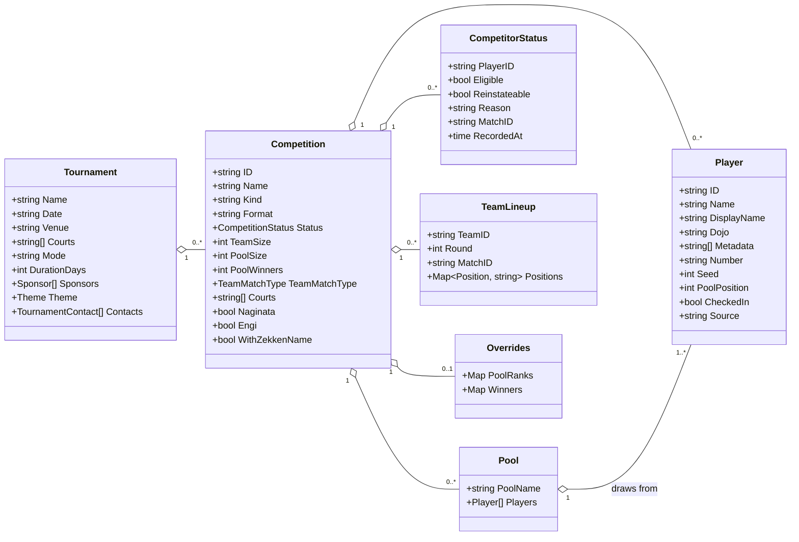
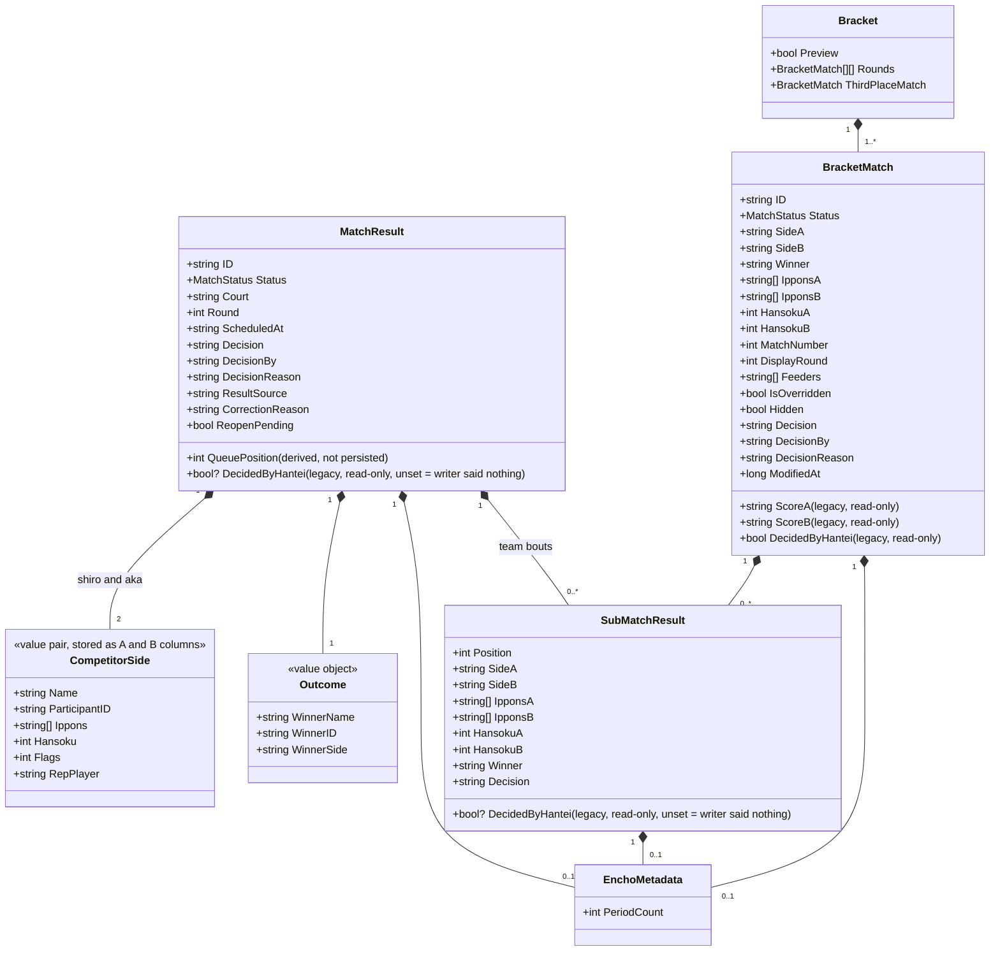
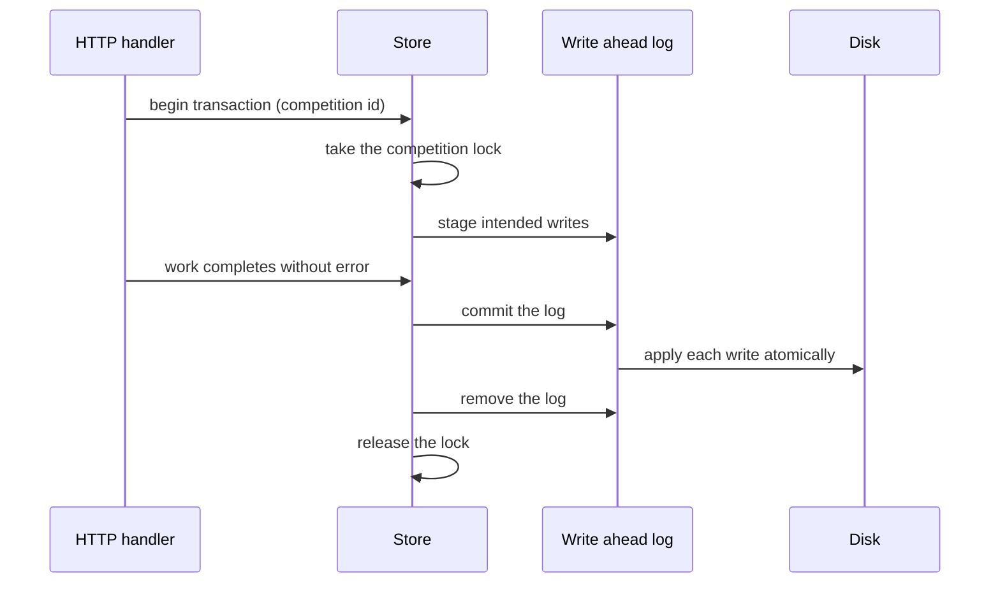

# Data model

The tournament app keeps all tournament state in plain files under a single data folder. There is
no database. This page describes the entities, how they relate, and how they are laid out on
disk.

> Related: [Software architecture](software-architecture.md) · [Network architecture](network-architecture.md) · [Infrastructure architecture](infrastructure-architecture.md)

## 1. Why files

The format is chosen for the room the software runs in, not for query power. A tournament
runs for a day in a sports hall, often on a laptop behind a flaky network, and the person
responsible for the results is a volunteer with a spreadsheet, not a database administrator.

Inspectability, repairability and diffability matter more here than normalisation:

* **Inspectable.** An organiser can open the results in Excel or a text editor mid event.
* **Repairable.** A wrong cell can be corrected by hand and the app picks it up on reload.
* **Diffable.** The whole tournament state can be committed to version control or copied to
  a USB stick as a backup, and two copies can be compared line by line.
  One exception: `tournament.md` holds the tournament and admin passwords in plain text, so
  strip or change them before sharing a copy.

The trade this makes is described honestly in [section 6](#6-how-the-model-maps-onto-rows).

## 2. Tournament and competition structure

A tournament owns competitions; a competition owns everything else. The competition is the
consistency boundary: every write is serialised per competition, and nothing spans two.

`Kind` separates individual from team competitions; `Format` selects playoffs, pools plus
knockout, league or Swiss. `TeamMatchType` selects fixed order or kachinuki for team
competitions. A competition in the `team` kind treats each `Player` entry as a team, with
member names held in the entry's metadata.

## 3. The match and result model

This is the detailed part of the model, because the rules it encodes are detailed. A match
carries its pairing, its score, how it was decided, when and where it is played, and an
audit trail for corrections.

The diagram makes three points that a raw field list would hide.

**`CompetitorSide` is a value object that the storage flattens.** The name is this page's
own, chosen for clarity: no such type exists in the code. Everything a competitor brings
to a match (name, participant id, struck points, outstanding fouls, flags, and the
representative player for a team tie breaker) exists twice, once per side. In the object
model those are `SideA`/`SideB`, `IpponsA`/`IpponsB`, `HansokuA`/`HansokuB` and so on. They
are one concept with two instances, not twelve independent attributes.

**A team match is an aggregate.** `SubMatchResult` is a full bout in its own right: its own
pairing, score, decision, overtime and judges' decision. A five person team encounter holds
five of them, plus an optional representative bout at position `-1`. Ranking figures such as
individual victories and points won are derived from these, never stored separately.

**Sides carry both a name and an id.** Results are written against the name, and the
participant id travels alongside it. Both are kept because a rename must not orphan a
recorded result.

### Match status and decision

`Status` moves `scheduled` to `running` to `completed`. A completed match is never sent back
to the queue by a score write; corrections are made through the score editor, which writes a
new completed result with a `CorrectionReason`.

`Decision` records how a match ended when it was not simply fought to a score: a draw, a
withdrawal, a no show, a representative bout, or exhaustion in a kachinuki encounter. A
judges' decision (hantei) is recorded separately, as the `Ht` entry in the winner's ippon
list: the mark occupies a point slot on the score sheet but never counts as a point, and
the winner it sits beside is the winner the referees chose from a level scoreline. The
`DecidedByHantei` fields in the diagrams are legacy read-only channels: a file that
carries the old flag loads through a conversion that moves it into the mark, and nothing
writes them. The bracket `ScoreA`/`ScoreB` strings are the same kind of channel: a file
that rendered each side's scoreline as one string loads through a conversion into the
ippon arrays, and every match record holds its score the same way.

## 4. On disk layout

Each competition is a folder. The tournament root holds the shared settings and the uploaded
images.

```mermaid
classDiagram
    direction LR

    class tournament_md["tournament.md"] {
        <<Markdown, YAML front matter>>
        Tournament
    }
    class config_md["competitions/&lt;id&gt;/config.md"] {
        <<Markdown, YAML front matter>>
        Competition
    }
    class participants_csv["participants.csv"] {
        <<CSV>>
        Player rows
    }
    class seeds_csv["seeds.csv"] {
        <<CSV>>
        Rank, Name, Dojo
    }
    class pools_csv["pools.csv"] {
        <<CSV>>
        PoolName, Name, Position, DisplayName, Dojo, Seed, Number, ID
    }
    class pool_matches_csv["pool-matches.csv"] {
        <<CSV, one row per match>>
        MatchResult rows
    }
    class bracket_json["bracket.json"] {
        <<JSON>>
        Bracket
    }
    class status_yaml["competitor-status.yaml"] {
        <<YAML>>
        CompetitorStatus list
    }
    class lineups_yaml["lineups.yaml"] {
        <<YAML>>
        TeamLineup by round
    }
    class overrides_json["overrides.json"] {
        <<JSON>>
        Overrides
    }
    class wal[".wal/"] {
        <<pending transactions>>
        replayed on startup
    }
    class branding_dir["branding/"] {
        <<uploaded images>>
        tournament logo
    }
    class sponsors_dir["sponsors/"] {
        <<uploaded images>>
        sponsor logos
    }

    tournament_md --> config_md : owns
    tournament_md --> branding_dir : owns
    tournament_md --> sponsors_dir : owns
    tournament_md --> wal : stages transactions in
    config_md --> participants_csv
    config_md --> seeds_csv
    config_md --> pools_csv
    config_md --> pool_matches_csv
    config_md --> bracket_json
    config_md --> status_yaml
    config_md --> lineups_yaml
    config_md --> overrides_json
```

Markdown, CSV, and JSON or YAML each earn their place:

| Format | Used for | Why |
| --- | --- | --- |
| Markdown with YAML front matter | tournament and competition settings | Human readable and editable, and the body can hold notes |
| CSV | participants, seeds, pools, pool and league matches | Opens in a spreadsheet; one row per record diffs cleanly |
| JSON and YAML | bracket, eligibility, lineups, overrides | Tree shaped data that does not fit a row |

The seed list stores the dojo alongside the name, and a seed is matched to its participant
by name and dojo together, because two competitors may share a name across dojos; a file
that stored only the name could not say which of them the rank belonged to. A row without a
dojo still matches by name alone when that name is unique in the roster, and a file without
the dojo column is completed from the roster on first load.

## 5. Write guarantees

**Every file write is atomic.** The bytes go to a temporary file in the same directory, are
flushed to disk, and are then renamed over the target, with the directory entry flushed too.
A power cut never leaves a half written results file: a reader sees either the previous
version or the new one.

**Writes to one competition are serialised.** Each competition has its own lock. A score
write takes it for the whole read, modify and write cycle, and reads from disk rather than
from cache while holding it, so two writes to the same competition cannot interleave.

**Multi file changes are transactional.** Some actions touch several files at once, for
example recording a withdrawal writes the match result, the competitor eligibility record
and the updated bracket. Those run as a transaction: the intended writes are collected,
committed to a write ahead log, and only then applied. If the process stops midway the log
is replayed at the next startup, so the group either lands completely or not at all.
One write sits outside this: a participant edit lands by atomic rename rather than through the
log, so it is crash safe on its own but is not rolled back if the rest of the group fails.

**Concurrent editors are not arbitrated.** Two operators scoring the same match is treated
as last write wins, which is intentional: more than one person may legitimately be scoring
one court. Three narrower guards do apply. A write stamped older than the stored result is
dropped, so a court coming back from an outage cannot overwrite a newer result recorded
elsewhere. A running write that arrives after the match has been completed is discarded
rather than reverting the result. An out of order write from the same client session is
dropped. Anything beyond that is a genuine disagreement between two people and is left
visible rather than resolved silently.

The stale write guard needs the timestamp of the stored result to compare against, so it
only works where that timestamp is saved. It is saved for every match, in both files, which
is what makes the rule the same wherever a match happens to be in the competition. A result
written before the timestamp existed, or by a client that does not send one, counts as
unstamped and always applies: the guard discriminates only when both sides carry a stamp,
so it can never silently drop a legitimate change.

### When a file is wrong

Section 1 promises that a wrong cell is repairable by hand, but not what happens when a hand
edit is itself wrong. Two things can be wrong, and they behave differently: a single cell that
will not parse, and a whole file that will not parse.

**A wrong cell degrades, and the file keeps loading.** A malformed cell falls back to its
documented default and never fails the row it lives in or the load the row belongs to. A team
match's sub-bout cell that will not parse as JSON loads as an empty encounter rather than
aborting the read; a seed row missing its rank or name, or too short to hold them, is skipped
rather than guessed; a number that will not parse is left at the column's documented default,
and a negative count is clamped to zero. One bad cell cannot stop a tournament. Two cases go
further and discard data outright, because there is nothing safe to default to: a legacy
judges' decision flag with no attributable winner is dropped rather than guessed onto a side,
and a hand-edited bracket file carrying both a legacy score string and the current ippon
arrays keeps the arrays and clears the string.

**A degraded cell is kept, not overwritten.** The results file is rewritten in full every time
any match in it is scored, so a cell that read as empty would otherwise be written back as
empty, and the bytes needed to repair it would be gone within seconds of the next bout. A
sub-bout cell that will not parse is therefore held exactly as it was read and written back
unchanged for as long as the encounter stays empty. Re-entering the encounter in the app
replaces it, which is the other way to repair it. While it is unrepaired the operator console
marks the match and the pool standings it feeds, because an encounter that loads as empty
contributes no individual victories and no points, and those are the figures a pool tied on
wins is separated on.

**A wrong file fails the load, and nothing is written to it.** When the damage is structural,
a bracket file that is not valid JSON or a results file whose rows no longer parse as CSV,
there is no row left to degrade. The load fails and every write to that file is refused, so
the competition stops rather than continuing from a half-read record. The file is left exactly
as it was: refusing the write is what makes a repair possible. The app reports which file
failed, the line and column, and what the parser found there, so the fault can be found in the
editor already open.

Repairing the file and reloading is always the option that loses nothing. When that is not
possible, a competition with a pool stage can reset its knockout stage instead: the unreadable
file is renamed aside rather than deleted, and the knockout is rebuilt from the pool draw,
which is held in a different file. That trade is real and the console states it, because the
knockout results are not recoverable from anywhere else and have to be re-entered from the
score sheets, and because the rebuilt pairings should be checked against the printed bracket.
A direct elimination competition cannot do this at all: its bracket file is the only record of
its draw, so rebuilding would produce a different set of pairings rather than restore the
original.

Anyone repairing a file mid tournament should read all of this as: fix the cell, reload, and
check the record, rather than trusting that a malformed edit would have been rejected.

## 6. How the model maps onto rows

The results file is row oriented, and a match is not flat. The mapping between the two is
mechanical: every persisted fact has exactly one representation, and the file holds the
same facts as the structs, encoded for a spreadsheet rather than for a parser. Nesting,
delimited lists, and a mark folded into the score: reading `pool-matches.csv` alone turns
up three encodings worth knowing.

**A team match nests.** The sub bouts are stored as a JSON document inside a single CSV
cell. That keeps the file to one row per match, at the cost of the richest data in a team
competition not being readable as columns.

**Lists sit inside cells.** A side's struck points are joined with `|` in one field, so a
two point match reads `M|K` rather than occupying two columns.

**The judges' decision rides in the score.** A match won on referee decision has no column
of its own. The mark occupies a point slot in the winner's score field, which is exactly how
it is drawn on a paper score sheet, and it stays there when the file is read: the mark is
part of the recorded score, and everything that counts points knows to skip it, so it can
never inflate a result.

Appending columns and leaving some fields unwritten are the two consequences that follow:

* Column position is the contract. New fields are appended, and a file written by an older
  version stays readable because the reader leaves each missing trailing column at its
  documented default, empty for most and `-1` for the round number, which means unknown.
* Some fields are useful only in flight and are not written at all. Client revision markers
  used to discard out of order writes are one example: they exist to order writes within one
  session and carry no meaning once the result has landed. A match's queue position is
  another: it is derived from court, status and scheduled time each time a match list is
  served, so the queue shrinks as matches finish, and persisting it would let a stale copy
  disagree with the schedule it was drawn from, so it is
  excluded from `pool-matches.csv` by name, on top of carrying a tag that already keeps it out
  of the YAML-marshalled forms.

If the storage were rebuilt around queries rather than around people reading it, the shape
would differ: a match side table would replace the paired columns, and sub bouts would be
rows rather than an embedded document. That would trade away the inspect and repair
properties in [section 1](#1-why-files), so the storage stays shaped for people.

## 7. How the layout is enforced

A single defined column order and a round trip guard on every file hold the layout to its
contract:

* **The results file's layout is defined once.** The header, the row writer and the reader
  all derive from a single ordered column list, so the three cannot disagree. A golden test
  pins the exact bytes. The ordered list, never Go struct order, is the on disk contract.

    Only the results file is built this way, because only it earns the machinery: it is by
    far the widest, and it is the one that grows a column whenever the rules do. Of the
    others, two could not use a positional column list at all (the roster file's layout
    varies by row, and the seed file is read by column name rather than position) and one
    derives a column from row order rather than from a field (pools.csv); the round trip
    guard below is what protects each of them.
* **Every CSV file has a round trip guard.** Each guard sweeps the persisted struct's
  fields and fails when a field neither survives a save and reload nor appears in an
  allow list with the reason it is legitimately transient. The files persisted by
  marshalling a whole structure are immune by construction, and a companion test pins the
  property that makes them immune.
