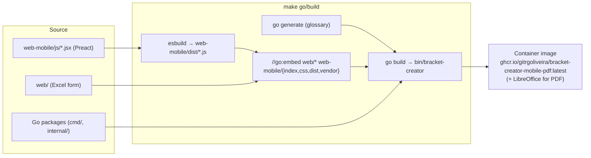
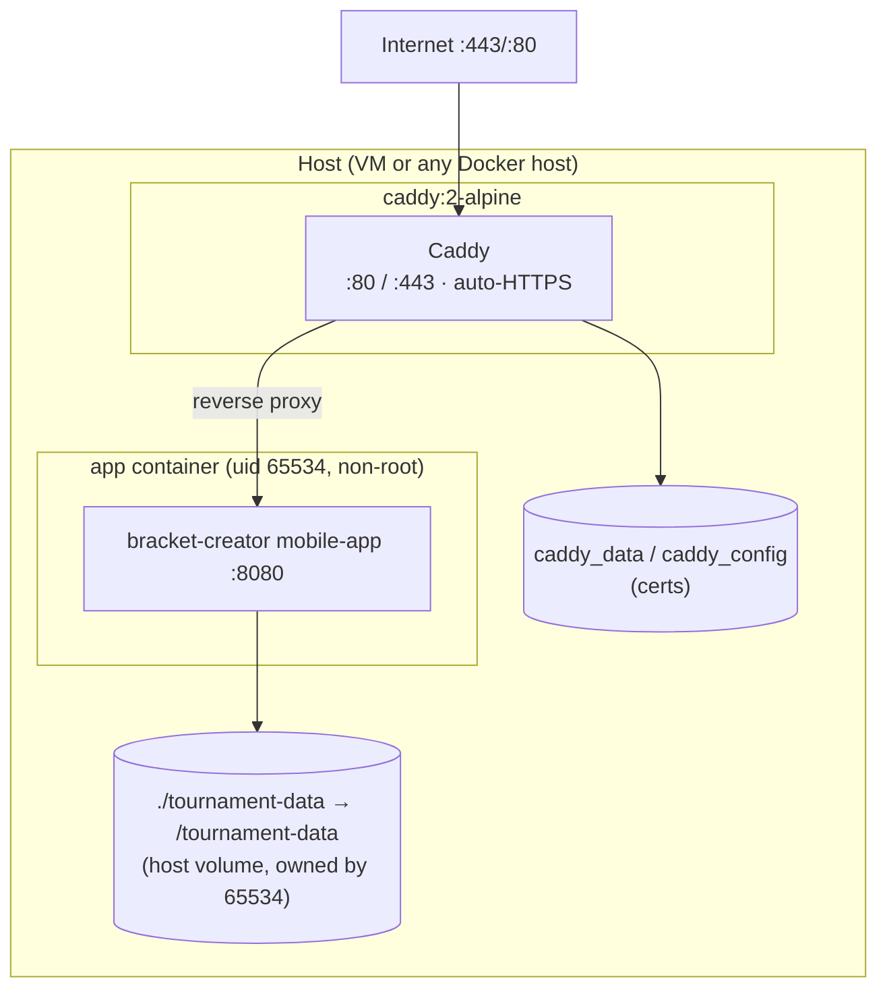
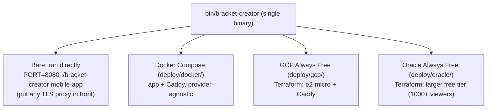
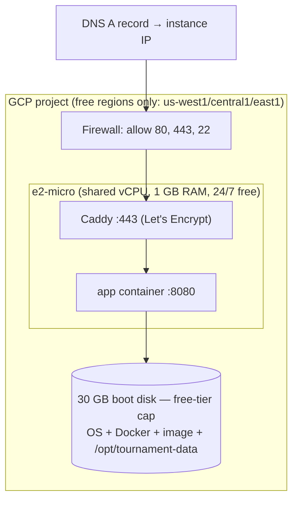
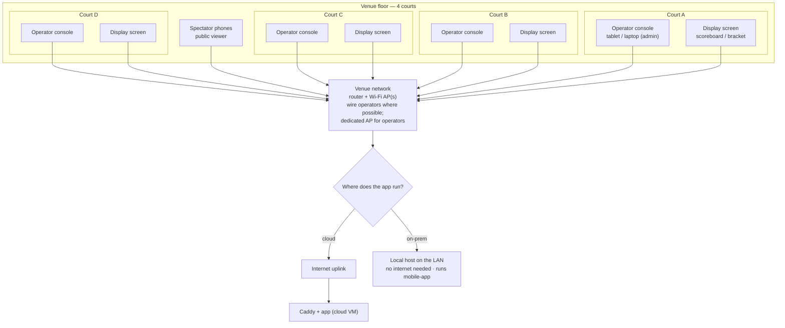
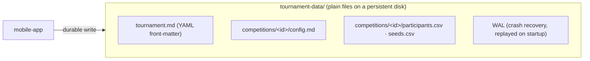
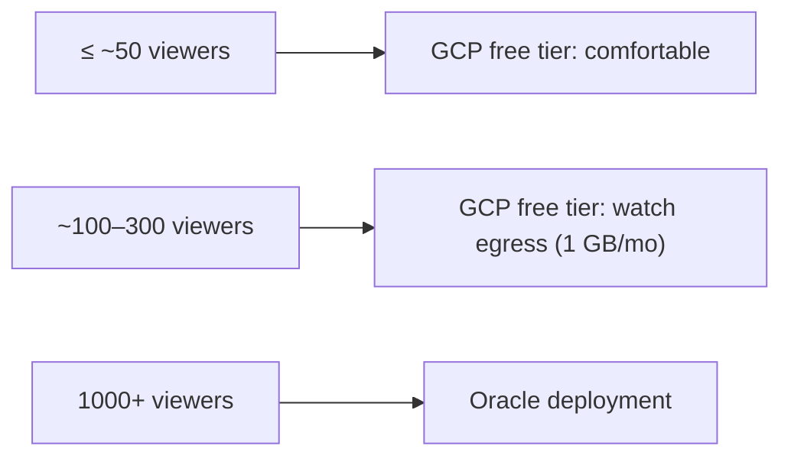
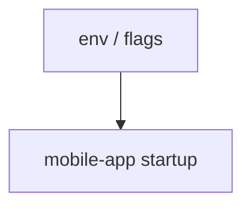

# Infrastructure architecture

How bracket-creator is built, packaged, deployed, and persisted. The whole product is a
**single self-contained Go binary** (web assets embedded) running behind a TLS proxy, with
tournament state on a plain disk — deployable from a laptop to a free-tier cloud VM.

> Related: [Software architecture](software-architecture.md) · [Network architecture](network-architecture.md)

## 1. Build & packaging pipeline

- `dist/` and `vendor/` are build artifacts (gitignored except `keep` placeholders); esbuild
  regenerates `dist/` on every build, then `go:embed` bakes the served assets into the binary.
- The published image adds LibreOffice so the `print` PDF exports work in a container.
- **One artifact, no runtime asset directory** — the binary serves everything from its embedded FS.

## 2. Runtime composition (container + proxy + disk)

- App runs as **non-root (uid 65534)**; the data volume must be owned by that uid or the app
  refuses to start. App port 8080 is `expose`d to the proxy only — never published to the host.
- `restart: unless-stopped` (compose) / auto-restart (cloud) brings the app back after reboots.

## 3. Deployment options

| Target | What it is | Best for |
|---|---|---|
| **Bare binary** | run the binary, bring your own TLS proxy | local / dev / custom hosts |
| **Docker Compose** (`deploy/docker/`) | `app` + `caddy` services, host volume for data | self-managed VMs / on-prem |
| **GCP Always Free** (`deploy/gcp/`) | Terraform → `e2-micro` + firewall + persistent disk + Caddy auto-HTTPS | club / regional events (~≤50–300 viewers) |
| **Oracle Always Free** (`deploy/oracle/`) | Terraform, larger free allowance | large events (1000+ concurrent viewers) |

### Cloud topology (GCP Always-Free example)

Terraform provisions the instance, network, and firewall, then installs Docker, prepares the
data dir, writes the app + Caddy config, and starts the app — reachable over HTTPS within minutes
of `terraform apply`. `terraform destroy` removes everything (run it after the event).

### Venue connectivity — a four-court event

The cloud/host above is only half the picture. On the venue floor, every operator console,
display screen, and spectator phone is just a **browser** reaching that one app over the network.
A typical four-court (shiaijo A–D) layout:

| Device | What it runs | Notes |
|---|---|---|
| Operator console — 1 per court | admin scoring SPA | tablet/desktop surface; authenticates with the tournament password; scores its own shiaijo |
| Display screen — 1 per court (optional) | public display / scoreboard view | just a browser at a display URL (smart-TV browser, or a mini-PC/laptop driving a TV); read-only, no auth |
| Spectator phones | public viewer (mobile-first) | can be on cellular — they don't need venue Wi-Fi when the app is cloud-hosted |

**Per-client load.** Every console, display, and phone holds **one SSE stream** plus its REST
calls. A four-court event is roughly 4 operators + 4 displays + N spectators of concurrent SSE
clients — comfortably within `SSE_MAX_CLIENTS`, but every live update fans out to all of them
(see [Capacity & scaling](#5-capacity--scaling)).

**Two venue patterns:**

- **Cloud-hosted** (topology above) — venue devices reach the cloud app over the venue's internet
  uplink; spectators can use cellular and skip venue Wi-Fi entirely. Needs a working uplink for
  the operators and displays.
- **On-prem / local** — run the single `mobile-app` binary on a laptop or mini-PC **on the venue
  LAN**; operators and displays hit it locally, so **scoring keeps working with no internet at
  all**. Put a local TLS proxy in front for secure-context features, or serve plain HTTP on the LAN.

**The network is the real fix.** Client resilience (offline write queue, SSE resync, silence
watchdog) keeps the app
usable across blips, but for a smooth event: **wire the operator consoles** where you can, put
operators on a **dedicated AP** separate from spectator guest Wi-Fi, and prefer the **on-prem**
pattern when the venue's internet is unreliable.

## 4. Persistence model

- **No database.** State is human-readable Markdown + CSV on disk; multi-file changes are made
  durable via a write-ahead log replayed on startup. The disk survives reboots and stop/start.
- Backups are trivial — snapshot the disk or copy `tournament-data/` elsewhere.
- **Disk sizing is not about data volume.** Tournament state is tiny (KB–MB). The cloud disks —
  30 GB on GCP, 50 GB on Oracle — are the free-tier **boot-disk** allowances (they hold the OS,
  Docker, and the app image, with `tournament-data/` alongside); the module simply uses the free
  cap rather than provisioning a separate data disk.

## 5. Capacity & scaling

Live updates fan out to every viewer, so **egress is the limit**, not CPU/RAM.

Set a **billing budget alert** (e.g. $1) on cloud deployments so you're warned if usage ever
exceeds the free allowance. `SSE_MAX_CLIENTS` bounds fan-out cost (default 5000; ~4–10 KB
resident per client).

## 6. Configuration (environment variables)

| Variable | Flag | Default | Purpose |
|---|---|---|---|
| `TOURNAMENT_DATA_DIR` | `-f/--folder` | `./tournament-data` | where state is stored |
| `PORT` | `-p/--port` | 8080 | listen port |
| `BIND_ADDRESS` | `-b/--bind` | localhost | listen address |
| `LOCK_PASSWORD` | `--lock-password` | false | enable locked (bcrypt) auth; disables reset endpoint |
| `TOURNAMENT_PASSWORD_HASH` | — | — | bcrypt hash for locked mode (root-owned, never in the image) |
| `SSE_MAX_CLIENTS` | — | 5000 | SSE subscriber cap |
| `ENABLE_TOURNAMENT_SCHEDULE` | — | off | feature flag for the schedule UI |

Generate the bcrypt hash with `bracket-creator hash-password`. In cloud deployments the secrets
are written to a protected, root-owned file on the instance — never baked into the container image.

## 7. Operational properties

- **Stateless app, stateful disk** — the container can be recreated freely; only the data volume
  matters. Auto-restart + a persistent disk = self-healing after reboots.
- **Zero-dependency runtime** — no DB, no cache, no message broker; just the binary, a TLS proxy,
  and a disk.
- **Graceful shutdown** (30s) lets in-flight writes finish and SSE goroutines exit cleanly before
  a container restart.
- **Teardown is one command** (`terraform destroy`) so no stray paid resources linger.
