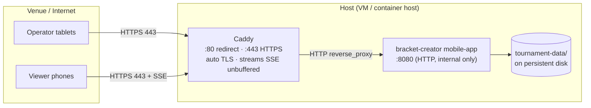
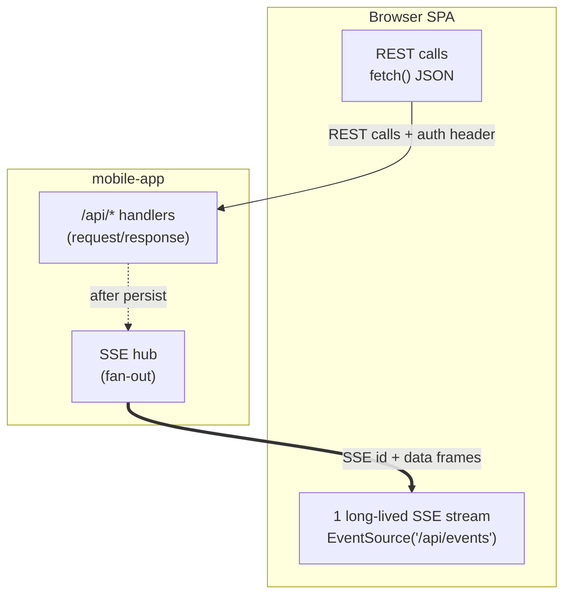
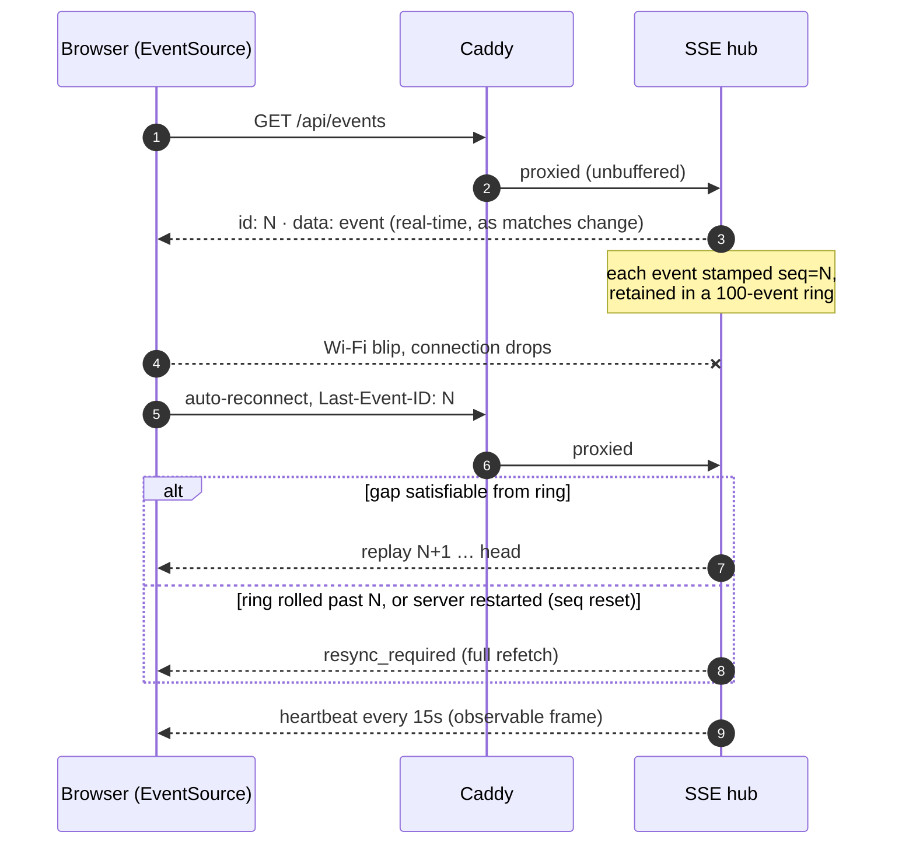
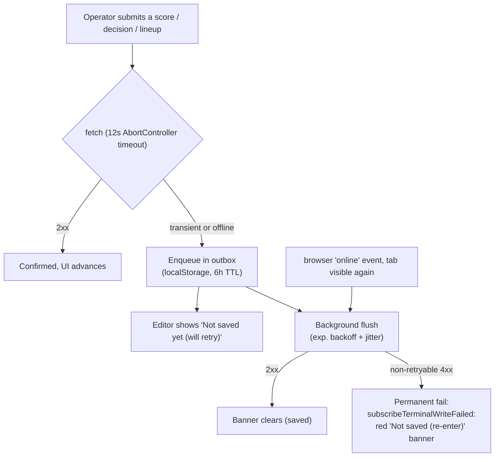
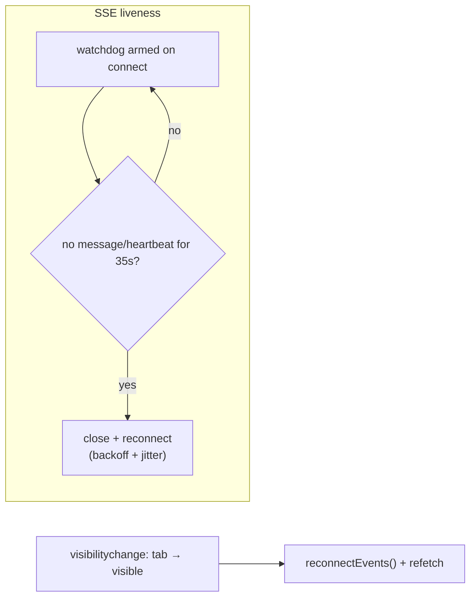
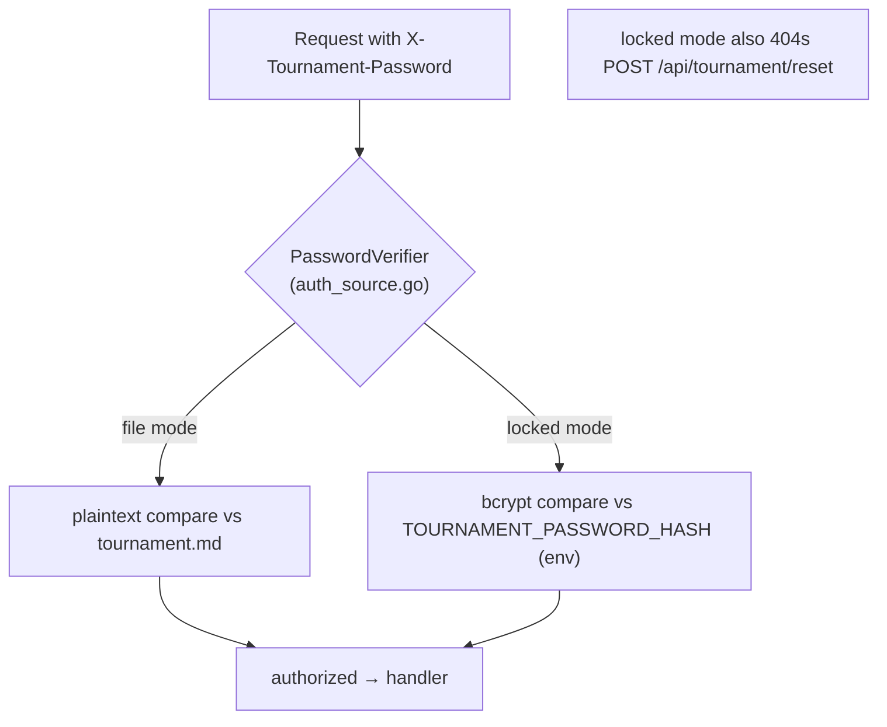

# Network architecture

How traffic flows between browsers and the tournament app: HTTPS termination at a reverse
proxy, plain HTTP to the app, real-time updates over Server-Sent Events (SSE), and the
client-side resilience that keeps it working on flaky venue Wi-Fi.

> Related: [Software architecture](software-architecture.md) · [Infrastructure architecture](infrastructure-architecture.md)

## 1. Edge topology

The app speaks **plain HTTP**; a TLS-terminating reverse proxy (**Caddy**, automatic
Let's Encrypt) sits in front and streams SSE through unbuffered.

| Port | Where | Purpose |
|---|---|---|
| 443 | Caddy (public) | HTTPS for REST + SSE |
| 80 | Caddy (public) | ACME challenge; redirect to 443 |
| 8080 | app (internal) | plain HTTP; **never published directly** (Caddy proxies it) |
| 22 | host (optional) | SSH (restrict to your IP) |

> **Proxy must stream, not buffer.** SSE is a long-lived response; the Caddyfiles deliberately
> avoid `flush_interval` / response-buffering directives, which would break the real-time event stream.
> (In production HTTPS comes from the proxy, so browser secure-context features work even though
> the app itself serves plain HTTP.)

## 2. Protocols on the wire

Two channels share the one HTTPS origin:

- **REST**: score/decision/lineup writes, config, participants. Auth through the
  `X-Tournament-Password` header (two modes, §5).
- **SSE**: one stream per client carrying `match_updated`, `competition_started/completed`,
  `competitor_status_updated`, `draw_generated`, `schedule_updated`, plus the resilience control
  events `resync_required` and `heartbeat`. Every real event is stamped with a monotonic `seq`
  written as the SSE `id:` line, so the browser's `Last-Event-ID` advances automatically.

## 3. Real-time delivery & reconnect (SSE hub)

- **Replay ring**: `DefaultHistorySize` (100) recent events. `Last-Event-ID` replays the gap.
- **`resync_required`**: emitted when a gap-free replay is impossible (ring eviction or a
  server restart that reset `seq`). The client resets its `lastSeq` and full-refetches. Emitted
  **without** an `id:` line when head seq is 0 so it can't force `Last-Event-ID` to "0".
- **Observable heartbeat**: a real `{"type":"heartbeat"}` frame (no `id:`) every 15s, so the
  client can tell "quiet" from "dead".
- **Per-client buffered channel**; a stalled client that can't drain is dropped (non-blocking
  send). Subscriber cap `SSE_MAX_CLIENTS` (default 5000).

## 4. Client resilience on flaky Wi-Fi

The client treats the link as unreliable by default; the following flows show how.

Key client mechanisms (all in `web-mobile/js/api_client.jsx` + consumers):

| Concern | Mechanism |
|---|---|
| Half-open / stalled sockets | 12s write timeouts, 35s SSE silence watchdog (armed at connect, not only `onopen`) |
| Reconnect storms | exponential backoff + jitter (vs. a fixed delay) |
| Lost writes | durable outbox persisted to `localStorage` (6h TTL), retried; survives tab refresh |
| Missed events | `Last-Event-ID` replay + `checkSeqGap` on every event → scoped refetch; `resync_required` |
| Tab resume | `visibilitychange` → force reconnect + refetch |
| False success | terminal writes show pending/failure state, never a false "saved" |
| Credential change | queue cleared on logout / `password_reset` (no stale-password retries) |

## 5. Authentication on the network

- **File mode** (default): plaintext compare against `tournament.md`. `POST /api/tournament/reset`
  is available (for a forgotten admin password).
- **Locked mode** (`--lock-password` / `LOCK_PASSWORD=true` + `TOURNAMENT_PASSWORD_HASH`): bcrypt
  compare; reset endpoint returns 404. `GET /api/auth-config` reports the mode to the SPA.

## 6. Server-side network hardening (`cmd/mobile_app.go`)

| Setting | Value | Why |
|---|---|---|
| `ReadHeaderTimeout` | 10s | slowloris-header defense |
| `ReadTimeout` | 30s | slow-body defense (still allows multi-MB CSV import) |
| `IdleTimeout` | 120s | bounds fd commitment per idle keep-alive |
| `WriteTimeout` | **0** | SSE is infinite; cancellation through the request context |
| `MaxHeaderBytes` | 1 MB | header-bomb defense |
| Body cap (admin JSON) | 1 MB | `MaxBodyBytes` middleware → 413 |
| Body cap (`/tournament/import`) | 64 MB | matches multipart CSV import |
| Graceful shutdown | 30s | `Hub.Close` through `RegisterOnShutdown` |

## 7. Scale limit = egress

Because every real-time update is fanned out to **every** connected viewer, **network egress is the
practical ceiling**, not CPU/RAM. See [Infrastructure architecture](infrastructure-architecture.md#5-capacity-scaling)
for per-tier audience guidance (for example, GCP free tier compared with Oracle for 1000+ viewers).
