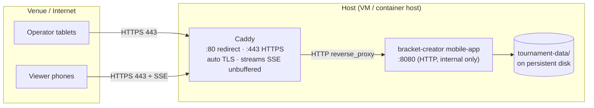
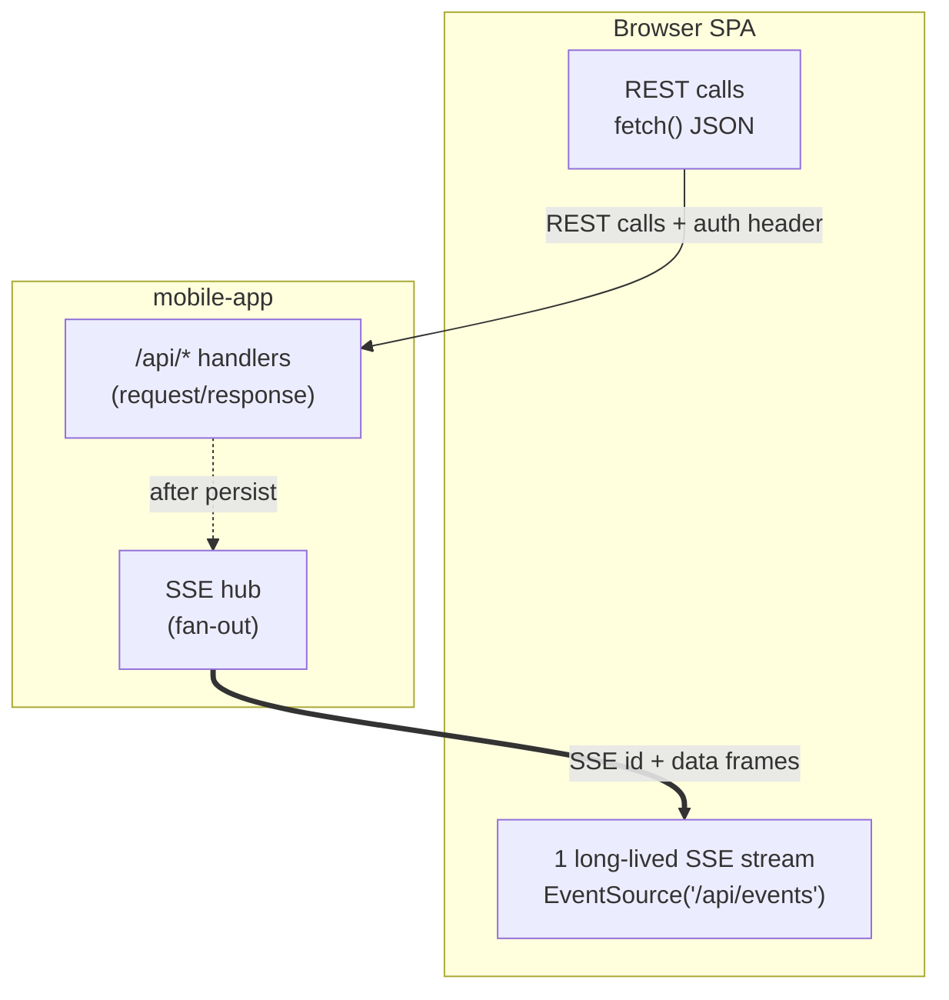
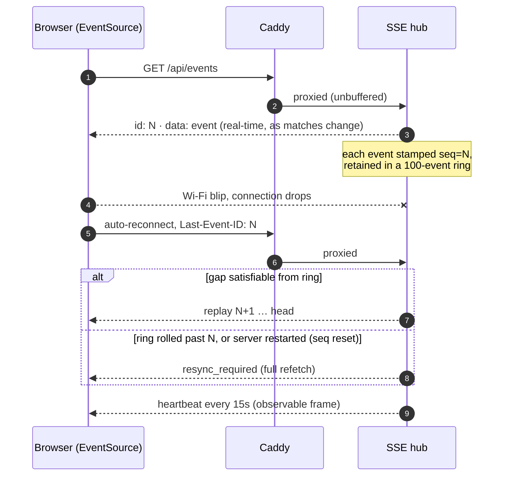
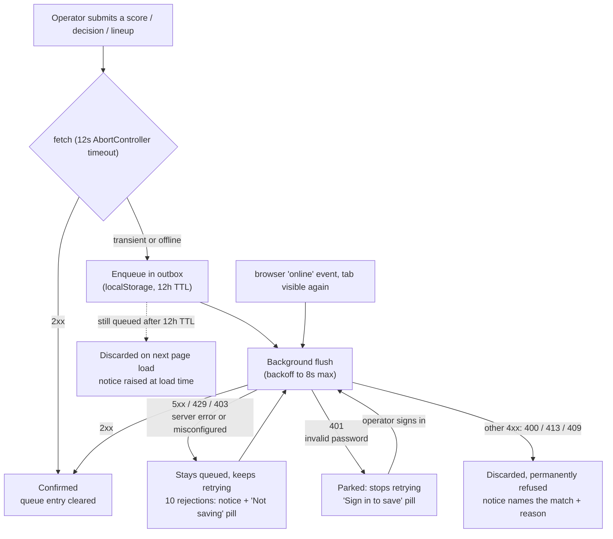
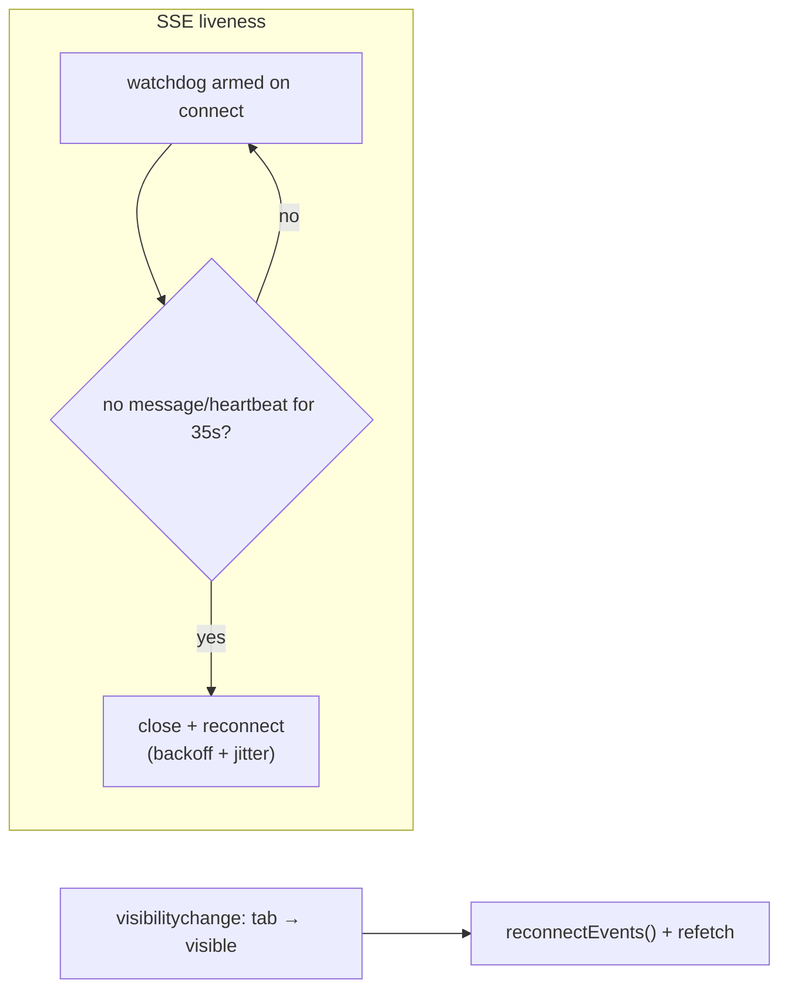
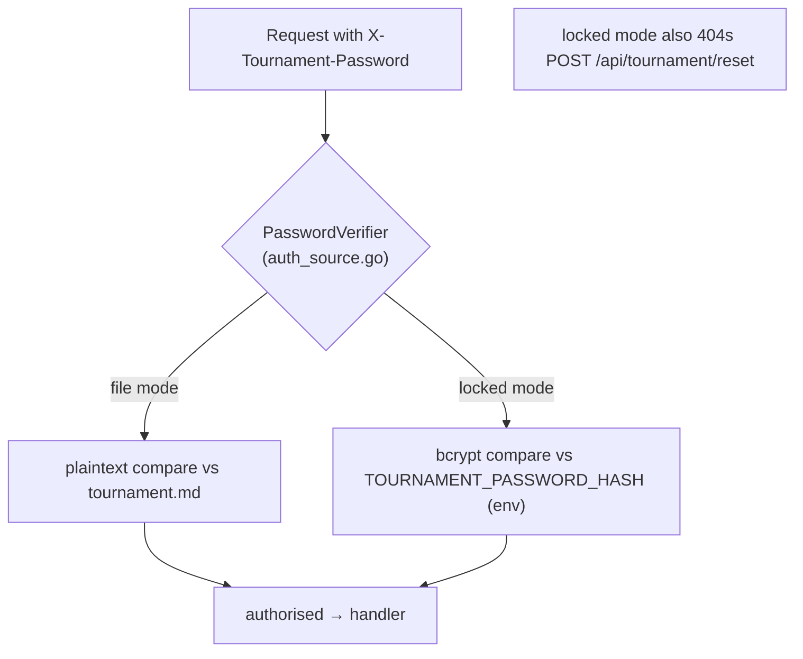

# Network architecture

How traffic flows between browsers and the tournament app: HTTPS termination at a reverse
proxy, plain HTTP to the app, real-time updates over Server-Sent Events (SSE), and the
client-side resilience that keeps it working on flaky venue Wi-Fi.

> Related: [Software architecture](software-architecture.md) · [Infrastructure architecture](infrastructure-architecture.md)

## 1. Edge topology

The app speaks **plain HTTP**; a TLS-terminating reverse proxy (**Caddy**, automatic
Let's Encrypt) sits in front and streams SSE through unbuffered.

```mermaid
flowchart LR
    subgraph net["Venue / Internet"]
        op["Operator tablets"]
        vw["Viewer phones"]
    end

    subgraph host["Host (VM / container host)"]
        caddy["Caddy<br/>:80 redirect · :443 HTTPS<br/>auto TLS · streams SSE unbuffered"]
        app["bracket-creator mobile-app<br/>:8080 (HTTP, internal only)"]
        disk[("tournament-data/<br/>on persistent disk")]
    end

    op -->|HTTPS 443| caddy
    vw -->|HTTPS 443 + SSE| caddy
    caddy -->|HTTP reverse_proxy| app
    app --> disk
```

| Port | Where | Purpose |
|---|---|---|
| 443 | Caddy (public) | HTTPS for REST + SSE |
| 80 | Caddy (public) | ACME challenge; redirect to 443 |
| 8080 | app (internal) | plain HTTP; **never published directly** (Caddy proxies it) |
| 22 | host (optional) | SSH (restrict to your IP) |

> **Proxy must stream, not buffer.** SSE is a long-lived response; the Caddyfiles deliberately
> avoid `flush_interval` / response-buffering directives, which would break the real-time event stream.
> (In production HTTPS comes from the proxy, so browser secure-context features work even though
> the app itself serves plain HTTP.)

## 2. Protocols on the wire

Two channels share the one HTTPS origin:

```mermaid
flowchart TB
    subgraph client["Browser SPA"]
        rest["REST calls<br/>fetch() JSON"]
        sse["1 long-lived SSE stream<br/>EventSource('/api/events')"]
    end
    subgraph server["mobile-app"]
        api["/api/* handlers<br/>(request/response)"]
        hub["SSE hub<br/>(fan-out)"]
    end
    rest -->|REST calls + auth header| api
    api -.->|after persist| hub
    hub ==>|SSE id + data frames| sse
```

- **REST**: score/decision/lineup writes, config, participants. Auth through the
  `X-Tournament-Password` header (two modes, §5).
- **SSE**: one stream per client carrying `match_updated`, `competition_started/completed`,
  `competitor_status_updated`, `draw_generated`, `schedule_updated`, plus the resilience control
  events `resync_required` and `heartbeat`. Every real event is stamped with a monotonic `seq`
  written as the SSE `id:` line, so the browser's `Last-Event-ID` advances automatically.

## 3. Real-time delivery & reconnect (SSE hub)

```mermaid
sequenceDiagram
    autonumber
    participant B as Browser (EventSource)
    participant C as Caddy
    participant H as SSE hub

    B->>C: GET /api/events
    C->>H: proxied (unbuffered)
    H-->>B: id: N · data: event   (real-time, as matches change)
    Note over H: each event stamped seq=N,<br/>retained in a 100-event ring
    B--xH: Wi-Fi blip, connection drops
    B->>C: auto-reconnect, Last-Event-ID: N
    C->>H: proxied
    alt gap satisfiable from ring
        H-->>B: replay N+1 … head
    else ring rolled past N, or server restarted (seq reset)
        H-->>B: resync_required (full refetch)
    end
    H-->>B: heartbeat every 15s (observable frame)
```

- **Replay ring**: `DefaultHistorySize` (100) recent events. `Last-Event-ID` replays the gap.
- **`resync_required`**: emitted when a gap-free replay is impossible (ring eviction or a
  server restart that reset `seq`). The client resets its `lastSeq` and full-refetches. Emitted
  **without** an `id:` line when head seq is 0 so it can't force `Last-Event-ID` to "0".
- **Observable heartbeat**: a real `{"type":"heartbeat"}` frame (no `id:`) every 15s, so the
  client can tell "quiet" from "dead".
- **Per-client buffered channel**; a stalled client that can't drain is dropped (non-blocking
  send). Subscriber cap `SSE_MAX_CLIENTS` (default 5000).

## 4. Client resilience on flaky Wi-Fi

The client treats the link as unreliable by default; the following flows show how.

Only a confirmed write ever empties the queue. A write that cannot be confirmed is never
dropped in silence: it is either kept and retried, parked until the operator can fix the
cause, or discarded with a visible notice naming the reason.

```mermaid
flowchart TD
    submit["Operator submits a score / decision / lineup"] --> try{"fetch (12s AbortController timeout)"}
    try -->|2xx| done["Confirmed<br/>queue entry cleared"]
    try -->|transient or offline| q["Enqueue in outbox<br/>(localStorage, 12h TTL)"]
    q --> flush["Background flush<br/>(backoff to 8s max)"]
    flush -->|2xx| done
    flush -->|5xx / 429 / 403<br/>server error or misconfigured| retrying["Stays queued, keeps retrying<br/>10 rejections: notice + 'Not saving' pill"]
    retrying --> flush
    flush -->|401<br/>invalid password| parked["Parked: stops retrying<br/>'Sign in to save' pill"]
    parked -->|operator signs in| flush
    flush -->|other 4xx: 400 / 413 / 409| refused["Discarded, permanently refused<br/>notice names the match + reason"]
    q -.->|still queued after 12h TTL| expired["Discarded on next page load<br/>notice raised at load time"]
    online["browser 'online' event, tab visible again"] --> flush
```

```mermaid
flowchart LR
    subgraph watchdog["SSE liveness"]
        arm["watchdog armed on connect"] --> silent{"no message/heartbeat for 35s?"}
        silent -->|yes| reconnect["close + reconnect<br/>(backoff + jitter)"]
        silent -->|no| arm
    end
    vis["visibilitychange: tab → visible"] --> rc["reconnectEvents() + refetch"]
```

Key client mechanisms (all in `web-mobile/js/api_client.jsx` + consumers):

| Concern | Mechanism |
|---|---|
| Half-open / stalled sockets | 12s write timeouts, 35s SSE silence watchdog (armed at connect, not only `onopen`) |
| Reconnect storms | exponential backoff + jitter (vs. a fixed delay) |
| Lost writes | durable outbox persisted to `localStorage` (12h TTL), retried; survives tab refresh |
| Server errors (5xx / 429), and 403 | write stays queued and keeps retrying for as long as the tab stays open (the TTL is applied at page load, not during a session); after 10 consecutive rejections the operator gets a notice and the sync pill shows "Not saving". On this server 403 is never a bad credential (that is 401): it means the tournament is not configured yet, or is missing its password. Only an admin fixing the server state clears it, so signing in again cannot help and the write keeps retrying instead of parking |
| Invalid credential (401) | the one 4xx a retry can fix: the write is parked, not discarded, stops retrying, and shows "Sign in to save"; signing in again re-sends it with the new credential |
| Other non-retryable 4xx (400 validation, 413, generic 409) | write is discarded (it can never succeed on retry), and the operator always gets a visible notice naming the match and the server's reason |
| Missed events | `Last-Event-ID` replay + `checkSeqGap` on every event → scoped refetch; `resync_required` |
| Tab resume | `visibilitychange` → force reconnect + refetch |
| False success | terminal writes show pending / parked / still-retrying / failure state, never a false "saved"; a write dropped for exceeding the TTL, or because the stored entry was corrupt, also raises a visible notice at page load, never a silent loss |
| Storage full | if the browser can't persist the queue (storage quota exhausted), that is surfaced to the operator rather than swallowed |
| Credential change | queue cleared on logout (the operator is asked to confirm first if writes are still unsent) or on `password_reset` (no stale-password retries) |

## 5. Authentication on the network

```mermaid
flowchart TD
    req["Request with X-Tournament-Password"] --> verifier{"PasswordVerifier<br/>(auth_source.go)"}
    verifier -->|file mode| md["plaintext compare vs tournament.md"]
    verifier -->|locked mode| bcrypt["bcrypt compare vs TOURNAMENT_PASSWORD_HASH (env)"]
    md --> ok["authorised → handler"]
    bcrypt --> ok
    note["locked mode also 404s POST /api/tournament/reset"]
```

- **File mode** (default): plaintext compare against `tournament.md`. `POST /api/tournament/reset`
  is available (for a forgotten admin password).
- **Locked mode** (`--lock-password` / `LOCK_PASSWORD=true` + `TOURNAMENT_PASSWORD_HASH`): bcrypt
  compare; reset endpoint returns 404. `GET /api/auth-config` reports the mode to the SPA.

## 6. Server-side network hardening (`cmd/mobile_app.go`)

| Setting | Value | Why |
|---|---|---|
| `ReadHeaderTimeout` | 10s | slowloris-header defense |
| `ReadTimeout` | 30s | slow-body defense (still allows multi-MB CSV import) |
| `IdleTimeout` | 120s | bounds fd commitment per idle keep-alive |
| `WriteTimeout` | **0** | SSE is infinite; cancellation through the request context |
| `MaxHeaderBytes` | 1 MB | header-bomb defense |
| Body cap (admin JSON) | 1 MB | `MaxBodyBytes` middleware → 413 |
| Body cap (`/tournament/import`) | 64 MB | matches multipart CSV import |
| Graceful shutdown | 30s | `Hub.Close` through `RegisterOnShutdown` |

## 7. Scale limit = egress

Because every real-time update is fanned out to **every** connected viewer, **network egress is the
practical ceiling**, not CPU/RAM. See [Infrastructure architecture](infrastructure-architecture.md#5-capacity-scaling)
for per-tier audience guidance (for example, GCP free tier compared with Oracle for 1000+ viewers).
