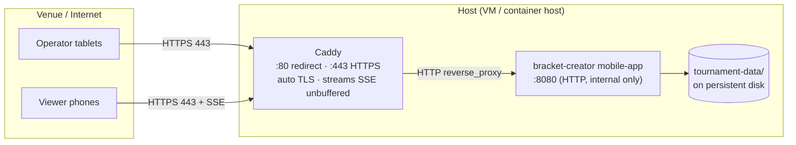
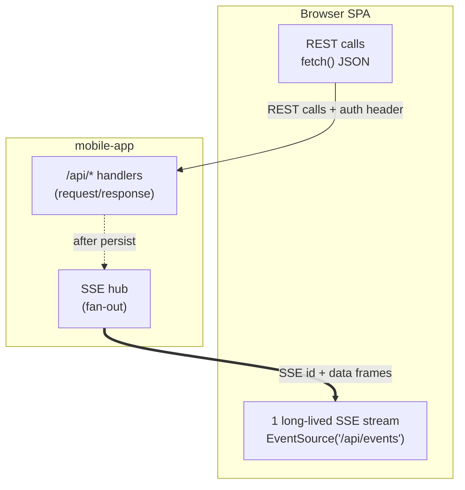
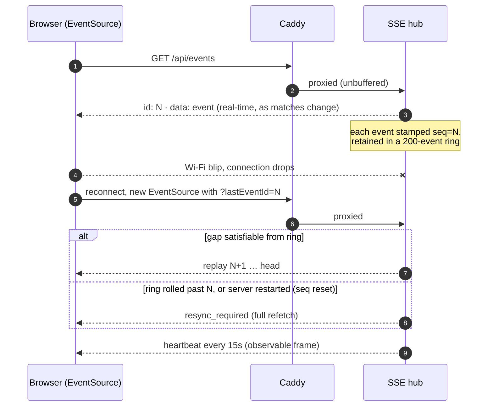
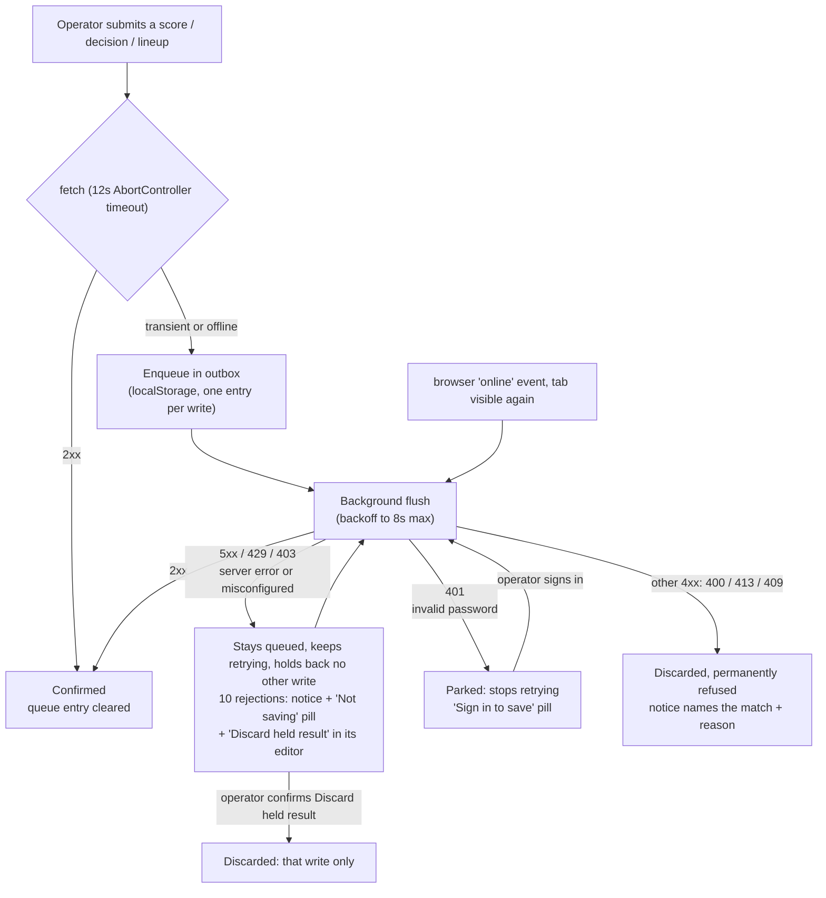
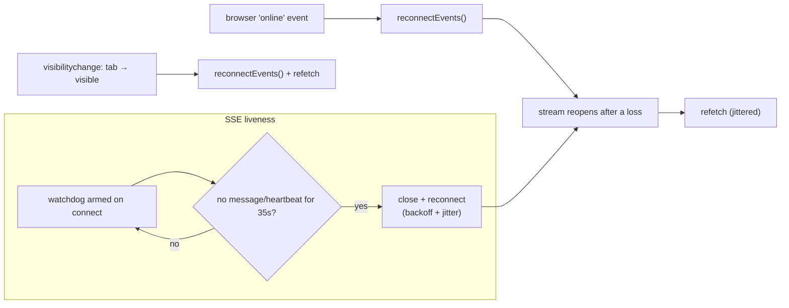
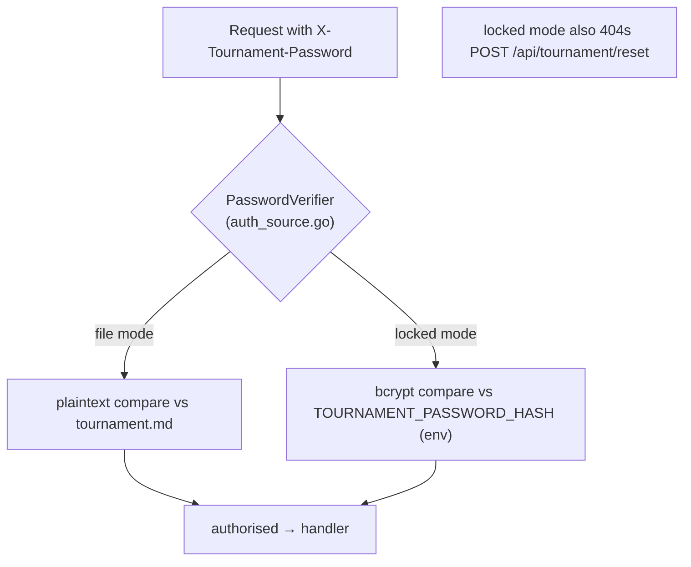

# Network architecture

How traffic flows between browsers and the tournament app: HTTPS termination at a reverse
proxy, plain HTTP to the app, real-time updates over Server-Sent Events (SSE), and the
client-side resilience that keeps it working on flaky venue Wi-Fi.

> Related: [Software architecture](software-architecture.md) · [Infrastructure architecture](infrastructure-architecture.md)

## 1. Edge topology

The app speaks **plain HTTP**. A TLS-terminating reverse proxy (**Caddy**, automatic
Let's Encrypt) sits in front and streams SSE through unbuffered.

```mermaid
flowchart LR
    subgraph net["Venue / Internet"]
        op["Operator tablets"]
        vw["Viewer phones"]
    end

    subgraph host["Host (VM / container host)"]
        caddy["Caddy<br/>:80 redirect · :443 HTTPS<br/>auto TLS · streams SSE unbuffered"]
        app["bracket-creator mobile-app<br/>:8080 (HTTP, internal only)"]
        disk[("tournament-data/<br/>on persistent disk")]
    end

    op -->|HTTPS 443| caddy
    vw -->|HTTPS 443 + SSE| caddy
    caddy -->|HTTP reverse_proxy| app
    app --> disk
```

| Port | Where | Purpose |
|---|---|---|
| 443 | Caddy (public) | HTTPS for REST + SSE |
| 80 | Caddy (public) | ACME challenge; redirect to 443 |
| 8080 | app (internal) | plain HTTP; **never published directly** (Caddy proxies it) |
| 22 | host (optional) | SSH (restrict to your IP) |

> **Proxy must stream, not buffer.** SSE is a long-lived response. The Caddyfiles deliberately avoid `flush_interval` and response-buffering directives, because those would break the real-time event stream.
> (In production HTTPS comes from the proxy, so browser secure-context features work even though
> the app itself serves plain HTTP.)

## 2. Protocols on the wire

Two channels share the one HTTPS origin:

```mermaid
flowchart TB
    subgraph client["Browser SPA"]
        rest["REST calls<br/>fetch() JSON"]
        sse["1 long-lived SSE stream<br/>EventSource('/api/events')"]
    end
    subgraph server["mobile-app"]
        api["/api/* handlers<br/>(request/response)"]
        hub["SSE hub<br/>(fan-out)"]
    end
    rest -->|REST calls + auth header| api
    api -.->|after persist| hub
    hub ==>|SSE id + data frames| sse
```

- **REST**: score/decision/lineup writes, config, participants. Auth through the
  `X-Tournament-Password` header (two modes, §5).
- **SSE**: one stream per client carrying `match_updated`, `competition_started/completed`,
  `competitor_status_updated`, `draw_generated`, `schedule_updated`, plus the resilience control
  events `resync_required` and `heartbeat`. Every real event is stamped with a monotonic `seq`
  written as the SSE `id:` line, so the browser's `Last-Event-ID` advances automatically.

## 3. Real-time delivery & reconnect (SSE hub)

```mermaid
sequenceDiagram
    autonumber
    participant B as Browser (EventSource)
    participant C as Caddy
    participant H as SSE hub

    B->>C: GET /api/events
    C->>H: proxied (unbuffered)
    H-->>B: id: N · data: event   (real-time, as matches change)
    Note over H: each event stamped seq=N,<br/>retained in a 200-event ring
    B--xH: Wi-Fi blip, connection drops
    B->>C: reconnect, new EventSource with ?lastEventId=N
    C->>H: proxied
    alt gap satisfiable from ring
        H-->>B: replay N+1 … head
    else ring rolled past N, or server restarted (seq reset)
        H-->>B: resync_required (full refetch)
    end
    H-->>B: heartbeat every 15s (observable frame)
```

- **Replay ring**: `DefaultHistorySize` (200) recent events. The last id the client saw replays
  the gap. The client reconnects by opening a new `EventSource`, which sends no `Last-Event-ID`
  header, so it sends that id as the `lastEventId` query parameter (the header wins if both
  arrive).
- **`resync_required`**: emitted when a gap-free replay is impossible (ring eviction or a
  server restart that reset `seq`). The client resets its `lastSeq` and full-refetches. Emitted
  **without** an `id:` line when head seq is 0 so it can't force `Last-Event-ID` to "0".
- **Observable heartbeat**: a real `{"type":"heartbeat","nowMs":<unix ms>}` frame (no `id:`)
  every 15s, so the client can tell "quiet" from "dead". `nowMs` is the server clock at send time. It is a tripwire for a client whose own clock has drifted, not a source to set the clock from. A one-way push carries no round trip to correct against, so a delayed frame would drag the client's clock backwards. A client that sees a large divergence relearns the
  offset from the time endpoint instead.
- **Per-client buffered channel**; a stalled client that can't drain is dropped (non-blocking
  send). Subscriber cap `SSE_MAX_CLIENTS` (default 5000).

## 4. Client resilience on flaky Wi-Fi

The client treats the link as unreliable by default. The following flows show how.

Only a confirmed write ever empties the queue. A write that cannot be confirmed is never
dropped in silence: it is either kept and retried, parked until the operator can fix the
cause, or, when the server refuses it outright, removed with a visible notice naming the
reason, or discarded by the operator from the match's score editor after a confirm, when
the server keeps refusing it. A write is never removed for its age: however long it waited,
it is sent, and the server orders it by when it was made. Nor does one write wait for
another: each is sent on its own, so a write the server keeps refusing holds back nothing.

```mermaid
flowchart TD
    submit["Operator submits a score / decision / lineup"] --> try{"fetch (12s AbortController timeout)"}
    try -->|2xx| done["Confirmed<br/>queue entry cleared"]
    try -->|transient or offline| q["Enqueue in outbox<br/>(localStorage, one entry per write)"]
    q --> flush["Background flush<br/>(backoff to 8s max)"]
    flush -->|2xx| done
    flush -->|5xx / 429 / 403<br/>server error or misconfigured| retrying["Stays queued, keeps retrying, holds back no other write<br/>10 rejections: notice + 'Not saving' pill<br/>+ 'Discard held result' in its editor"]
    retrying --> flush
    retrying -->|operator confirms Discard held result| discarded["Discarded: that write only"]
    flush -->|401<br/>invalid password| parked["Parked: stops retrying<br/>'Sign in to save' pill"]
    parked -->|operator signs in| flush
    flush -->|other 4xx: 400 / 413 / 409| refused["Discarded, permanently refused<br/>notice names the match + reason"]
    online["browser 'online' event, tab visible again"] --> flush
```

```mermaid
flowchart LR
    subgraph watchdog["SSE liveness"]
        arm["watchdog armed on connect"] --> silent{"no message/heartbeat for 35s?"}
        silent -->|yes| reconnect["close + reconnect<br/>(backoff + jitter)"]
        silent -->|no| arm
    end
    vis["visibilitychange: tab → visible"] --> rc["reconnectEvents() + refetch"]
    back["browser 'online' event"] --> rco["reconnectEvents()"]
    rco --> reopen["stream reopens after a loss"]
    reconnect --> reopen
    reopen --> rf["refetch (jittered)"]
```

Key client mechanisms (all in `web-mobile/js/api_client.jsx` + consumers):

| Concern | Mechanism |
|---|---|
| Half-open / stalled sockets | 12s write timeouts, 35s SSE silence watchdog (armed at connect, not only `onopen`) |
| Reconnect storms | exponential backoff + jitter (vs. a fixed delay) |
| Lost writes | durable outbox persisted to `localStorage`, retried until it lands, with no age limit; survives tab refresh. Each pending write is its own entry, and each is sent on its own. A flush pass sends the entries in the order they were made (their `modifiedAt`), but one that does not land (offline, or a 5xx that keeps coming back) holds back nothing after it, and a new write goes straight to the server whatever is queued: the server orders writes by when they were made, not by when they arrive (refer to the next row), so holding a later write back gained nothing and let one failing write stop every write after it. A later running update never takes the place of a queued Finish or decision, and a decision and a score for the same match are both kept; only a score write folds into the score write queued just before it (a running update into a running update, a Finish into either, as when the editor re-sends a held Finish), naming every group either changed. A lineup save is the other write that folds: it takes the place of a queued save of the same lineup, because a lineup save restates the whole lineup and carries no time the server could order it by. A refusal on replay is always reported, never taken as success. Every tab of the app shares the stored outbox. A tab saving its queue merges into it: it adds its own writes, keeps the newer copy where two tabs hold the same entry, and removes only the writes it settled. Each tab also takes up the writes another tab stores, so a write queued in a tab that then closes is still sent by a tab left open. A write two tabs hold can be sent by both, which is harmless: the server orders the two by their timestamps (refer to the next row) |
| Order of writes | nothing a device sends is thrown away, and changes are put in the order they were made (the write's `modifiedAt`), never the order they arrive. A device stamps a write with its estimate of the server's time, and never earlier than the match it was made against: two devices' estimates can differ by up to the 5 s the server accepts, so a change made a moment after a write stamped by a device running ahead would otherwise read as older than the write it changed. The stamp is therefore the later of the device's time and the stamp of the match as the operator saw it plus 1 ms (for an autosave, as it was at the tap), never more than 4 s past the device's time. A score write names the groups of the match it changes (`changed`: `points`, `result`, `encho`, `flags`, `rep`, or one bout row, `bout:<position>`). The score editor works this out by comparing what it sends with the match it was showing. The server applies each named group only if the write is not older than the last change applied to that group, and never touches a group the write does not name, so two devices changing different things both land whatever order they arrive in. A named group a newer change outranks is not applied: its value is kept in the match's history (`GET /api/competitions/:id/matches/:mid/history`), which the score editors show under **History**. A write applied in part answers with `heldGroups`; one none of which applied answers `{"applied": false, "reason": "superseded"}` with the same list, and the editor says "Not applied" rather than "Not saved". A change that would leave a finished match without the winner it needs (a knockout match left tied, an engi match with no valid flag count) is not applied either: the match keeps its recorded result, the change is kept in the history, and the answer adds `heldReason: "needs_winner"`, on which the editor tells the operator to correct the result with a winner. A change from a board still scoring a match that a default win closed because the other side cannot fight is held as well: that default win was awarded for a withdrawal recorded on another match, which points scored here say nothing about, so it stands and the history gives the reason. The other arrival order is answered applied: an older finish that arrives after a newer scoring change which would leave it without a winner is recorded, that later change is moved to the history (an entry of its own, at its own time), and the answer names it in `displacedGroups` with the same `heldReason` and no `heldGroups`; the editor says "Saved" and what was moved, and a held finish replayed this way raises one information alert. Where the outbox folds a queued running update into a later one, the later one names every group either changed. The same holds for the writes that are not score sheets: an older save the same device had already followed with a newer one (an out-of-order delivery after a reconnect) is kept whole in the history as an "older revision of this board"; a winner set by hand that a newer result outranks is kept in the history with the winner it named, and answered like a held score; an engi result is ordered by when it was saved, its flags and the winner they decide kept together. A queued decision whose first send landed but whose answer was lost is answered as recorded when it is sent again |
| Edits not yet sent | a score editor holds each edit for a short autosave window (300ms) before it writes it. The sync pill reads "Syncing…" from the first tap, not "Synced". If the editor goes away inside that window (closed, Prev/Next, another match picked, a court switch), the edit is written at once. If the tab is hidden or unloaded inside it, the edit is written straight into the outbox, so a reload does not lose it. An autosave carries the time of the tap, not the time it is sent, so it never outranks a result another device recorded after the tap. A running write already sent but not yet answered is also kept when the page goes away, which cancels its request; while the request is still open, that copy is not sent |
| Server errors (5xx / 429), and 403 | write stays queued and keeps retrying until it lands, holding back no other write; after 10 consecutive rejections the operator gets a notice and the sync pill shows "Not saving", and the match's score editor offers **Discard held result**, which discards that write and nothing else after a confirm. The held-writes count in the admin topbar opens a list of every held write (score updates, results, decisions, winners set by hand, lineups), where any write that keeps failing can be discarded the same way, one at a time; a write only waiting for the connection cannot be discarded there. On this server 403 is never a bad credential (that is 401): it means the tournament is not configured yet, or is missing its password. Only an admin fixing the server state clears it, so signing in again cannot help and the write keeps retrying instead of parking |
| Invalid credential (401) | the one 4xx a retry can fix: the write is parked, not discarded, stops retrying, and shows "Sign in to save"; signing in again re-sends it with the new credential, together with every other queued write still carrying the refused password (one queued after it, before its own 401 came back), so one sign-in is enough. A write queued without a password (a competitor's in a self-run event) is never given one |
| Other non-retryable 4xx (400 validation, 413, generic 409) | write is discarded (it can never succeed on retry), and the operator always gets a visible notice naming the match and the server's reason |
| Missed events | replay from the last event id the client saw (`?lastEventId=`), `checkSeqGap` on every event → scoped refetch; `resync_required`. A stream that reopens after it was lost also refetches everything, jittered over 2s so a venue's devices do not all ask at once: replay does not resend an event the page received whose refetch then failed because the device could not fetch |
| Back online | the browser's `online` event forces a reconnect, and the reopened stream refetches as above (the stream can outlive the outage, so it is not left to report a loss itself) |
| Tab resume | `visibilitychange` → force reconnect + refetch |
| False success | terminal writes show pending / parked / still-retrying / failure state, never a false "saved"; a write dropped because the stored entry was corrupt also raises a visible notice at page load, never a silent loss. The admin topbar counts this tab's held writes after the connection status ("Offline: 1 result not sent", "Sending 1 result…", "Not saving: 1 result"), so a held result stays visible after the editor that held it closes, and the connection status reads "Reconnecting…" while held writes fail for network reasons. When held finished results land, one success toast per flush says so ("1 finished result sent."). A write that lands on its first attempt never enters the outbox, so it raises neither |
| Storage full | if the browser can't persist the queue (storage quota exhausted), that is surfaced to the operator rather than swallowed: an alert, and the queued write answers `persisted: false`, so its score editor says "Not sent yet: keep this page open until the connection returns." instead of "saved on this device" |
| Credential change | queue cleared on logout (the operator is asked to confirm first if writes are still unsent). On `password_reset` the queued writes are parked instead: the old password is removed from every stored write, every tab's included, and they are re-sent once the operator signs in again (no stale-password retries) |

## 5. Authentication on the network

```mermaid
flowchart TD
    req["Request with X-Tournament-Password"] --> verifier{"PasswordVerifier<br/>(auth_source.go)"}
    verifier -->|file mode| md["plaintext compare vs tournament.md"]
    verifier -->|locked mode| bcrypt["bcrypt compare vs TOURNAMENT_PASSWORD_HASH (env)"]
    md --> ok["authorised → handler"]
    bcrypt --> ok
    note["locked mode also 404s POST /api/tournament/reset"]
```

- **File mode** (default): plaintext compare against `tournament.md`. `POST /api/tournament/reset`
  is available (for a forgotten admin password).
- **Locked mode** (`--lock-password` / `LOCK_PASSWORD=true` + `TOURNAMENT_PASSWORD_HASH`): bcrypt
  compare; reset endpoint returns 404. `GET /api/auth-config` reports the mode to the SPA.

## 6. Server-side network hardening (`cmd/mobile_app.go`)

| Setting | Value | Why |
|---|---|---|
| `ReadHeaderTimeout` | 10s | slowloris-header defense |
| `ReadTimeout` | 30s | slow-body defense (still allows multi-MB CSV import) |
| `IdleTimeout` | 120s | bounds fd commitment per idle keep-alive |
| `WriteTimeout` | **0** | SSE is infinite; cancellation through the request context |
| `MaxHeaderBytes` | 1 MB | header-bomb defense |
| Body cap (admin JSON) | 1 MB | `MaxBodyBytes` middleware → 413 |
| Body cap (`/tournament/import`) | 64 MB | matches multipart CSV import |
| Graceful shutdown | 30s | `Hub.Close` through `RegisterOnShutdown` |

## 7. Scale limit = egress

Because every real-time update is fanned out to **every** connected viewer, **network egress is the
practical ceiling**, not CPU/RAM. Refer to [Infrastructure architecture](infrastructure-architecture.md#5-capacity-scaling)
for per-tier audience guidance (for example, GCP free tier compared with Oracle for large events).
