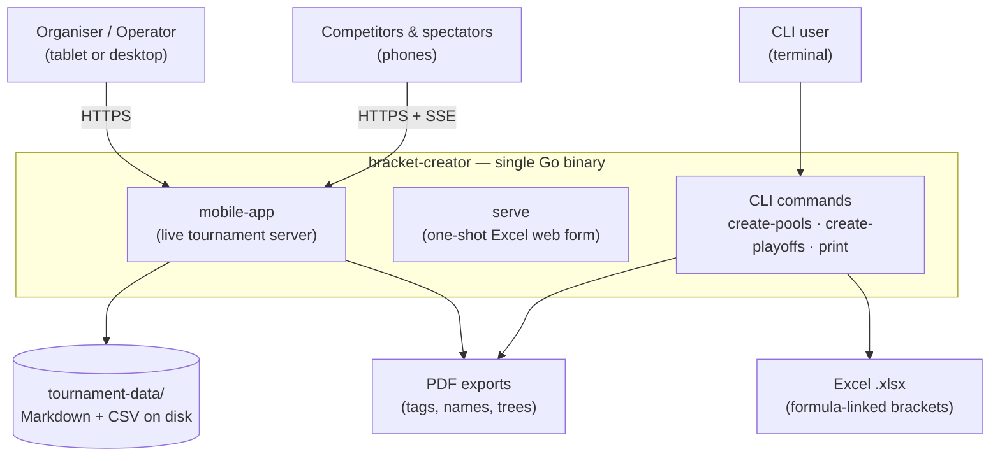
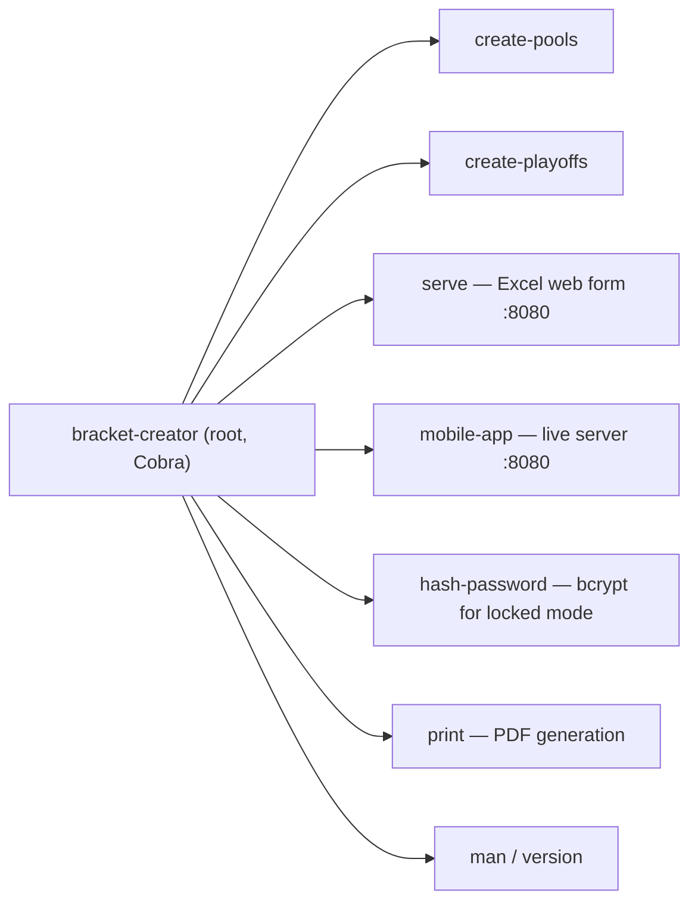
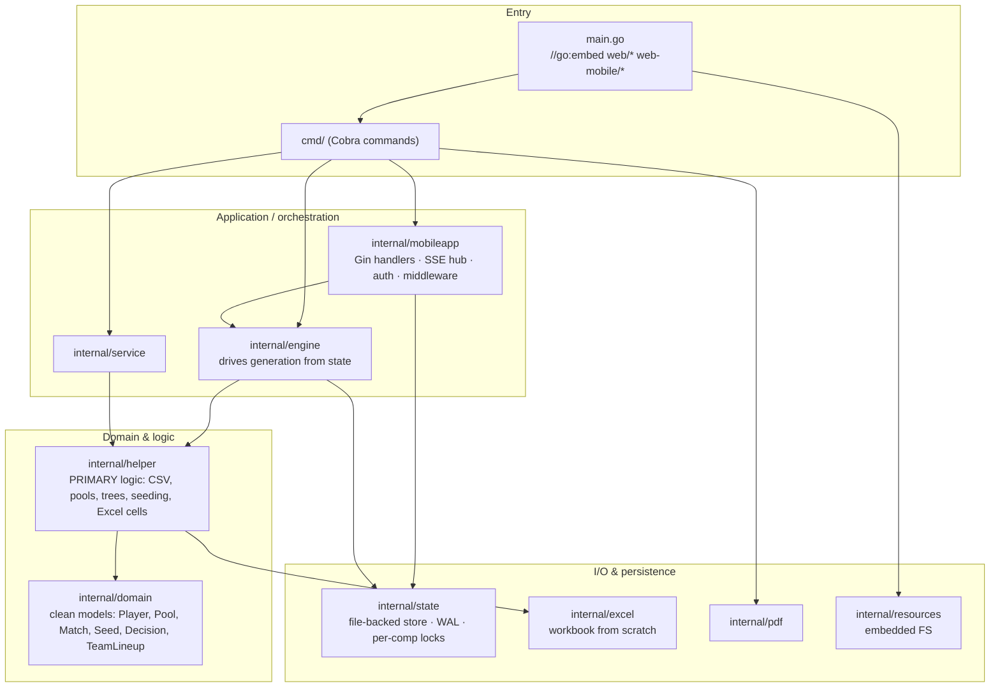
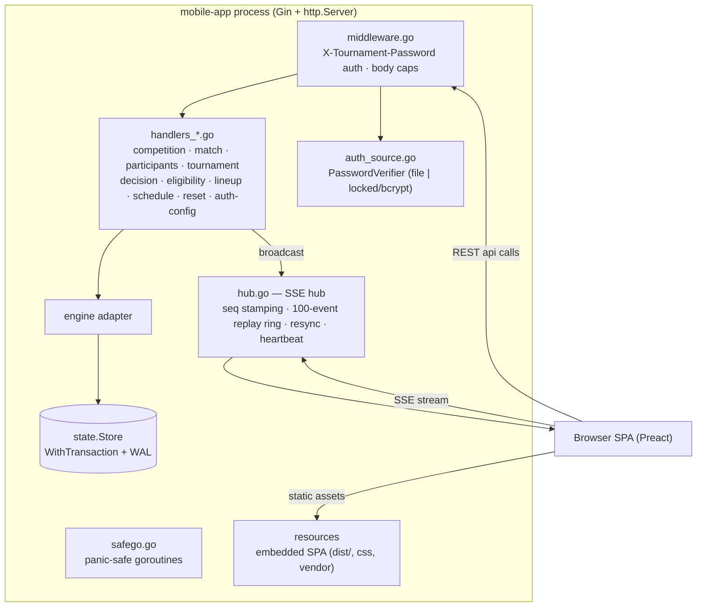
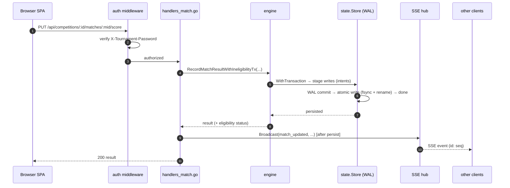
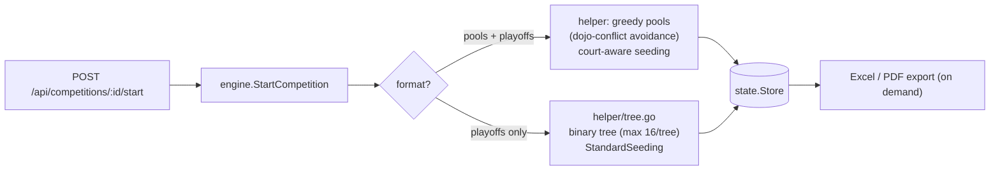
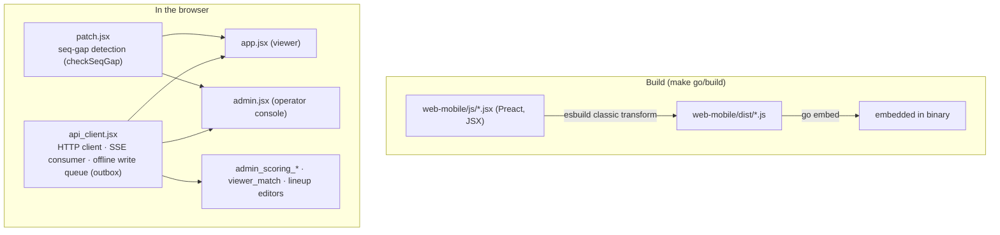

# Software architecture

How the bracket-creator codebase is organised: a single Go binary that is both a **CLI**
(Excel bracket generator) and a **live tournament web app** (the `mobile-app` server), plus a
Preact frontend compiled into the binary.

> Related: [Network architecture](network-architecture.md) · [Infrastructure architecture](infrastructure-architecture.md) · [Connection resilience](../dev-guide/connection-resilience.md)

## 1. System context

The same binary ships the CLI, the legacy one-shot Excel web form (`serve`), and the
real-time tournament app (`mobile-app`). All web assets are embedded at build time, so there is
nothing to install beyond the binary itself.

## 2. Command surface (Cobra CLI)

Each command is an options struct with a `run()` method (`cmd/*.go`); `create-pools` and
`create-playoffs` share `cmd/shared.go`. `main.go` embeds the web assets and calls
`cmd.ExecuteWithResources(res)`.

## 3. Package layers

**Dual domain model (in transition).** `internal/helper` is where the real algorithms live —
its types carry Excel coordinates (`sheetName`, `cell`) tightly coupled to output generation.
`internal/domain` holds clean models being phased in gradually. Don't confuse the two.

| Package | Responsibility |
|---|---|
| `cmd` | Cobra commands; each an options struct with `run()` |
| `internal/helper` | CSV parsing, pool/match generation, binary-tree brackets, seeding, Excel rendering |
| `internal/domain` | Clean models + canonical decision/lineup rules |
| `internal/engine` | Thin adapter that drives `helper` generation from a `state.Competition`; scoring, eligibility, kachinuki, schedule estimate |
| `internal/state` | File-backed store (`tournament.md`, `competitions/<id>/config.md`, `participants.csv`); transactions + write-ahead log; per-competition locks |
| `internal/excel` | Excel lifecycle + `NewFileFromScratch` |
| `internal/pdf` | PDF exports (LibreOffice-backed) |
| `internal/mobileapp` | Gin HTTP handlers, SSE hub, auth middleware, `safeGo` |
| `internal/resources` | Embedded web-asset management |

## 4. The `mobile-app` server at runtime

Server hardening (constants in `cmd/mobile_app.go`): `ReadHeaderTimeout 10s`, `ReadTimeout 30s`,
`IdleTimeout 120s`, `MaxHeaderBytes 1 MB`, **`WriteTimeout 0`** (SSE streams are infinite —
per-request cancellation runs via the request context), graceful shutdown 30s with
`Hub.Close` wired through `RegisterOnShutdown`. Every handler-spawned goroutine uses `safeGo`
(Gin Recovery only catches the request goroutine).

## 5. Write path — recording a score (ACID + broadcast)

Core invariant (project constitution): **persist then broadcast** — a write is durable
(`fsync` + atomic rename, WAL for multi-file changes) before the 200 and before any SSE
fan-out. Scoring is ACID; a legitimate operator change is never dropped.

## 6. Bracket generation (engine → helper)

## 7. Frontend (Preact SPA)

The operator console is a tablet/desktop surface; the viewer is mobile-first. The client's
**offline write queue, SSE resume, and reconnect resilience** are documented separately in
[Connection resilience](../dev-guide/connection-resilience.md) and depicted in
[Network architecture](network-architecture.md).

## Key design rules (see also [`CLAUDE.md`](https://github.com/gitrgoliveira/bracket-creator/blob/main/CLAUDE.md) and [`DESIGN.md`](https://github.com/gitrgoliveira/bracket-creator/blob/main/DESIGN.md))

- **Persist before broadcast**; scoring is ACID; never drop a legitimate operator change.
- **Use layout/sheet constants** (`internal/helper/constants.go`), never string literals.
- **`errcheck` is enforced** in production code — propagate or log, never `_ =`.
- **Aka (Red) / Shiro (White) are positional**, distinguished by treatment, not hue alone.
