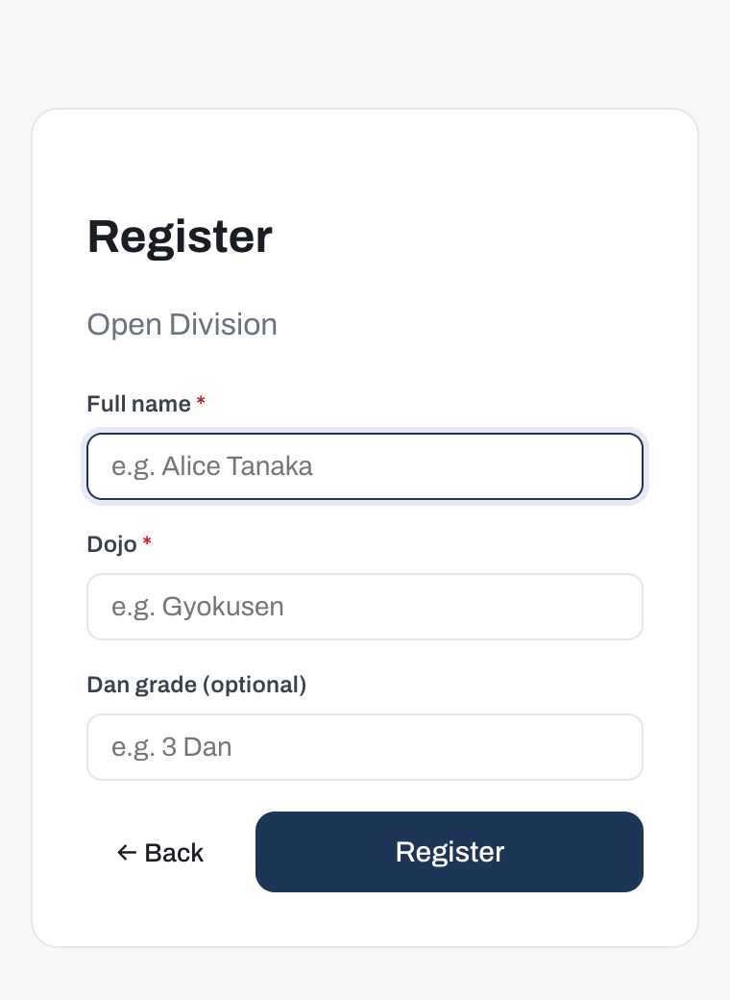
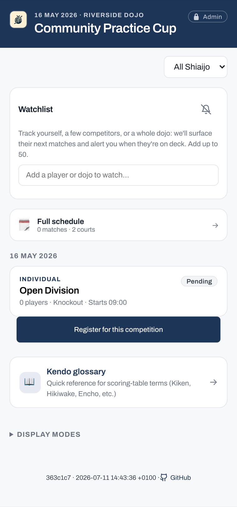

# Take part in a self-run tournament

A self-run tournament lets competitors and table helpers run and score their own matches with no admin password; the organiser turns this on when creating the tournament. For the full rules of self-run and officiated modes, see [Operating modes](../organisers/operating-modes.md).

The steps on this page apply only to a self-run tournament. In an officiated tournament, an operator carries out these actions for you.

## Register yourself

When the tournament is self-run, a public self-registration page is open for individual competitions while they are still in setup, before the organiser generates the draw. Open the registration page on your own device and enter your details to join a competition.

{ .bc-phone }

!!! note
    Self-registration is not available for team competitions; the organiser adds the team roster directly. It also closes once the draw is generated. In an officiated tournament, the registration page is not available at all, and the organiser adds you to the competition directly.

## Check in on the day

If the competition uses check-in, mark yourself present before the organiser generates the draw. Self-run mode does not require a password for this: open the competition from the dashboard and mark yourself present in the participant list. Competitors who have not checked in are excluded from the draw.

## Report your own score

You can record your match result directly from the public viewer, without the admin password. A result you enter is tagged as self-reported; a result entered by an operator is tagged as admin.

Only everyday match outcomes are available to self-reporters. Decisions that require an official ruling remain with the operator, and so do destructive actions such as editing the roster. For a full list of outcomes and what they mean, see [Recording decisions](../court-operators/recording-decisions.md).

## Follow your matches and standings

To track your progress, view the draw, and see standings, see [Following a tournament](../spectators/following.md).

{ .bc-phone }
