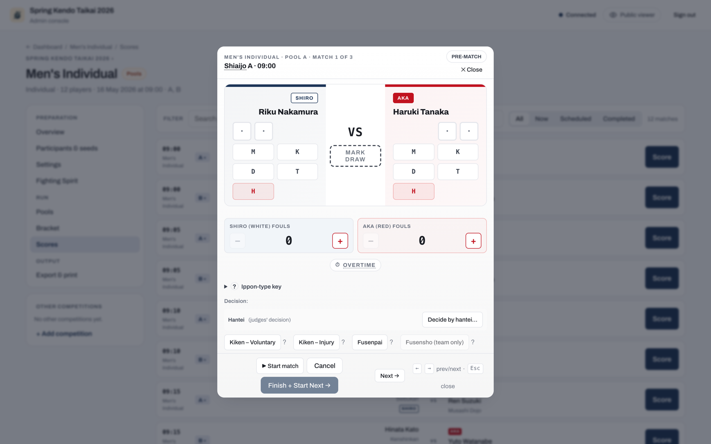

# Record match decisions

Not every bout is decided on points. The score editor records the kendo outcomes described here. Open the score editor from the **Scores** tab on a competition page, or from a match card in the court console (see [Score a match](scoring-a-match.md)).

## Kiken (withdrawal)

Kiken covers two distinct situations with different consequences.

### Voluntary withdrawal (FIK Article 31)

A voluntary kiken is permanent. The competitor takes no further matches in this competition and cannot be reinstated.

### Injury withdrawal (FIK Article 30)

An injury kiken can be reinstated later by the operator if the competitor recovers and is fit to continue. Until reinstated, the competitor is blocked from starting any further match.

## Fusenpai and fusensho

**Fusenpai** is a no-show default loss: the competitor who did not appear forfeits the match.

**Fusensho** is a per-bout default win, used in team matches when the opposing team fields a vacant position.

## Hikiwake

A hikiwake is a draw. It applies in pool, league, and Swiss matches (not in the knockout phase) and contributes to the standings separately from wins and losses.

## Daihyosen

A daihyosen is a representative bout used to break a tie when points and ranking criteria cannot separate two teams.

It applies in two situations:

- In the knockout phase, when a team encounter finishes level.
- In team pool or league play, when two teams finish equal on every ranking criterion and the tie decides who advances or how they are seeded.

A tie that does not affect advancement is left as a shared rank with no extra bout. In league play, running the daihyosen is the operator's choice rather than an automatic step; see [Team standings and tie-breaks](../organisers/team-tournaments.md#team-standings-and-tie-breaks) for both options.

The bout is a single-point ippon-shobu with no time limit, between one representative from each tied team. The score editor lets you pick each team's representative from its roster. On the court console, the bout appears with a **DH** tag. In pool and league standings, the team that won its daihyosen carries a **DH** badge.

## Chusen (drawing lots)

Chusen is the last resort when two or more tied teams have played a round of daihyosen and the bouts still do not produce a strict order (for example, a cycle where each team beats another, an all-drawn round, or two teams finishing level on daihyosen wins).

When chusen is required, the **Pools** tab (labelled **League** for league competitions) shows a **"Chusen (drawing lots) required"** panel listing the tied teams. Draw lots offline, enter each team's finishing position in the panel, and record it to settle the order and let the competition advance.

Chusen is the only place ranks are set by hand, and it happens only when the bouts themselves cannot decide the order.

## Competitor eligibility after a decision

A kiken or fusenpai marks the competitor who withdrew or did not appear as ineligible for further matches. The app blocks starting an ineligible competitor, so a withdrawn competitor cannot silently re-enter the draw. An injury kiken (FIK Article 30) can be reversed: once the operator reinstates the competitor, the eligibility block is lifted and they can fight again.
