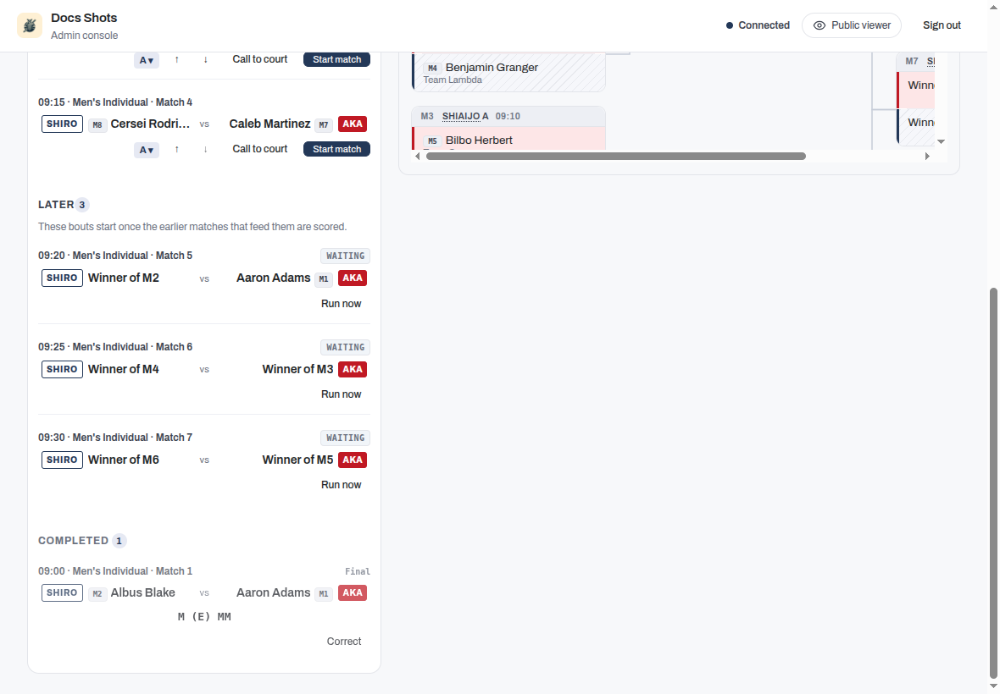
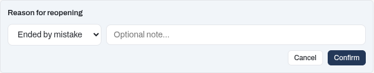

# Score a match

The court console at `/admin/shiaijo/<court>` (linked from the dashboard under **Shiaijo operator views**) is your primary surface for running bouts at a single court. It shows that court's current and upcoming matches with their match numbers, and keeps the scoring flow chained to the same court throughout the session. It also prompts you to switch to whichever competition needs the court next.

## Enter scores

Open a match from the Upcoming list to start scoring it; the score editor opens inline within the court console. For outcomes that are not decided on points (withdrawals, no-shows, draws, and representative bouts), refer to [Record match decisions](recording-decisions.md).

!!! tip
    In self-run events, competitors or table helpers can record their own scores without the admin password. Refer to the [Competitor self-run guide](../competitors/self-run.md) and [Operating modes and access control](../organisers/operating-modes.md) for how that works.

On a laptop you can score without the mouse. When scoring an individual match or a kachinuki bout, press **M**, **K**, **D**, **T**, or **H** to award that strike to Shiro (White). Hold **Shift** with the same key to award it to Aka (Red). **Left** and **Right** move to the previous or next match on the court, and **Esc** closes the editor. On a tablet, use the on-screen buttons.

To take back a strike, tap the scored mark itself in the centre of the board. The editor says so while any mark is scored: under the marks on an individual match, and once above the first bout on a team match. Taking one back frees a cell, and the next strike you award fills it. Take both back and the next two strikes fill the cells in the order you award them, from the outside in.

## Send a match back to the queue

If you start the wrong bout, use **Send back to queue** on the running match. The action clears any partial score, removes the match from the active view, and returns it to the Upcoming list so the correct match can start.

!!! note
    Send back to queue only works on a running, unfinished match. A completed, scored match is not affected. To fix a result that has already been recorded, use **Correct** on the match in the Completed list (refer to [Correct a completed result](#correct-a-completed-result)).

## Correct a completed result

Once a match is scored it moves to the **Completed** list on the court console, and each row carries a **Correct** button. You do not have to leave the console to fix a mistake. Correct opens the finished match back in the score editor, even while the next match is already running on the same court.

What Correct offers depends on the format:

- For most matches, the editor reopens with the recorded scores ready to edit. Adjust the ippons, fouls, or winner, then use **Save correction**. A short reason is required so the change stays traceable.
- For a kachinuki team encounter, the editor shows the recorded bouts with a **Reopen match** button. An encounter that ended with a withdrawal or a no-show shows **Clear withdrawal and reopen** instead; refer to [Correcting a withdrawal recorded by mistake](recording-decisions.md#correcting-a-withdrawal-recorded-by-mistake). Reopen is immediate: one tap returns the encounter to running with its bout log intact, so you can carry on or fix a bout. A reason is still kept with the result, but the app asks for it when you end the match again, not on the way back in. Correcting a mistake never costs you more than a tap.

    You are asked for that reason however you end it. If the encounter finishes with a withdrawal or a no-show instead of a scored bout, the kiken or fusenpai panel asks for the reason in the same way. The **Record** button stays unavailable until you give one.

    

    Ending it on a scored bout asks in the same dialog, with **Ended by mistake** offered as the first reason:

    

Reopening puts the encounter back into play, and a court can only run one match at a time. If another match is already running on that court, the editor names it and offers two ways forward. Leave it running, or clear its score, send it back to the queue, and reopen in a single step. Sending a match back to the queue clears any score already entered for it, so if that match is part way through, finish it first instead.

If the correction changes who won a knockout match, the later rounds update to follow the new winner. If the next match, or the bronze (3rd-place) match, has already been fought and scored, the app refuses the correction and names the match that is blocking it by its number and round, for example Match 3 (Final): the round is the heading of the bracket column you find it under. You can confirm anyway. Confirming applies the correction and reopens the named match where it is: its recorded result, including its bouts, is cleared, and the new pairing must be fought and scored again. The match was already played, so it stays where it is and nothing in the queue changes. A semifinal is the one case that names two matches at once, because it feeds both the final and the bronze match; confirming then reopens both. A round further on that nobody has played yet stops showing the winner of the reopened match. A round further on that has already been played is not changed yet: when you enter the result of the match you have just re-fought, the app asks you the same question again for that round, so you work forward one round at a time. A later slot that was only filled by a bye, and never fought, does not block a correction; it simply updates to follow the new winner. A match that is under way is not blocked or cleared either: it keeps what has been scored so far, now shown under the new competitor's name, and whoever is at the shiaijo finishes it as normal. When you are done, use **Back to court** to return to the live match.

### Correct a pool result after the knockout has started

In a competition that has pools and then a knockout, a pool result decides who goes through to the knockout. You can still correct it after its qualifiers have been placed in the bracket, even after they have fought there.

- If the correction does not change who holds any qualifying place in that pool, it is saved as usual.
- If it changes a qualifier whose knockout match has not been played yet, it is saved and the new qualifier takes the old one's place in the bracket.
- If it changes a qualifier who has already fought a knockout match, the app shows you who moves and which knockout match was fought before anything is saved, for example: "Changing this result moves Pool A's 1st place from Aoki to Sato, who takes Aoki's place in the knockout. Match 9 (Quarterfinals) was already fought with Aoki: it will be reopened, its result cleared, and it must be fought again." A knockout match is always named with its round, so it cannot be mistaken for the pool match you are correcting, which has its own Match 1, Match 2 and so on. Cancel to leave everything as it was, or choose **Apply and reopen**. The correction is then saved, the new qualifier is placed in that match, and the match is reopened where it is, to be fought and scored again. If a withdrawal decided that match, the competitor it barred can compete again. A later round that nobody has played yet stops showing the old winner. A later round that has already been played is not changed now: when you enter the result of the re-fought match, the app asks you about that round in the same way.
- If a knockout match that the change reaches is being fought right now, the correction is refused: "Match 9 (Quarterfinals) is being fought now. Finish it or send it back to the queue, then save again."
- If the correction leaves a qualifying place tied, that place goes back to waiting in the bracket until the tie-break is fought, and the tie-break winner is placed there. A knockout match on that place that was already fought is reopened, and it is fought again once the tie-break decides who holds the place.

A correction made while offline never carries a confirmation with it. If it reaches the server after a knockout match has been played with the old qualifier, it is not applied and you get a "Not saved" notice; make the correction again once you are online, and the app asks you then.

## Matches waiting on earlier results

A knockout final cannot be called until the earlier bouts that feed it are scored. While it is still waiting, it appears under a **Later** heading with a **Waiting** tag. Its competitors read "Winner of …" until the feeding bouts are known.

You cannot start a match that has no confirmed competitors. The Later heading lets you see that more play is scheduled for your court, so the queue never appears empty when further matches are still pending.

## Refresh the court view

If the console looks out of date (for example, a bout that finished on another court has not appeared yet), use **Refresh** in the header to re-pull this court's matches from the server. The console also refreshes automatically when it reconnects after a network drop.

## Run a match before results have synced

At a large event, the bouts feeding a final can run on other courts, and their results may take a moment to reach your console. If you already know who won those earlier bouts, open the waiting match's **Run now** action and record each winner. The match becomes startable immediately without waiting for the official result to arrive.

!!! note
    Recording a winner through **Run now** is provisional. If the official result arrives later and differs, the later result takes over.

## Score without a connection

The court console keeps working if it loses its connection to the server. You can finish scoring the bout in progress, and use **Run now** to resolve and start the next match, all while offline. Everything you enter is saved on the device and sent when the connection returns.

If two courts recorded different results for the same match while one was offline, the more recent change wins when they reconcile. The court whose result lost is told: a "Not saved" notice appears on the score editor and as an alert, explaining that a newer result is already recorded. When you see it, check what is recorded before re-entering anything. Do not re-enter your result, because a fresh entry counts as the newest change and would overwrite the result that won.

This applies to a correction as well. A correction you save while offline is held on the device like any other result, so it can reach the server long after you wrote it. If someone has changed that match in the meantime, your correction is refused rather than applied on top, and you get the same "Not saved" notice. Look at the current result first, since it may already be right. If it is not, correct it again from what is now recorded.

## Team matches and kachinuki

In a regular team match every bout is fought, so **Finish** does not record the encounter while a bout has no result. It names the bouts that still need one. Give each of them a score, a **Tie**, or a **Fusensho**. Every bout needs a result or a decision, whoever the lineups name. If only one team has a fighter for a position, record a **Fusensho** for that team. If neither team has a fighter for a position, record that bout as a **Tie**: it counts as an individual draw for both teams. **Save correction** follows the same rule.

A team match that ended with a withdrawal (**Kiken** or **Fusenpai**) is the exception. When you correct a bout fought before the withdrawal, **Save correction** saves the bouts you enter and keeps the withdrawal exactly as it was recorded: the same winner, and the same effect on the team's eligibility. The bouts nobody fought after the withdrawal are not left empty: they are credited to the other team as a default win, 2-0 each, exactly as a fusensho bout is scored; refer to [Fusenpai and fusensho](recording-decisions.md#fusenpai-and-fusensho). An individual match corrected after a withdrawal works the same way: the withdrawn competitor's points you enter are saved, and the winner's default-win circles and the withdrawal are kept. If the withdrawal itself was recorded against the wrong team, open **Withdrawal or no-show** in the same editor and record it again for the other team. If nobody withdrew, choose **Clear withdrawal and reopen**: the match goes back to in progress with the bouts already fought kept, the team is eligible again, and you score the remaining bouts and finish it. For both fixes, refer to [Correcting a withdrawal recorded by mistake](recording-decisions.md#correcting-a-withdrawal-recorded-by-mistake).

Kachinuki team encounters are scored one bout at a time. Score the current bout, then use **Record bout** to keep going (the winner stays on and the next pairing is added) or **End match** to finish on the last scored bout. You decide when the encounter is over, so end it when a team is out of fighters or when the other team's Taisho has been beaten.

On a tied bout you also decide what the tie means, according to the [kachinuki mode](../organisers/team-tournaments.md#kachinuki-modes) in force:

- **Record bout** retires both fighters. Under the taisho rule a Taisho who draws stays on, and **Record bout** pairs them with the next opponent automatically.
- **Encho** keeps the same pair fighting when the pairing must produce a result. It is available in any stage.
- **End match** records a drawn encounter in pools or leagues. In a knockout a tied last bout cannot end the match, so continue with **Record bout** or **Encho**.

If you finish too early, open the completed match and use **Reopen match** to carry on. Reopening takes a single tap; you are asked for a reason when you end the match again. The bouts you have already fought stay on screen as read-only rows above the current bout. The encounter reads like a regular team sheet, and you can check the winner-stays-on order at a glance. **× Remove this bout** takes back an unscored pairing the app added by mistake without ending the encounter.

To fix a bout you have already recorded, tap its row: it reopens in place with the scoring controls. If your change flips who won, the app flags the later bouts for you to check. Refer to [Scoring a kachinuki encounter](../organisers/team-tournaments.md#scoring-a-kachinuki-encounter) for the full flow.

