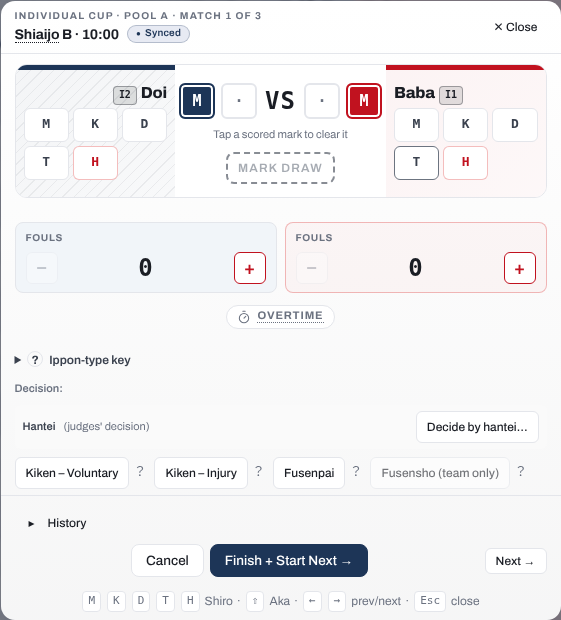
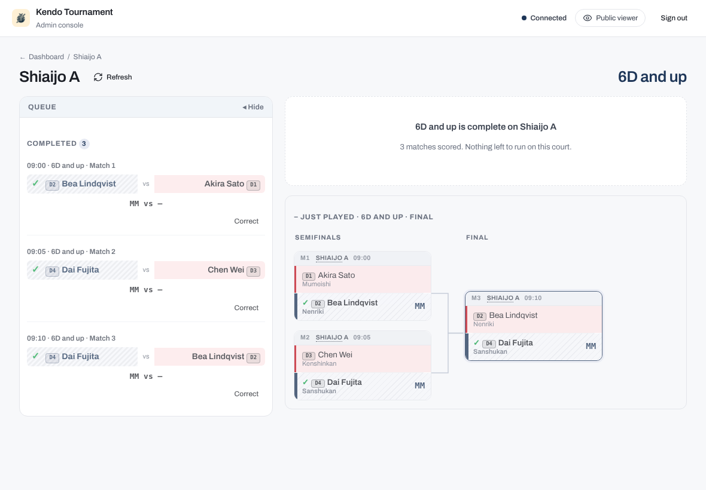

# Score a match

The court console at `/admin/shiaijo/<court>` (linked from the dashboard under **Shiaijo operator views**) is your primary surface for running bouts at a single court. It shows that court's current and upcoming matches with their match numbers, and keeps the scoring flow chained to the same court throughout the session. When another competition also has matches on the court, for example one moved here from another shiai-jo, a quiet line names them ("1 Individual match also waiting on this court.") while yours still has matches to run. Once yours has none left here, it turns amber and prompts you to switch. Either way the console switches only when you tap it.

## Enter scores

Open a match from the Upcoming list to start scoring it; the score editor opens inline within the court console. For outcomes that are not decided on points (withdrawals, no-shows, draws, and representative bouts), refer to [Record match decisions](recording-decisions.md).

!!! tip
    In self-run events, competitors or table helpers can record their own scores without the admin password. Refer to the [Competitor self-run guide](../competitors/self-run.md) and [Operating modes and access control](../organisers/operating-modes.md) for how that works.

On a laptop you can score without the mouse. When scoring an individual match or a kachinuki bout, press **M**, **K**, **D**, **T**, or **H** to award that strike to Shiro (White). Hold **Shift** with the same key to award it to Aka (Red). **Left** and **Right** move to the previous or next match on the court, and **Esc** closes the editor. On a tablet, use the on-screen buttons.

Everything you enter on a running match is saved as you go, so closing the editor or moving to another match keeps it, even straight after a tap. Two things are only kept when you press **Finish** or save a correction: a **Mark draw** on a running match, and changes to a finished match. If you close the editor or move to another match with one of those not yet saved, the app asks first: **Discard changes** drops it, and **Cancel** keeps you on the match.

**Finish** also starts the next scheduled match automatically if one is available. If the next match cannot start for any reason (for example, one competitor is competing on another court), the Up next card shows why.

To take back a strike, tap the scored mark itself in the centre of the board. The editor says so while any mark is scored: under the marks on an individual match, and once above the first bout on a team match. Taking one back frees a cell, and the next strike you award fills it. Take both back and the next two strikes fill the cells in the order you award them, from the outside in.

### Match history

Every score editor has a **History** button under the board. It is closed until you open it, and opening it changes nothing on the match. It lists every save that reached the match, oldest first, in the order the changes were made: the time, what made it (the score sheet, a decision, a reopen, a send-back to the queue, a representative bout added or removed, and so on), and what it changed. A change that was kept rather than applied, because a newer change to the same thing was recorded first, is listed with what it would have set, for example "Kept in history: points, MK vs H" or "Kept in history: the result, Kiken – Voluntary by Aka". A save kept whole for one reason says so, for example "Not applied: older revision of this board", an earlier save from the same device that arrived after a later one, or "Not applied: a knockout match needs a winner", a change that would have left a finished knockout match level. A change that was recorded and later moved aside for the same reason is listed as "Later change moved to history" with "Moved to history: a knockout match needs a winner". The history is for the organiser and court operators: it does not appear on a competitor's score sheet in a self-run event.

## Send a match back to the queue

If you start the wrong bout, use **Send back to queue** on the running match. It is always offered, whatever has been scored. The match leaves the active view and returns to the Upcoming list so the correct match can start, and it keeps any score already entered: its points, fouls, overtime and, for a team match, its bouts. When you start it again, the score board opens where it left off. If a mark was entered by mistake, tap it on the board to take it back.

While a match waits in the queue, every screen shows it as not started, the court display and the public viewer included, even when it holds points. They appear again when the match is started.

Starting a different match from the Upcoming list works the same way: the match in progress goes back to the queue with its score, so if you switched by mistake, tap **Start match** on it to carry on.

In an engi match the flags are saved as you enter them once the match has started, so they are kept too.

!!! note
    Send back to queue only works on a running, unfinished match. A completed, scored match is not affected. To fix a result that has already been recorded, use **Correct** on the match in the Completed list (refer to [Correct a completed result](#correct-a-completed-result)).

## Correct a completed result

Once a match is scored it moves to the **Completed** list on the court console, and each row carries a **Correct** button. You do not have to leave the console to fix a mistake. Correct opens the finished match back in the score editor. It works while no match is running on the court. If one is, tapping **Correct** names that match and tells you to finish it or send it back to the queue first, then correct.

What Correct offers depends on the format:

- For most matches, the editor reopens with the recorded scores ready to edit. Adjust the ippons, fouls, or winner, then use **Save correction**. A short reason is required so the change stays traceable. A judges' decision (hantei) given to the wrong competitor is corrected by picking the other competitor's hantei button and then **Save correction**; the new decision replaces the old one.
- For a kachinuki team encounter, the editor shows the recorded bouts with a **Reopen match** button. An encounter that ended with a withdrawal or a no-show shows **Clear kiken and reopen** or **Clear fusenpai and reopen** instead; refer to [Correcting a withdrawal recorded by mistake](recording-decisions.md#correcting-a-withdrawal-recorded-by-mistake). Reopen is immediate: one tap returns the encounter to running with its bout log intact, so you can carry on or fix a bout. No reason is needed, and none is asked for when you end the match again, whether you finish on a scored bout or record a withdrawal or a no-show. Correcting a mistake never costs you more than a tap.

While a correction is open, **Start match** does not start another match: it tells you to save the correction or leave it with **Back to court** first. **Save correction** finishes it, and **Back to court** cancels it without saving. If a match is started on the court from another screen while you correct, the correction stays open and the running match is listed above it until you save or go back to the court.

Reopening puts the encounter back into play, and a court can only run one match at a time. On the court console nothing else is running while you correct, but when you correct from the Scores page another match may be running on that court. Then the editor names it and offers two ways forward. Leave it running, or send it back to the queue and reopen in a single step with **Queue it and reopen**. The match sent back keeps any score already entered for it and carries on from there when it is started again.

If the correction changes who won a knockout match, the later rounds update to follow the new winner. If the next match, or the bronze (3rd-place) match, has already been fought and scored, the app refuses the correction and names the match that is blocking it by its number and round, for example Match 3 (Final): the round is the heading of the bracket column you find it under. You can confirm anyway. Confirming applies the correction and reopens the named match where it is, with the new competitor in it: its winner is cleared, and its points and bouts are kept, so check them and take back any that no longer apply before you finish it again. The match was already played, so it stays where it is and nothing in the queue changes. A semifinal is the one case that names two matches at once, because it feeds both the final and the bronze match; confirming then reopens both. A round further on that nobody has played yet stops showing the winner of the reopened match. A round further on that has already been played is not changed yet: when you finish the match you have just reopened, the app asks you the same question again for that round, so you work forward one round at a time. A later slot that was only filled by a bye, and never fought, does not block a correction; it simply updates to follow the new winner. If the next match, or the bronze match, is being fought right now, the correction is refused and nothing is saved, for example "Match 3 (Final) is being fought now on Shiaijo A. Finish it or send it back to the queue, then save this correction again." Confirming cannot get past it. Sending the match back to the queue keeps its score. A later match that was sent back to the queue with points already scored takes the new competitor's name and keeps its points, so check them when you start it and take back any that no longer apply. When you are done, **Save correction** ends the correction, or use **Back to court** to cancel it without saving.

### Correct a pool result after the knockout has started

In a competition that has pools and then a knockout, a pool result decides who goes through to the knockout. You can still correct it after its qualifiers have been placed in the bracket, even after they have fought there.

- If the correction does not change who holds any qualifying place in that pool, it is saved as usual.
- If it changes a qualifier whose knockout match has not been played yet, it is saved and the new qualifier takes the old one's place in the bracket.
- If it changes a qualifier who has already fought a knockout match, the app shows you who moves and which knockout match was fought before anything is saved, for example: "Changing this result moves Pool A's 1st place from Aoki to Sato, who takes Aoki's place in the knockout. Match 9 (Quarterfinals) was already fought with Aoki: it will be reopened with its winner cleared and its points kept, and it must be finished again." A knockout match is always named with its round, so it cannot be mistaken for the pool match you are correcting, which has its own Match 1, Match 2 and so on. Cancel to leave everything as it was, or choose **Apply and reopen**. The correction is then saved, the new qualifier is placed in that match, and the match is reopened where it is with its points kept: check them, take back any that no longer apply, and finish it again. If a withdrawal decided that match, the competitor it barred can compete again. A later round that nobody has played yet stops showing the old winner. A later round that has already been played is not changed now: when you finish the reopened match, the app asks you about that round in the same way.
- If a knockout match that the change reaches is being fought right now, the correction is refused: "Match 9 (Quarterfinals) is being fought now on Shiaijo B. Finish it or send it back to the queue, then save this correction again."
- If the correction leaves a qualifying place tied, that place goes back to waiting in the bracket until the tie-break is fought, and the tie-break winner is placed there. A knockout match on that place that was already fought is reopened, and it is fought again once the tie-break decides who holds the place.

A correction made while offline never carries a confirmation with it. If it reaches the server after a knockout match has been played with the old qualifier, it is not applied and you get a "Not saved" notice; make the correction again once you are online, and the app asks you then.

## Matches waiting on earlier results

A knockout final cannot be called until the earlier bouts that feed it are scored. While it is still waiting, it appears under a **Later** heading with a **Waiting** tag. Its competitors read "Winner of …" until the feeding bouts are known.

You cannot start a match that has no confirmed competitors. The Later heading lets you see that more play is scheduled for your court, so the queue never appears empty when further matches are still pending.

## Refresh the court view

If the console looks out of date (for example, a bout that finished on another court has not appeared yet), use **Refresh** in the header to re-pull this court's matches from the server. The console also refreshes automatically when it reconnects after a network drop.

## Run a match before results have synced

At a large event, the bouts feeding a final can run on other courts, and their results may take a moment to reach your console. If you already know who won those earlier bouts, open the waiting match's **Run now** action and record each winner. The match becomes startable immediately without waiting for the official result to arrive.

!!! note
    Recording a winner through **Run now** is provisional. If the official result arrives later and differs, the later result takes over.

## Score without a connection

The court console keeps working if it loses its connection to the server. You can finish scoring the bout in progress, and use **Run now** to resolve and start the next match, all while offline. Everything you enter is saved on the device and sent when the connection returns.

While a result is held on the device, the score editor says "Not sent yet: saved on this device, and sent when the connection returns." The console moves on to the next match once you finish a bout, so the bar at the top of every admin page also counts what is held, for example "Offline: 1 result not sent", and the connection status beside it reads "Reconnecting…". When the connection returns and the held results reach the server, the count goes and a short message confirms it, for example "1 finished result sent." You do not need to do anything: keep scoring. A result you finish while the connection is working is sent at once, so neither appears.

If the browser cannot store what it holds (its storage is full), an alert says so, and the score editor says "Not sent yet: keep this page open until the connection returns." instead. The result is then held in that page only: closing or reloading the page loses it, so keep the page open until it is sent.

Results held on the device are kept however long they wait, and each is sent on its own: a held result never holds back another, and a result you enter while one is held is sent at once. The server puts them in the order you made them, whatever order they arrive in. If you finish a match while offline and then tap again on the same match, both are kept: the later tap never replaces the finish. A decision and a score for the same match are both kept too. If the server refuses a held result when it is finally sent, you are told, with the reason; it is never treated as saved.

If the server keeps failing a held result (an error on every attempt), it is still tried again, the bar at the top reads "Not saving: 1 result" and an alert says so. Your other results are still sent. Its score editor then says "Not saved yet: the server keeps refusing it. It is still being tried." If it never goes through, open that match: its score editor shows **Discard held result** beside that line. After you confirm, that result alone is discarded and nothing else is. Check the match, and enter the result again if it is still needed.

The count in the bar at the top is also a button. Tap it to see everything held on the device: each item names its competition and match (or team, for a lineup), what it is (a score update, a finished result, a decision, a winner set by hand, or a team lineup) and whether it is waiting to be sent, waiting for you to sign in, or the server keeps refusing it. An item the server keeps refusing has a **Discard** button, which works the same way: after you confirm, that item alone is discarded. Use it for anything held that has no score editor of its own to offer it, such as a lineup or a winner set with **Run now**. An item that is only waiting for the connection cannot be discarded: it is sent when the connection returns.

Nothing you enter is thrown away, and changes are put in the order they were made, not the order they arrive. Each save says what it changed: the points, the result, the overtime, the flags, or one bout of a team match. If two courts changed the same match while one was offline, changes to different things both apply, for example one court's points and the other's overtime. Only where both changed the same thing does the more recent change apply. The other one is kept in the match's history rather than applied (refer to [Match history](#match-history)).

The court whose change was kept rather than applied is told. When none of a save applied, a "Not applied" notice appears on the score editor and as an alert. It says that a newer change to the same thing was recorded first, and that this one was kept in the match's history, so nothing is lost. When you see it, check the match and its history before entering anything again. Do not simply re-enter your result: a fresh entry counts as the newest change and would replace the one that was recorded first. When only part of a save was kept, the rest applies as usual and a short note in the editor names what was kept, for example "Kept in the match's history, not applied: points. A newer change to the same thing was recorded first."

A finished knockout match needs a winner. A change that would leave one level, for example a point added to the loser that ties the score, is not applied: the match keeps the result it was finished with, and the change is kept in the match's history. The score editor says "Not applied: this change would leave the finished match without a winner, and it needs one, so it was kept in the match's history and nothing is lost. Correct the result with a winner." When only part of the save was held, the note in the editor ends "It would leave the finished match without a winner, and it needs one: correct the result with a winner." Correct the result so that one competitor wins. An engi result likewise stays as it is when a change would leave it with no valid flag count. In a pool or league match the same change is applied and the match becomes a draw.

A match closed with a kiken, fusenpai, or fusensho (a withdrawal, or a fusensho recorded for a competitor barred elsewhere) keeps that result too. Points or overtime sent for it by a court still scoring the match, for example from a device that was offline when the match was closed, are not applied: the result stands. The match's history records the held change with the reason, for example "a fusensho closed this match", shown there as "Not applied: a fusensho closed this match". The score editor on that court says "Not applied: this match was closed with a fusensho, so this change was kept in the match's history and nothing is lost. To change the result, correct the fusensho from the match's score editor." When only part of the save was held, the note ends "This match was closed with a fusensho: to change the result, correct the fusensho from the match's score editor." To change that result, open the match's score editor and correct the decision there, not through further scoring.

The same rule holds the other way round. If a finish made earlier reaches the server after a later change to that match was already recorded, for example a finish held on a device that was offline, and that later change would leave the finished match level, the finish is recorded and the later change is moved to the match's history. The court that sent the finish sees "Saved. A later change to points would have left the finished match without a winner, so it was moved to the match's history." There is nothing to correct: the match has the result it was finished with, and the history lists the moved change as "Moved to history: a knockout match needs a winner". If that later change was right after all, correct the result as usual.

This applies to a correction as well. A correction you save while offline is held on the device like any other result, so it can reach the server long after you wrote it. If someone has changed the same thing on that match in the meantime, your correction is kept in the match's history rather than applied on top, and you get the same "Not applied" notice. Look at the current result and its history first, since it may already be right. If it is not, correct it again from what is now recorded.

## Team matches and kachinuki

In a regular team match every bout is fought, so **Finish** does not record the encounter while a bout has no result. It names the bouts that still need one. Give each of them a score, a **Tie**, or a **Fusensho**. Every bout needs a result or a decision, whoever the lineups name. If only one team has a fighter for a position, record a **Fusensho** for that team. If neither team has a fighter for a position, record that bout as a **Tie**: it counts as an individual draw for both teams. **Save correction** follows the same rule.

A team match that ended with a withdrawal (**Kiken** or **Fusenpai**) is the exception. When you correct a bout fought before the withdrawal, **Save correction** saves the bouts you enter and keeps the withdrawal exactly as it was recorded: the same winner, and the same effect on the team's eligibility. The bouts nobody fought after the withdrawal are not left empty: they are credited to the other team, 2-0 each, exactly as a fusensho bout is scored; refer to [Fusenpai and fusensho](recording-decisions.md#fusenpai-and-fusensho). An individual match corrected after a withdrawal works the same way: the withdrawn competitor's points you enter are saved, and the winner's circles for that decision and the withdrawal are kept. If the withdrawal itself was recorded against the wrong team, open **Withdrawal or no-show** in the same editor and record it again for the other team. If nobody withdrew, choose **Clear kiken and reopen** (or **Clear fusenpai and reopen**): the match goes back to in progress with the bouts already fought kept, the team is eligible again, and you score the remaining bouts and finish it. For both fixes, refer to [Correcting a withdrawal recorded by mistake](recording-decisions.md#correcting-a-withdrawal-recorded-by-mistake).

Kachinuki team encounters are scored one bout at a time. Score the current bout, then use **Record bout** to keep going (the winner stays on and the next pairing is added) or **End match** to finish on the last scored bout. You decide when the encounter is over, so end it when a team is out of fighters or when the other team's Taisho has been beaten.

On a tied bout you also decide what the tie means, according to the [kachinuki mode](../organisers/team-tournaments.md#kachinuki-modes) in force:

- **Record bout** retires both fighters. Under the taisho rule a Taisho who draws stays on, and **Record bout** pairs them with the next opponent automatically.
- **Encho** keeps the same pair fighting when the pairing must produce a result. It is available in any stage.
- **End match** records a drawn encounter in pools or leagues. In a knockout a tied last bout cannot end the match, so continue with **Record bout** or **Encho**.

If you finish too early, open the completed match and use **Reopen match** to carry on. Reopening takes a single tap, and ending the match again asks for no reason. The bouts you have already fought stay on screen as read-only rows above the current bout. The encounter reads like a regular team sheet, and you can check the winner-stays-on order at a glance. **× Remove this bout** takes back an unscored pairing the app added by mistake without ending the encounter.

To fix a bout you have already recorded, tap its row: it reopens in place with the scoring controls. If your change flips who won, the app flags the later bouts for you to check. Refer to [Scoring a kachinuki encounter](../organisers/team-tournaments.md#scoring-a-kachinuki-encounter) for the full flow.

