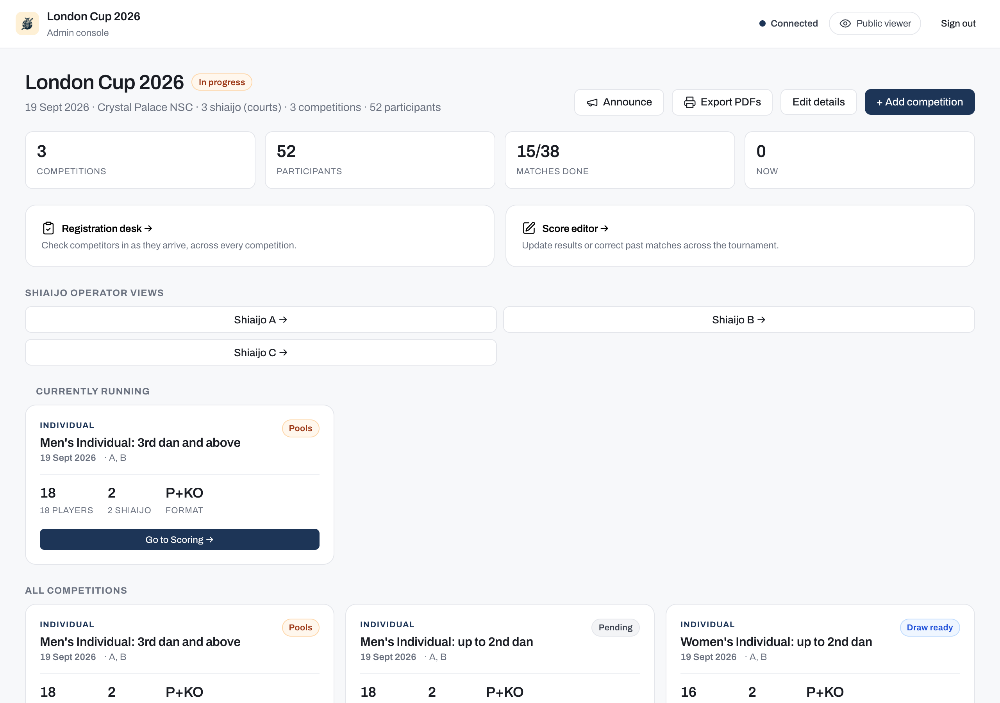
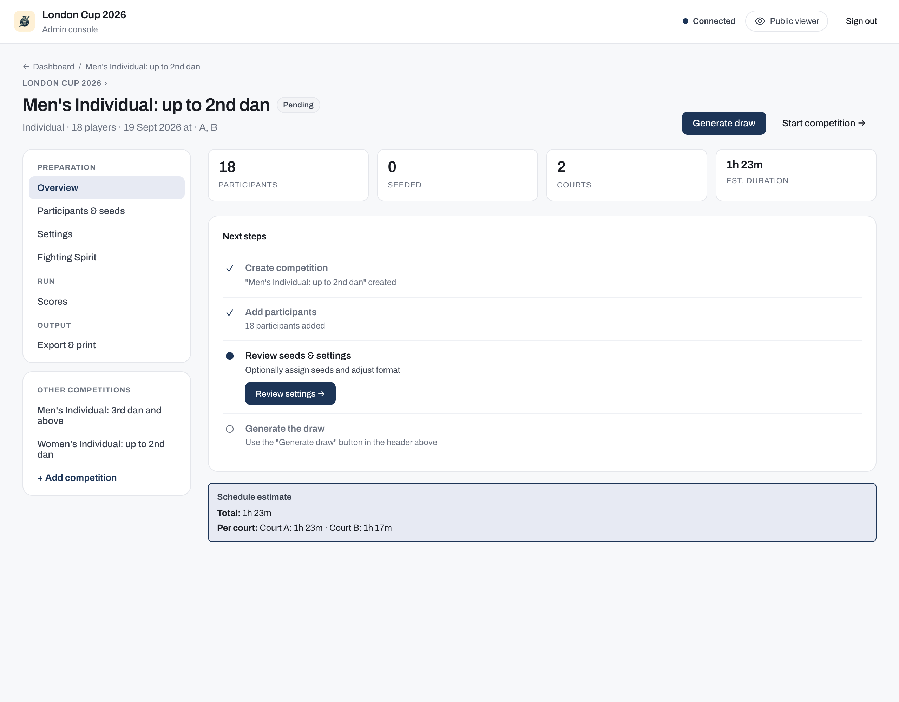
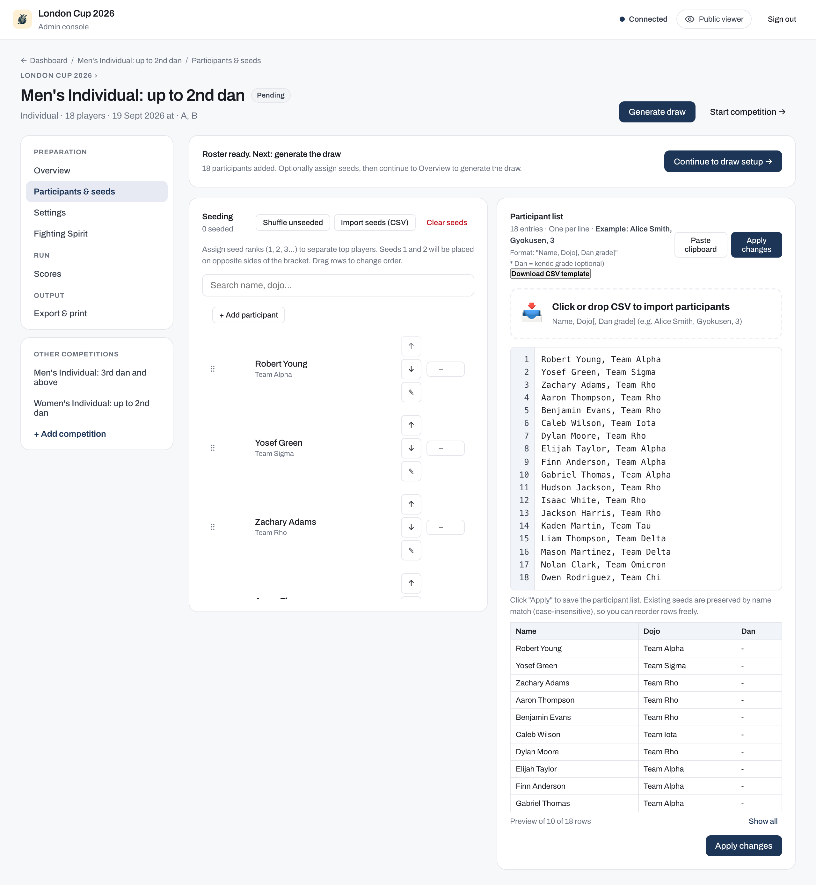
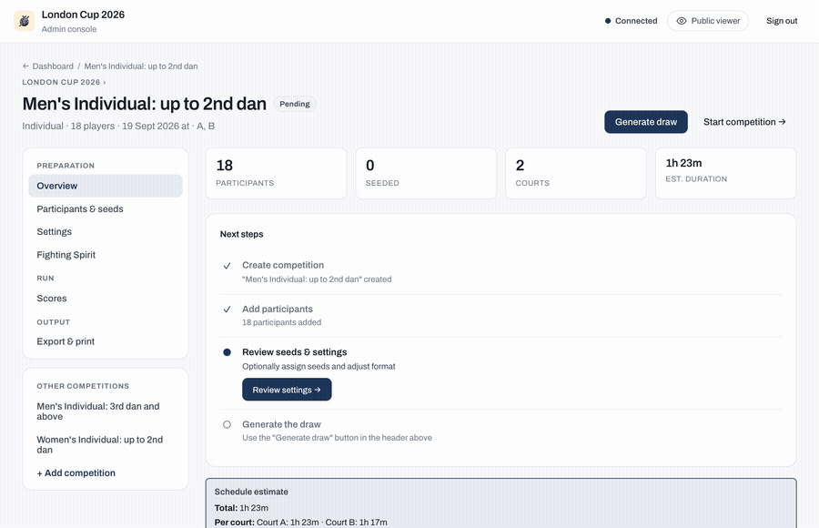
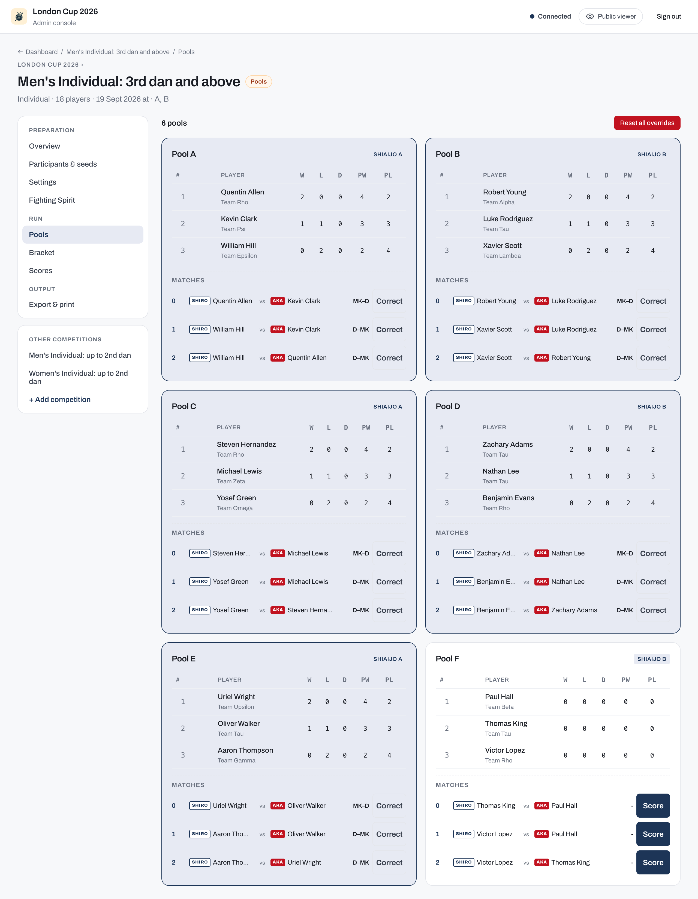

# Mobile tournament app

The `mobile-app` command starts a real-time tournament management server for use **on the day of the tournament**. Any device on the same network can open the URL to view real-time results or (with the admin password) manage pools and scores.

## Start the server

```bash
bracket-creator mobile-app --folder ./tournament-data
```

You can also supply the `--folder` and `--port` flags as environment variables (useful for systemd units, Docker, or any deploy not started with `make`):

```bash
TOURNAMENT_DATA_DIR=/path/to/data PORT=8082 bracket-creator mobile-app
```

| Flag | Env var | Default |
|------|---------|---------|
| `--folder` / `-f` | `TOURNAMENT_DATA_DIR` | `.` |
| `--port` / `-p` | `PORT` | `8080` |
| `--bind` / `-b` | `BIND_ADDRESS` | `localhost` |
| (none) | `API_RATE_LIMIT` | `5000` |
| (none) | `API_RATE_LIMIT_BURST` | `10000` |

An explicit flag always wins over the env var.

Or with the Makefile:

```bash
make run-mobile
PORT=8082 make run-mobile                        # custom port
TOURNAMENT_DATA_DIR=/path/to/data make run-mobile
```

Open [http://localhost:8080](http://localhost:8080) in your browser (or share the LAN address with scorers).

## Run your first tournament

New to the app? This is the fastest path from a running server to live results on screen. Each step links to the detail further down; you don't need the rest of this page to get going.

1. **Start the server** and open it (see [Start the server](#start-the-server)). On an empty data folder the app's **Create tournament** flow sets the name, date, venue, number of shiai-jo, and the admin password.
2. **Create a competition** from the dashboard: choose individual or team, and a format (playoffs, mixed, league, or Swiss).
3. **Add competitors.** In the competition's setup, paste a newline-separated roster into the participant panel and click **Apply changes** ([participant setup](#the-participant-setup-view)).
4. **Generate the draw**, check the preview, then **Start competition** ([draw preview](#the-draw-preview-status-draw-ready-workflow)). Matches now appear to scorers and to the public viewer.
5. **Enter a score** from the **Scores** tab ([pools](#pools)).

!!! tip "The moment it clicks"
    Open `http://localhost:8080` on a second screen (a scoreboard TV, a phone) with no password. As a scorer records a result, the pool standings and bracket update there **live, with no refresh**. That shared real-time picture is the whole point of running the app on the day.


The rest of this page is reference: [authentication and security](#admin-authentication), the full setup and check-in options, the Swiss flow, scheduling, and the on-disk [data format](#data-format). Reach for it when you need it, not before.

## Who uses what

A tournament has several audiences and roles, and each maps to a different surface of the app. These needs come from [Running a Kendo Tournament](https://github.com/gitrgoliveira/bracket-creator/blob/main/running_a_kendo_tournament.md#information-needs-by-audience) (on GitHub).

| Who | What they need | Where in the app |
|-----|----------------|------------------|
| **Competitors and teams** | their next match, and roughly how many bouts until it | Public viewer: add yourself to the **Watchlist** for an on-deck alert; your competition's schedule shows the bouts ahead of yours |
| **Coaches** | when their players or a whole dojo fight; results so far | Public viewer: watch a player or a dojo on the Watchlist; recent results per competition |
| **Spectators** | who is fighting where, with live scores | Public viewer: the all-shiai-jo schedule and live standings |
| **Referees and the two competitors** | the agreed live score for the bout in front of them | The court **scoreboard** on a TV: `/display?court=A` |
| **Lobby / outside screen** | progress across every court at a glance | A TV on `/display?court=all` (all courts) |
| **Stream / broadcast viewers** | player names and the live score over the video | The **overlay** `/display?court=A&overlay=true`, keyed into OBS / vMix as a browser source |
| **Table operator** | record results for their court | Admin: the court's shiai-jo operator view and the score editor |
| **Court manager** | call competitors, watch the queue | Admin: the shiai-jo view (current match plus the upcoming queue) |
| **Tournament manager** | oversee all courts; set times, move matches | Admin: the [dashboard](#dashboard) and the [Tournament schedule](#tournament-schedule) |

The public surfaces (viewer, displays) need no password; the operator and manager surfaces sit behind the [admin password](#admin-console).

## Public viewer

The default view needs no password: it is the one screen **competitors, coaches, and spectators** share. It shows:

- A personal **Watchlist**: track yourself, specific competitors, or a whole dojo, and get an on-deck nudge as a watched match approaches, so players know when to warm up and coaches know when to be matside.
- The full match schedule across all shiai-jo, filterable by player or team. The free-text filter also matches a competitor's assigned number or tag (for example "A1"), so you can jump straight to a competitor's bouts by their tag.
- Pool standings updated in real time as scores are entered.
- The elimination bracket as it fills in.


Tap a competition to drill into its schedule, pool standings, and bracket. Aka (red) and Shiro (white) sides are colour-coded throughout.


### Scoreboards and court displays

Each shiai-jo runs **one digital scoreboard** on a TV or projector: a court-scoped display (no password) showing the live score for the current bout. It is read by the **referees** (confirming it matches their calls), the **two competitors**, the **scoring operator** (a check against what they entered), and spectators at that court. A separate all-courts view is the **outside / lobby screen** from the tournament guide, the progress board for everyone waiting to fight.

- `/display?court=A` shows a single court's current match, upcoming queue, and recent results.
- `/display?court=all` shows every court at once, for a lobby or overview screen.
- Add `&overlay=true` for a transparent variant you key into a live stream as a browser source (OBS, vMix, or similar), so online viewers see player names and the live score over the video.


If the venue Wi-Fi drops, the court scoreboard keeps updating as long as the scoring tab for that court stays open on the same computer: the operator's entries reach the board directly. A small status dot appears in the top corner only when the connection is degraded. Amber means the board is being fed by the court's own scoring computer while the link to the server is down. Red means no updates are getting through, so the board may be out of date until the connection returns. When everything is healthy no dot is shown.

## Admin console

Click **Admin** and enter the tournament password to access the admin console. How the password is stored is set by the [authentication mode](#admin-authentication) (file or locked); *who is allowed to act* is set by the [tournament mode](#tournament-mode-officiated-or-self-run).

### Tournament mode: officiated or self-run

Every tournament is created in one of two **modes**, which decide who may run and score matches. The mode is chosen once during **Create tournament** and **cannot be changed afterward**. (This is separate from the file and locked [authentication modes](#admin-authentication), which only control how the admin password is stored.)

- **Officiated** (default): the admin password gates the **whole** operator surface. Scoring, check-in, and drawing or starting competitions all happen behind the password, so every result is recorded as entered by an operator.
- **Self-run**: constructive actions, **scoring, check-in, starting and completing competitions**, are **public** with no admin password, so competitors or table helpers can run and score their own matches. Only **destructive** actions (deleting a competition, editing the roster, discarding a draw) stay gated, behind the [destructive-ops password](#destructive-ops-password-second-password). Self-run also opens a public **self-registration** page where competitors enter themselves (that page returns 404 in officiated mode).

In self-run, each result records its provenance: a score entered by the public is tagged **self-reported**, while one entered by an operator (with the destructive-ops password) is tagged **admin**. In officiated mode every result is **admin**.

Three separate choices use the word *mode*, keep them apart: the **tournament mode** here (who may act), the [authentication mode](#admin-authentication) (how the admin password is stored), and the [digitization level](../index.md#three-ways-to-run-a-tournament) on the home page (how much equipment you use on the day).

!!! note
    In **file mode**, a self-run tournament must have a destructive-ops password set, otherwise destructive actions would have no gate at all.

### Admin authentication

**File mode** (default: local / private LAN use):

The admin password lives plaintext in `tournament-data/tournament.md`. Set it during the **Create tournament** flow, or edit the file directly. If you forget the password, browse to `http://<host>/reset` from any device on the same network and choose a new one (no old password required). The reset endpoint is intentionally unauthenticated and is the documented recovery path; for trusted networks this is convenient, and for internet-exposed deployments use locked mode.

**Locked mode** (recommended for any deployment reachable over the internet):

```bash
# 1) generate a bcrypt hash for your chosen password.
# hash-password reads from stdin without a prompt or echo masking;
# pipe from a secrets manager or here-doc rather than typing interactively.
printf '%s' "$MY_ADMIN_SECRET" | bracket-creator hash-password
# (the hash is printed on stdout; copy it)

# 2) start the server with --lock-password and the hash in the env
TOURNAMENT_PASSWORD_HASH='$2a$10$...' \
  bracket-creator mobile-app --lock-password -f ./tournament-data
```

In locked mode:

- The on-disk password in `tournament.md` is ignored.
- `POST /api/tournament/reset` returns 404. The SPA's `/reset` page still loads (it's part of the embedded SPA bundle) but renders an "operator-disabled" message instead of the form, and the AuthModal hides the "Forgot password?" link.
- Authentication compares the `X-Tournament-Password` header against the env-var bcrypt hash.
- Rotating the credential requires restarting the server with a new hash; the runtime never reads the env var twice.
- If `--lock-password` is set but `TOURNAMENT_PASSWORD_HASH` is empty or malformed, the server **refuses to start** (fail-closed, so a misconfigured deployment can't silently fall through to file mode).

The public `GET /api/auth-config` endpoint reports `{mode: "file"|"locked", resetEnabled: bool, elevatedRequired: bool, elevatedConfigured: bool, elevatedEditable: bool}` so SPAs and external monitoring can see the active mode (and whether the destructive-ops password gate is active) without authenticating.

### Destructive-ops password (second password)

You can require a **second, separately-held password** for destructive
actions, so that table staff who hold the main password can run matches and
check-in without being able to destroy data. The gate covers:

- Delete a competition; mark a competition invalid.
- Discard a generated draw; reset a competition's manual overrides (recorded chusen ranks and match winner overrides).
- Add, edit, or replace participants; import competitions from a folder.

It does **not** cover routine operations (scoring, decisions, check-in,
starting/finishing competitions, lineups) or the `/reset` recovery path.
When a gated action is triggered the admin UI prompts for the destructive-ops
password each time (no session is cached); the value is sent in an
`X-Admin-Password` header alongside the main `X-Tournament-Password`.

**File mode.** Set or change it from **Admin → Edit details → Destructive-ops
password**. The current value is never displayed (write-only) and is stored in
`tournament-data/tournament.md` under `admin_password`. Changing it once set
requires entering the current destructive-ops password. While unset, the
feature is off and destructive actions are gated by the main password only.
so existing file-mode deployments are unaffected until you opt in.

**Locked mode.** The destructive-ops password is the bcrypt hash in the
`TOURNAMENT_ADMIN_PASSWORD_HASH` env var (the elevated-credential analogue of
`TOURNAMENT_PASSWORD_HASH`); it is **not** editable from the UI. Generate it
the same way:

```bash
printf '%s' "$MY_DESTRUCTIVE_OPS_SECRET" | bracket-creator hash-password
TOURNAMENT_PASSWORD_HASH='$2a$10$...main...' \
  TOURNAMENT_ADMIN_PASSWORD_HASH='$2a$10$...destructive...' \
  bracket-creator mobile-app --lock-password -f ./tournament-data
```

> **Locked-mode behavior change.** In locked mode the destructive-ops gate is
> **always active and fail-closed**: if `TOURNAMENT_ADMIN_PASSWORD_HASH` is
> unset (or malformed), the gated endpoints return **503 "admin password not
> configured"** rather than allowing the action with the main password alone.
> A malformed/empty hash does **not** prevent startup; the server boots and
> only the destructive endpoints 503, so set the env var if your operators
> need to delete competitions or edit rosters on a locked deployment.

**Scope of protection.** This is a privilege-separation speed bump for
shared-credential operation, not a network-security control. Over plain HTTP
(the common LAN default) both passwords travel in cleartext; anyone with
filesystem access to `tournament.md` reads both in file mode. For a real
network boundary, run behind TLS and/or `--lock-password`.

### Operational notes

- **No rate limiting on `POST /api/tournament/reset`.** This reset endpoint is unauthenticated by design and the server does not throttle calls to it (the `/reset` page is just the SPA route that hosts the UI). On a trusted LAN this is fine (the legitimate operator is the only person at the keyboard); on any network where untrusted clients can reach the server, an attacker can grief the deployment by repeatedly POSTing new passwords and locking the operator out. **Always run with `--lock-password` for internet-exposed deployments**, or front the server with a reverse proxy that rate-limits `/api/tournament/reset`.
- **Mode switching preserves the stored password.** When you switch from file mode to locked mode, the password on disk in `tournament.md` is **not** erased; auth ignores it at that point. If you later switch back to file mode (drop `--lock-password`), the original password authenticates again. Treat this as a feature for rollback experimentation, but be aware that the on-disk credential remains discoverable by anyone with filesystem access. If you want to fully retire a file-mode password, run `POST /api/tournament/reset` to a value you don't intend to use before switching to locked mode.

### Dashboard

The dashboard lists all competitions. Each card shows the competition type, number of participants, format, and current status. Click a card to manage that competition.



### Tournament details and the public info page

Edit the tournament details from **Admin** to set the public-facing information attendees see: the venue address and a map link, opening and closing times, a link to the rules, an awards note, free-form info notes, and contact people. Setting the **public URL** here also enables the [QR codes on tags](#export-print) and shareable links. These fields populate a public **info page** in the viewer, so spectators have one place for the practical details of the day.

### Branding and sponsors

The same details screen lets you brand the tournament: upload a **logo** and set the **primary and accent colours**, and the public viewer and displays adopt them. You can also add an ordered list of **sponsor logos** that appear on the public tournament page. All of these are optional; with nothing set, the app uses its default kendo theme.

### Announcements

From the admin console you can **broadcast a short announcement** to every connected viewer (for example, "Lunch break until 13:00" or "Shiai-jo C is moving to the far hall"). Choose how long it stays up, **5, 10, 15, or 30 minutes**, and it clears itself automatically. The message appears as an overlay on the public viewer and the displays; viewers who allow browser notifications can also receive it in the background.

### Registration desk

The **Registration desk** (opened from the dashboard) is a cross-competition check-in surface for the welcome table. Instead of checking people in one competition at a time, it lists every competitor across the whole tournament so a helper can mark them present as they arrive. It complements the per-competition [check-in workflow](#optional-check-in-workflow).

### Shiai-jo court console

Each court has a dedicated operator console at `/admin/shiaijo/<court>` (linked from the dashboard's **Shiaijo operator views**). It shows that court's current and upcoming matches with their match numbers, keeps the scoring flow chained to the same court, and nudges the operator to switch to whichever competition next needs the court.

### Set up a competition

Each competition goes through a **Setup → Draw Preview (status `draw-ready`) → Live play (status `pools` or `playoffs`)** lifecycle. "Swiss" is a *format*, not a separate status; Swiss-format competitions run live under the `pools` status.



#### The participant setup view



The participant setup view places two panels side by side:

* **Check-in & Seeding panel** (titled **Seeding** when check-in is off, **Check-in & Seeding** when it is on): the working roster of all saved players.
    * When **Enable check-in** is turned on in the competition settings, each row gains a check-in check-box, and the panel adds a "Show unchecked" / "Show all" filter toggle plus a "Check in all" button.
    * The roster is drag-and-drop enabled: drag rows to assign seeding ranks, or type ranks manually in the seed column. A "Shuffle unseeded" button randomizes the starting positions of unseeded competitors, and "Import seeds (CSV)" / "Clear seeds" manage ranks in bulk.
* **Participant list panel** (titled **Team list** for team competitions): contains a `LinedTextarea` with line numbers where operators paste newline-separated CSV participant rosters, plus a "Paste clipboard" helper that converts tab-separated values (for example, from Excel) to CSV.

Format for bulk paste:
* Without Zekken: `Name, Dojo[, Dan grade]`
* With Zekken: `Name, Zekken display name, Dojo[, Dan grade]`

To save the bulk import, click the **Apply changes** button at the bottom of the Participant list panel.

#### Participant edit modal

To edit details of a single competitor (for spelling corrections, dojo transfers, or dan grade updates) without wiping the bulk list:
1. Click the edit pencil icon next to the participant's name in the Check-in & Seeding panel. Editing is available during setup only; once the draw is generated (status `draw-ready`) the pencil is disabled, so discard the draw first to make corrections.
2. In the modal that appears, modify the name, dojo, dan grade, or display name.
3. Click **Save changes** to commit. The edits are persisted atomically to `participants.csv` without disrupting existing check-in or seeding states. Seed ranks are managed in the same Check-in & Seeding panel from [the participant setup view](#the-participant-setup-view), using drag-and-drop or the seed-rank input, not in a separate tab.

#### Optional check-in workflow

You can enable check-in for any competition in its **Settings** tab. When check-in is enabled:
- A check-in panel displays in the viewer roster screen.
- Operators can check in players individually by checking their checkbox, bulk check in all players from a specific dojo, or click **Check in all** to check in everyone.
- Check-in affects the draw with **opt-in semantics**: when you click **Generate draw**, if at least one participant is checked in, only checked-in participants are included (unchecked no-shows are automatically excluded, and their seed assignments dropped); if nobody has checked in yet, everyone is included, so enabling the panel never shrinks the field on its own. (When check-in is disabled for the competition, check-in markers are ignored entirely.)

#### The draw preview (status `draw-ready`) workflow

To prevent mistakes and allow manual inspection of the draw before matches are locked and started, the application uses a multi-step **Draw-Preview** workflow:



1. Under the setup tab, after importing and checking in all players, click **Generate draw**.
2. The competition transitions to the **`draw-ready`** status.
3. An interactive draw preview appears, showing the generated pools, bracket structure, or Swiss Round 1 pairings. 
4. While a draw is in the `draw-ready` status, **participant roster edits are locked** to prevent TOCTOU data corruption. Check-in toggles remain available during this phase.
5. If the draw is satisfactory, click **Start competition**. This transitions the status to `pools` (for mixed and Swiss formats) or `playoffs` (for playoffs-only) and exposes the matches to scorers and the public viewer.
6. If the draw needs changes (for example, a late-arriving player needs to be added, or a seed rank must be corrected), click **Discard draw**. This deletes the draft pools and bracket files, unlocks the participant list, and returns the competition to the `setup` phase so you can edit and regenerate.

### Pools

Once the competition has started, the **Pools** tab shows all pools and their current standings. The operator sees the same standings as the public viewer: rows stay in draw (fight-order) position and each team's rank is shown as a badge. Ranks are computed automatically from results (there is no manual rank editing); a tie that decides who advances (or their seed) is settled by a daihyosen (see [Recording match decisions](#recording-match-decisions)), and the team that wins it carries a **DH** badge. Scorers can use the **Scores** tab or the dedicated score editor to record match results.



### Bracket

After all pool matches are complete, advance the pool winners to the elimination bracket. The bracket updates in real time as scores come in.

#### Swiss format tournament flow

For large individual tournaments using the **Swiss** format:
1. **Start**: Click **Start competition**. The competition transitions to `pools` status (the same lifecycle status used for mixed/league formats) and Round 1 pairings are generated. Round 1 has no prior results, so it uses **fold pairing** when seeds are present (1 vs N, 2 vs N-1, …) or a deterministic-random pairing otherwise. The "winners face winners" grouping by win record applies from Round 2 onward.
2. **Match Completion**: Scorers record match outcomes. A Swiss round must have all matches completed before the operator can generate the next round.
3. **Cumulative Standings**: Standings are calculated in real time based on wins, points scored, head-to-head records, and stable alphabetical sorting. This cumulative standings view is public (no authentication required) so spectators can track who is leading the field at any point.
4. **Advancement**: Click **Generate next round** to compute pairings for the subsequent round. This increments `swissCurrentRound` and broadcasts `swiss_round_generated` SSE events to refresh all screens.

### Team lineups

In team competitions you set each team's **fighting order** across the positions Senpo, Jiho, Chuken, Fukusho, and Taisho (or fewer for smaller team sizes). A lineup is set **per team match**, and you can reuse the previous round's order with **Copy from previous match**. The app applies the FIK rules for an incomplete team: Senpo and Taisho must always be filled; a single vacancy must be Jiho, two vacancies must be Jiho and Fukusho, and three or more empty positions disqualify the team. Because lineups are often filled in as the round runs, the app flags a lineup that breaks these rules as a warning rather than blocking the save, so you can complete it as you go. Lineups appear on the viewer, the court display, and the streaming overlay.

### Recording match decisions

Not every bout is decided on points. The score editor records the kendo outcomes described in the [rules guide](https://github.com/gitrgoliveira/bracket-creator/blob/main/running_a_kendo_tournament.md#withdrawal-mid-tournament-kiken):

- **Kiken** (withdrawal): **voluntary** (FIK Art. 31) is permanent, the competitor takes no further matches; **injury** (FIK Art. 30) can be **reinstated** later by the operator if the competitor recovers.
- **Fusenpai** (a no-show default loss) and **fusensho** (a per-bout default win in team matches).
- **Daihyosen** (a representative bout) to settle a tie: in the knockout when a team encounter is level, or in a team pool or league when two teams finish equal on every ranking criterion and the tie decides who advances (or their seed). It is a single-point ippon-shobu bout (no time limit) between one representative from each tied team, played to decide their relative order. A tie that does not affect advancement (for example two teams level below the qualifying places) is left as a shared rank with no extra bout. It appears on the shiaijo with a **DH** tag, and the score editor lets you pick the player each team fields from its roster. In the pool and league standings, the team that won its daihyosen carries a **DH** badge, regardless of its finishing rank; tap the badge for a definition.
- **Chusen** (drawing lots) is the last resort when three or more tied teams play a round of daihyosen and it still doesn't produce a strict order (for example a cycle where each beats another, an all-drawn round, or two teams finishing level on daihyosen wins). The Pools tab then shows a **"Chusen (drawing lots) required"** panel listing the tied teams: draw lots and enter each team's finishing position, then record it to settle the order and let the competition advance. This is the only place ranks are set by hand, and only when the bouts cannot decide it.
- **Hikiwake** (a draw) in pools.

A kiken or fusenpai marks the competitor who withdrew or did not appear as ineligible for further matches, and the app blocks starting an ineligible competitor until they are reinstated, so a withdrawal cannot silently re-enter the draw.

### Naginata competitions

Turn on **Naginata competition** in a competition's Settings tab (locked once the draw is generated) to enable naginata-specific rules:

- **Sune ippon**: the score editor's waza buttons add **S** (Sune, a strike to the shin) alongside M/K/D/T/H, and the same keyboard shortcuts apply (`s` for Shiro, `Shift+S` for Aka).
- **3rd-place playoff**: unlike kendo's two joint 3rd places, naginata plays a decider between the two semi-final losers. Once both semi-finals are complete the playoff appears in the bracket and, if it shares the final's court, in that shiaijo's queue too, labelled **3rd Place**. The winner takes 3rd; the loser is 4th and does not appear on the awards podium.

### Engi-kyogi (kata) competitions

Turn on **Engi (kata demonstration)** in a competition's Settings tab (locked once the draw is generated) for flag-count scoring instead of ippon waza. An Engi competitor is a **pair**, entered as one participant row: `Name 1, Name 2, Dojo`.

- **Scoring**: the score editor becomes a referee flag counter for each side. A bout's flags must total 1, 3, or 5 (an odd panel size), so a bout can never end in a draw.
- **Standings**: pools and leagues rank pairs by total wins first, then by total flags accumulated across all bouts (both the winning and losing side's flags count toward their own tally).
- Quick-score, manual winner overrides, and daihyosen are kendo-scoring shortcuts and are disabled for Engi competitions; every result goes through the flag editor.

### Awards and winners

When a competition finishes, the public viewer shows its **podium**. Kendo competitions follow the convention of **1st, 2nd, and two equal 3rd places** (there is no bronze-medal match); naginata competitions instead show a single 3rd place, decided by the 3rd-place playoff. For a mixed competition still in its pool phase, it shows a provisional cross-pool ranking until the knockout decides the final places. Operators also get an **all-competition winners** view that gathers every result in one place, and each competition can carry optional **fighting-spirit (敢闘賞) awards**, free-text individual honours that also appear to viewers.

### Export & print

A competition's **Export & print** offers two formats:

- **Excel (`.xlsx`)**: two workbooks, both always available with no extra dependencies. **Download results** produces a workbook with the played scores, pool standings, winners, and match decisions (Kiken / Fus. / DH / Ht) filled in, for a shareable archive of a finished or in-progress competition. **Download blank template** produces the empty bracket workbook (pool draws, matches, and trees) with linked formulas, for scoring by hand.
- **PDF** (competitor tags, name sheets, and bracket trees): an admin-only export that renders the spreadsheets through **LibreOffice**, so the server needs `soffice` available. Use the PDF-enabled image `ghcr.io/gitrgoliveira/bracket-creator-mobile-pdf:latest`, or install LibreOffice on the host. The default lean image omits it to stay small; without LibreOffice the app returns a clear message rather than a broken file.

**QR codes on competitor tags.** When the tournament's **public URL** is set and competitors have numbers, each numbered tag carries a **QR code** that opens that competitor's page on the public viewer (their schedule and results) when scanned, so a player can scan their own tag to follow their matches. Set the public URL under **Admin** (the tournament's details) to an address competitors' phones can reach, for example your deployed `https://...` site (see [Host the live app](hosting.md)). Without a public URL the tags still print, without the QR.

## Data format

State is stored as plain files in the data folder:

```
tournament-data/
  tournament.md                 ← YAML: name, date, venue, courts, password, admin_password
  competitions/
    <id>/
      config.md                 ← YAML: kind, format, pool settings, courts, …
      participants.csv          ← name[, zekken][, dojo][, dan]
```

The files can be hand-edited between rounds if needed.

## Tournament schedule

The **Tournament schedule** view (accessible from the admin dashboard) lets you set start times and minutes-per-match per competition, then auto-schedule all pool matches across the assigned shiai-jo.
