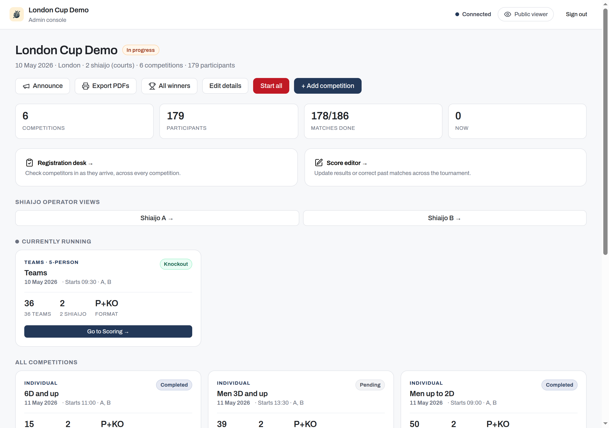
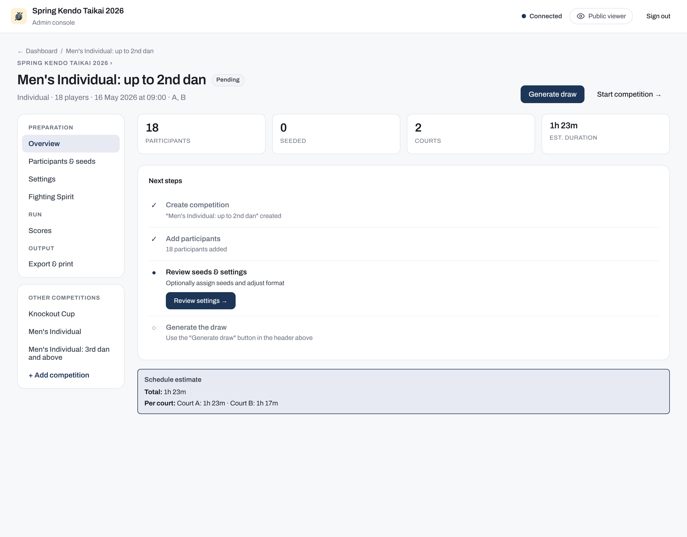
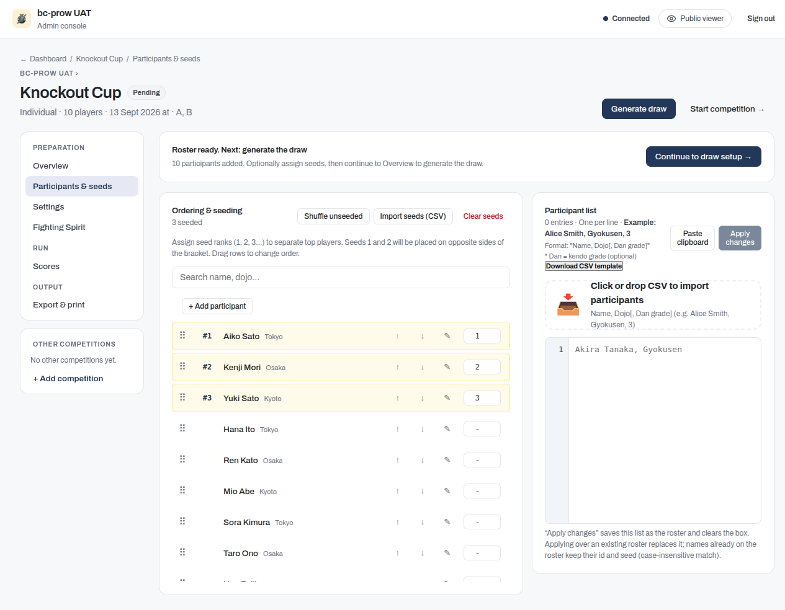
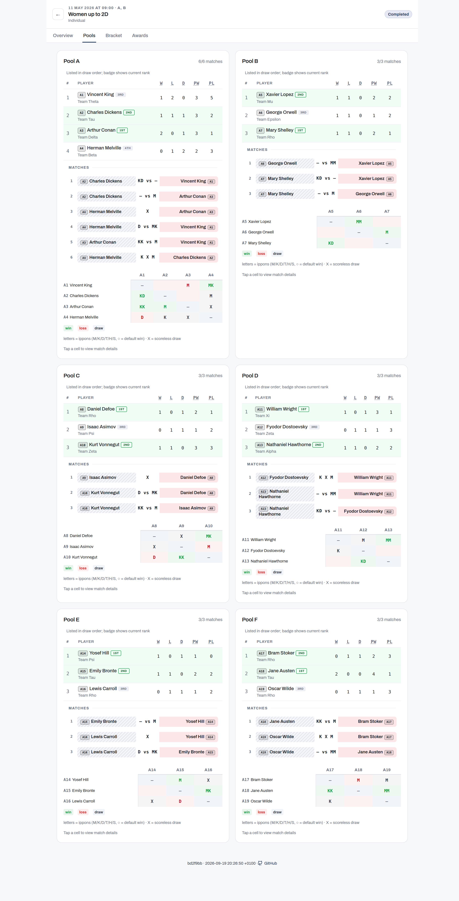
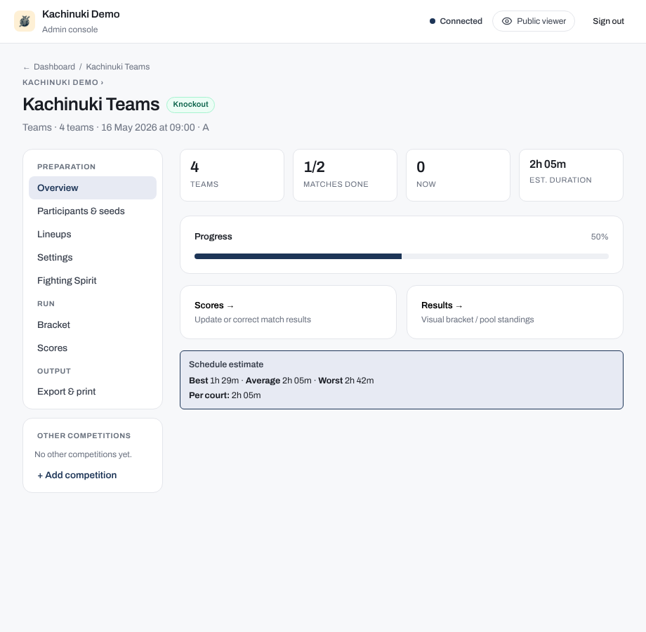

# Run a tournament on the day

This page is the operational hub for tournament day: start the tournament app, manage competitions, score matches, and export results. If you have not set up your tournament data yet, follow the quickstart at [First tournament](../start-here/first-tournament.md) before continuing here.

## Start the server

Run the following command from your terminal:

```bash
bracket-creator mobile-app --folder ./tournament-data
```

Then open `http://localhost:8080` in a browser. The server binds to `localhost` by default, so other devices cannot reach it yet. To let helpers on the same network connect, start the server with `--bind 0.0.0.0` (or a specific LAN interface), then share your machine's LAN address, for example, `http://192.168.1.10:8080`.

The following flags and environment variables control the server:

| Flag | Short | Env var | Default | Description |
|---|---|---|---|---|
| `--folder` | `-f` | `TOURNAMENT_DATA_DIR` | `.` | Path to the data folder |
| `--port` | `-p` | `PORT` | `8080` | HTTP port to listen on |
| `--bind` | `-b` | `BIND_ADDRESS` | `localhost` | Network address to bind |

An explicit flag always takes precedence over the matching environment variable.

The `make` targets let you launch quickly without typing flags:

```bash
make run-mobile                            # Default port 8080, ./tournament-data folder
PORT=8082 make run-mobile                  # Different port
TOURNAMENT_DATA_DIR=/path make run-mobile  # Different data folder
```

Two environment variables tune the API rate limiter for large events:

| Env var | Default | Description |
|---|---|---|
| `API_RATE_LIMIT` | `5000` | Sustained requests per second |
| `API_RATE_LIMIT_BURST` | `10000` | Peak burst size |

!!! tip
    For events with hundreds of simultaneous spectators, consider raising both rate-limit values before the tournament starts.

## The admin console

Click **Admin** in the navigation bar and enter the admin password. The rules for who can access which features depend on your tournament's operating mode. See [Operating modes](operating-modes.md) for the full access-control rules.

## Dashboard

The dashboard lists all competitions for the tournament. Each card shows the competition type, participant count, bracket format, and current status. Click a card to manage that competition.



## Tournament details and the public info page

Open **Edit details** from the dashboard to fill in the public information your attendees see:

- Venue address and a map link
- Opening and closing times
- A website link and an awards note
- Free-text info notes (rules, transportation, access details)
- Contact entries

Set the **Public URL** field to the externally reachable address of your app (for example, `https://my-tournament.example.com`). Setting this field enables QR codes on competitor tags and makes every shareable link work. The public URL also populates the public info page in the viewer and on spectator display screens.

!!! note
    For guidance on making the app reachable over the internet, see [Hosting](../install/hosting.md).

## Branding and sponsors

The same **Edit details** page also has branding and sponsor fields, below tournament details. All fields are optional; the default kendo theme applies when nothing is configured.

- **Logo**: upload an image file shown on the viewer, the lobby displays, and the admin screens.
- **Accent colours**: set a primary accent colour and a soft background tint; the viewer and display screens adopt them across the whole site.
- **Sponsors**: upload full-width images that appear on the public viewer page only. Sponsor images do not appear on the TV lobby boards or scoring displays.

## Announcements

Click **Announce** from the dashboard to broadcast a short message to every viewer. Choose a duration of 5, 10, 15, or 30 minutes; the message clears itself automatically when the time expires. It appears as an overlay on the viewer and display screens. Spectators who allow browser notifications can receive it in the background.

## Registration desk

Open **Registration desk** from the dashboard to access the cross-competition check-in surface for the welcome table. This view lists every competitor across all competitions so a registration helper can mark participants present as they arrive. It complements the per-competition check-in described in [Set up a competition](#set-up-a-competition).

## Set up a competition

A competition moves through three phases:

1. **Setup**: configure participants, seeding, and optional check-in.
2. **Draw preview** (`draw-ready`): review the generated pools, bracket, or first Swiss round. The roster is locked during this phase.
3. **Match play**: competitions with a pool phase start in `pools` status; knockout-only formats start in `playoffs`.



### Assigning shiai-jo

The competition **Settings** page has an **Assigned shiai-jo (courts)** field listing every shiai-jo in the venue. Pick the ones this competition runs on; the number you pick is how many of its matches can run at the same time.

Assign **1, 2, 4, 8 or 16 shiai-jo**. The knockout draw gives each shiai-jo its own block of the bracket and the blocks merge in pairs, so the count has to halve cleanly all the way down. Being even is not enough on its own: six blocks pair off into three, and three cannot pair off again, so 6 and 10 are refused just as 3, 5 and 7 are. When you pick a count the rule does not allow, the settings page names the counts to use instead, and it always offers 1. A single shiai-jo is always allowed. Where a competition sends two or more qualifiers up from each pool, its bracket splits into two half-blocks that act as partner shiai-jo, so the draw has the same shape as a two-shiai-jo one; where each pool sends up a single competitor, nothing crosses between shiai-jo and the bracket is left whole. 16 is the highest, and it is also the most shiai-jo a tournament can have, so no shiai-jo you can add is one a competition could not be given. See [The knockout draw](knockout-draw.md#how-many-shiai-jo-a-competition-can-use) for the full explanation.

**This is a rule about each competition, never about your venue.** A hall with three shiai-jo is completely normal, and nothing asks you to change it. What it means is that each competition there runs on 1 or 2 of the three, not that the third stands idle: run the seniors on 2 shiai-jo and the juniors on the remaining 1 at the same time, and all three are busy. A five shiai-jo hall works the same way, with one competition on 4 and another on 1, or two competitions of 2 alongside a third on 1.

A competition also cannot end up with a count the rule does not allow by inheriting one. If you create a competition without choosing its shiai-jo, it starts from the venue's list, and that inherited list is checked in exactly the same way, so on a three shiai-jo venue you are asked to pick 1 or 2 rather than being handed all three.

The rule applies only to the formats that produce a knockout bracket, which are playoffs and mixed. League and Swiss competitions have no bracket to merge, so they can use any number of shiai-jo the tournament has.

#### If you assign more shiai-jo than the competition has pools

The draw never uses more shiai-jo than the competition has pools, because a shiai-jo with no pool of its own would own an empty block of the bracket. When you assign more than that, nothing is refused and no warning is shown: the draw steps down to the largest allowed count that fits and is generated on that. A competition with seven pools assigned eight shiai-jo runs on four. The count you assign is therefore not always the count you get.

The step-down applies to the whole competition, not only to the knockout, and the blocks are handed to the assigned shiai-jo in order. Assign A to H to a seven-pool competition and it runs entirely on A, B, C and D: the pools split 2 / 2 / 2 / 1 across those four, and every knockout match from the first round to the final is on them as well. Open the Shiaijo operator view for E, F, G or H and it reads "No matches on this court".

So assign a count the competition can fill, and give the rest to another competition running alongside it. If you want eight shiai-jo busy, the competition needs at least eight pools.

#### If a competition already has a count the rule does not allow

You can meet this after an upgrade, because the rule is newer than the data folder: a competition set up on 3, 5 or 6 shiai-jo before the rule existed keeps that allocation on disk, and so does one whose data folder was edited by hand.

Such a competition is not broken. It loads, its matches and results are intact, it appears to spectators as usual, and its Settings page stays fully editable, so renaming it or changing anything else on that page still saves normally. The page carries a standing warning naming the counts to use instead.

What you cannot do is draw or start it. **Generate draw** and **Start competition** are disabled with the reason shown, and the app refuses the same action from anywhere else, until you reassign its shiai-jo to 1, 2, 4, 8 or 16.

### Knockout qualifiers

For a **Mixed** competition with **Pool size is a** set to **minimum**, a **Knockout qualifiers** control appears alongside **Players per pool** and **Winners per pool**, on both the competition create form and its Settings page. It offers three options: **Standard** (every pool sends the same number of qualifiers), **Oversized pools send one extra**, and **Fit the knockout exactly**. See [How many qualify from each pool](knockout-draw.md#how-many-qualify-from-each-pool) for what each one does, with worked examples.

Selecting either of the two non-standard options sets **Winners per pool** to 1 and disables the field, because both currently require it; switching back to Standard makes the field editable again. Below the options, a preview line updates as you adjust pool size and roster, reading something like "34 pools -> 36 qualifiers -> 64-slot knockout (28 byes)" for whichever option is selected. On the create form the preview is a placeholder until the competition has participants; on the Settings page it previews against the real roster, and is locked once the competition reaches `draw-ready`, alongside the rest of the pool configuration.

### Adding participants

The participant setup view has two panels.

The **Participant list** panel (labelled **Team list** for team competitions) contains a line-numbered paste box. Paste newline-separated rows in one of these formats:

- Without display name: `Name, Dojo[, Dan grade]`
- With display name (zekken): `Name, Zekken display name, Dojo[, Dan grade]`

Click **Paste clipboard** to read a tab-separated selection from the clipboard and convert it automatically. Click **Apply changes** to save the list.



The **Check-in & Seeding** panel (labelled **Seeding** when check-in is disabled) shows the working roster. From here you can:

- Drag rows to assign seeds, or type a rank number directly.
- Click **Shuffle unseeded** to randomise unranked positions.
- Click **Import seeds (CSV)** to load a seed file, or **Clear seeds** to remove all ranks.

The order you rank the seeds in is used, not just the set of seeded competitors: seeds 1 and 3 land in one half of the knockout draw and seeds 2 and 4 in the other, each in its own quarter, and a seeded pool's winner is first in line for any bye in its shiai-jo's block. Fewer than four seeds, including none at all, is a normal configuration. See [Seeding in the knockout draw](knockout-draw.md#seeding).

Ranks must run from 1 with none missing. You can enter them in any order and each is saved as you type it, so a partly-entered seeding is expected; while it has a hole in it the panel names the ranks still to set and the **Generate draw** and **Start competition** buttons are disabled. Fill in the missing ranks, or click **Clear seeds** to start again.

#### Editing a single competitor

Click the pencil icon on any row to open the edit modal for that competitor. You can change the name, dojo, dan grade, and display name during setup. Once the draw is generated, the pencil icon is disabled; discard the draw to re-enable editing.

### Check-in workflow

Enable check-in in **Settings** for the competition. When enabled, each row in the seeding panel gains a check-in checkbox. A **Show unchecked / Show all** toggle filters the list, and **Check in all** marks every participant at once.

The check-in rule is opt-in: when you click **Generate draw**, if at least one participant is checked in, only checked-in participants join the draw and unchecked participants are excluded (their seeds are dropped). If nobody is checked in, everyone is included.

### Draw preview

Click **Generate draw** to produce the bracket. The competition enters `draw-ready` status and shows an interactive preview:

- Pools competitions show pool assignments.
- Knockout competitions show the bracket tree.
- Swiss competitions show round 1.

You can still toggle individual check-in status during `draw-ready`, but roster edits (add, remove, reorder) are locked.

When the preview looks correct, click **Start competition** to move to match play. To make roster changes instead, click **Discard draw** to delete the draft and return to setup.

<!-- Raw HTML is copied verbatim by MkDocs (only markdown image paths get
     rewritten), so this src must be relative to the BUILT page URL
     (/user-guide/organisers/run-tournament/): three levels up, not two. -->
<figure class="bc-fig">
  <video controls loop muted playsinline preload="metadata" width="900" height="580" aria-label="Generating the draw: the pools preview appears after clicking Generate draw.">
    <source src="../../../screenshots/draw-generation.mp4" type="video/mp4">
  </video>
  <figcaption>Generating the draw. Press play to watch.</figcaption>
</figure>

## Pools and bracket

The **Pools** tab shows standings for every pool. Ranks are computed automatically from match results; operators do not edit them by hand, with one exception: chusen (drawing lots), the last-resort tie-break for a consequential team-pool tie that a daihyosen cannot settle (see [Recording decisions](../court-operators/recording-decisions.md)). When a daihyosen settles a tie that determines pool advancement, the winning side carries a **DH** badge in the standings.

After all pool matches are complete, advance pool winners to the elimination bracket from the Pools tab. The bracket updates in real time as results come in.



For the four competition formats and the Swiss round-by-round flow, see [Formats](formats.md).

For team lineups and team scoring rules, see [Team tournaments](team-tournaments.md).

For how to enter scores and navigate between matches, see [Scoring a match](../court-operators/scoring-a-match.md).

For kiken, fusenpai, daihyosen, and other special decisions, see [Recording decisions](../court-operators/recording-decisions.md).

For naginata and Engi-kyogi divisions, see [Naginata](naginata.md).

## Results and awards

The public viewer shows a competition's podium when it finishes, and a provisional ranking while it is still in progress:

- **Kendo knockout** (default): 1st place, 2nd place, and two equal 3rd places. There is no bronze match; both semi-final losers share third.
- **Naginata**: a single 3rd place is decided by a playoff. See [Naginata](naginata.md) for naginata-specific configuration.
- **Mixed format** (still in its pool phase): the viewer shows a provisional cross-pool ranking until the knockout decides the final places.

Operators see an all-competition winners view from the dashboard. You can also record optional **fighting-spirit** (敢闘賞) awards as free text; these appear on the viewer for all spectators. Saving awards requires the destructive-ops password in self-run mode; see [Operating modes](operating-modes.md#destructive-ops-password).

**League competitions** derive the podium from final standings. In an individual league, any tie within the top three places triggers a short ippon-shobu tie-breaker automatically, so the competition never closes with an unearned tie. Engi kata competitions never hold supplementary bouts; they rank by wins, then accumulated flags (see [Naginata](naginata.md#standings)). The one exception is 3rd place: with the **Award two joint 3rd places** option enabled (the default for kendo), competitors tied entirely for third share the position instead, with no decider. In a team league, the operator chooses whether to run a tie-breaker or accept a tie at any position; see [Team standings and tie-breaks](team-tournaments.md#team-standings-and-tie-breaks).

Set the **Award two joint 3rd places** option during setup, before you generate the draw. Once the draw exists, the option is locked; discard the draw to change it.

## Export and print

### Excel

Two Excel downloads are available from the competition page:

- **Download results (.xlsx)**: a workbook with played scores, pool standings, winners, and decisions filled in. Covers pools, league, and knockout formats. Swiss competitions have no static bracket; follow the current standings instead.
- **Download blank template (.xlsx)**: an empty bracket workbook with linked formulas for hand scoring at events without a network connection.

### PDF

PDF exports (competitor tags, name sheets, and bracket trees) are available to admins only. Rendering requires LibreOffice:

- Use the `ghcr.io/gitrgoliveira/bracket-creator-mobile-pdf:latest` container image, which includes LibreOffice.
- Or install LibreOffice on the host and ensure `soffice` is on the system path.

The lean container image omits LibreOffice and returns a clear message when a PDF is requested.

When the **Public URL** is set and competitors have assigned numbers, each printed tag includes a QR code that opens that competitor's public page. See [Hosting](../install/hosting.md) for guidance on setting the public URL.

## Data format

Tournament state is stored as plain files inside the data folder you specified with `--folder`. You can hand-edit these files between rounds when a correction is needed:

- `tournament.md`: YAML front-matter with the tournament name, date, venue, court count, and the admin password and destructive-ops password.
- `competitions/<id>/config.md`: YAML front-matter with competition kind, format, pool settings, and courts.
- `competitions/<id>/participants.csv`: one participant per line with name, optional display name (zekken), dojo, and optional dan grade.

!!! warning
    Edit data files only between rounds, not while the server is actively processing match results. Concurrent writes can produce inconsistent state.

## Tournament schedule

Open **Tournament schedule** from the dashboard to configure timing for each competition. Set start times and the time per match, typed as minutes and seconds (for example `2:30`), then click **Auto-schedule competition** to distribute all pool matches across the assigned shiai-jo automatically. The view shows an estimated end time per court based on match duration and the number of assigned matches.

Each competition can also set its own pool and playoff match durations on its **Settings** page. Type them as minutes and seconds, for example `2:30`. A whole number on its own is read as minutes, so `3` means three minutes. Leave a duration blank to use the default of 3:00. Clearing a duration you had set resets it to that default. Durations must fall between 1:00 and 60:00; a value outside that range is refused rather than quietly adjusted, because match duration drives the whole schedule.

A competition created before durations were measured in seconds is converted the first time it is opened, and its saved value carries over unchanged. Only a value above 60:00 is capped, which no realistic match setting reaches.

Changing a match duration never invalidates a generated draw. Pools, brackets and seedings are unaffected, so you can retime a competition after generating its draw without regenerating anything.

For a kachinuki (winner stays on) competition the number of bouts is not fixed, so the estimate is a range rather than a single figure. The competition Overview shows **Best**, **Average**, and **Worst**: best is a clean sweep where one fighter wins every bout, worst is the longest run where each bout retires one fighter, and average sits between them. Use the worst figure for planning the day and the average for a realistic finish time.


