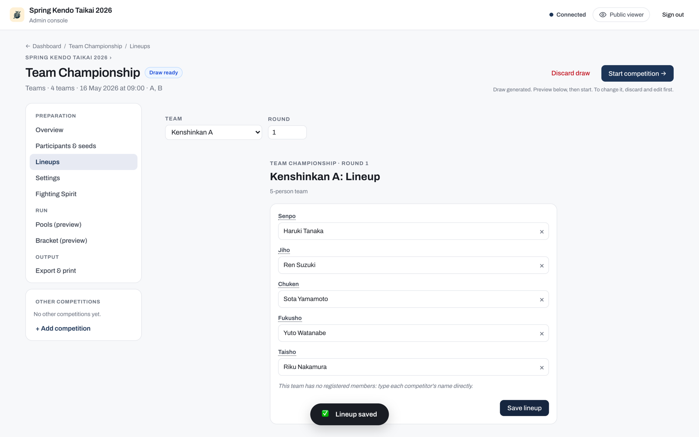

# Team tournaments

Team tournaments work with any of the four formats described in [Tournament formats](formats.md). The format controls how rounds and brackets are structured; the team setting changes how individual bouts are grouped into team encounters and how standings are calculated.

## Team lineups

Before each team encounter, set the fighting order for each team across the five positions: Senpo, Jiho, Chuken, Fukusho, and Taisho. Smaller teams use fewer positions.

Each team encounter has its own lineup. To carry over the same order from the previous encounter, use **Copy from previous match** at the top of the lineup panel.

### FIK incomplete-team rules

Not every position needs to be filled, but FIK rules place strict conditions on which positions may be left vacant:

- Senpo and Taisho must always be filled.
- One vacant position must be Jiho.
- Two vacant positions must be Jiho and Fukusho.
- Three or more vacant positions disqualify the team.

The app warns you if a lineup breaks these rules, but does not block you from saving it. This lets you complete the lineup as the round is running. You can edit a lineup at any time, including after the match has started.

Lineups appear on the viewer, the court display, and the streaming overlay, so competitors and spectators can follow the order in real time.

## How a team encounter is decided

Individual bouts are scored first. Once all bouts are done, the encounter result is determined in this order:

1. The team with the highest number of individual wins (victories) wins the encounter.
2. If wins are equal, the team with the highest points scored wins.
3. If both wins and points are equal, the encounter is a draw in pools or league. In a knockout stage, the encounter goes to a representative bout (daihyosen). See [Recording decisions](../court-operators/recording-decisions.md) for how daihyosen is handled.

## Kachinuki (winner-stays-on)

In kachinuki format, the winner of each bout remains on the court to face the next opponent from the opposing team. If a bout ends in a hikiwake (draw), both fighters retire instead of one continuing; the next pair, one from each team's remaining roster, takes the court. Bouts continue in succession until one team has no remaining fighters. The team that exhausts the other team wins the encounter.

## Team standings and tie-breaks

In pools and league, team standings are resolved in this order:

1. Team matches won
2. Team matches lost (fewer is better)
3. Draws in team matches
4. Individual winners across all bouts
5. Individual losses across all bouts (fewer is better)
6. Individual draws across all bouts
7. Points scored
8. Points lost (fewer is better)

!!! note
    When two or more teams remain tied after all eight criteria and the tie is consequential (it decides who advances or how they are seeded), what happens next depends on format:

    - **Mixed-format pools**: the app schedules a daihyosen automatically to break the tie.
    - **League**: the operator decides. From the League tab, either run a daihyosen among the tied teams or accept the shared ranks to finalise standings with the tie left in place. This choice is available for any tied position, including joint first, once every regular league match is complete.

    A tie that does not affect advancement is left as a shared rank with no extra bout. If a daihyosen still cannot separate the teams, it goes to chusen (drawing lots). See [Recording decisions](../court-operators/recording-decisions.md) for the procedures for both.
