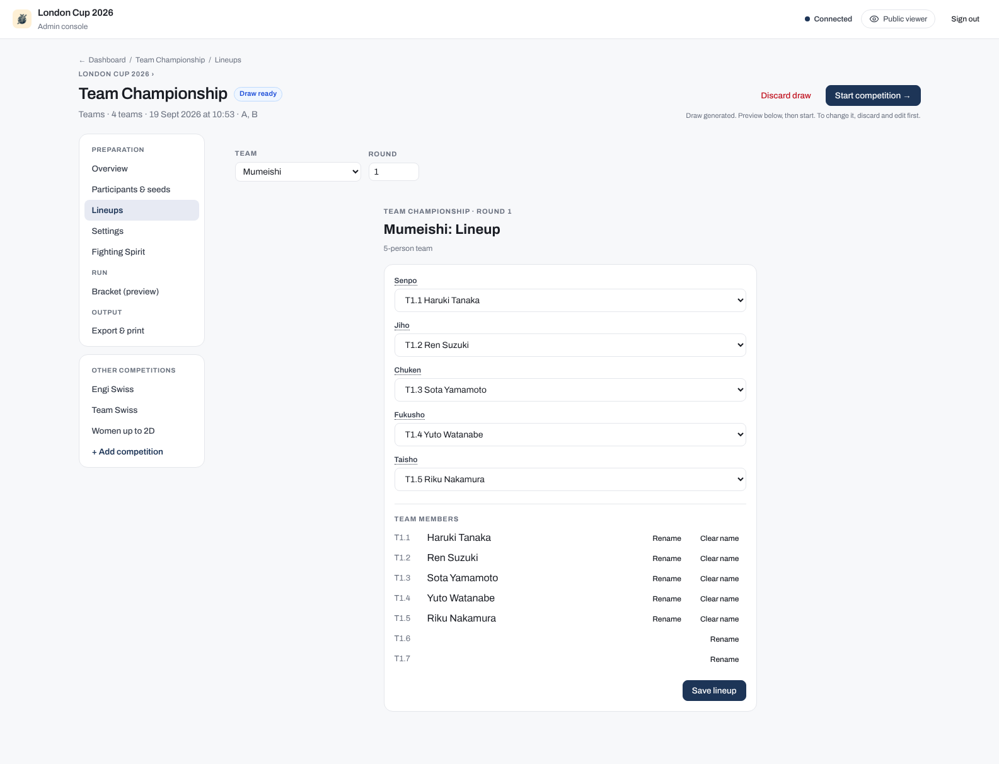
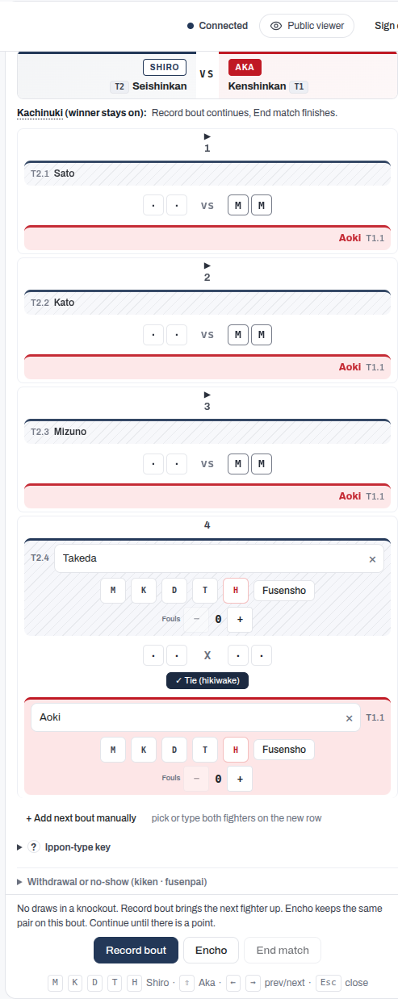
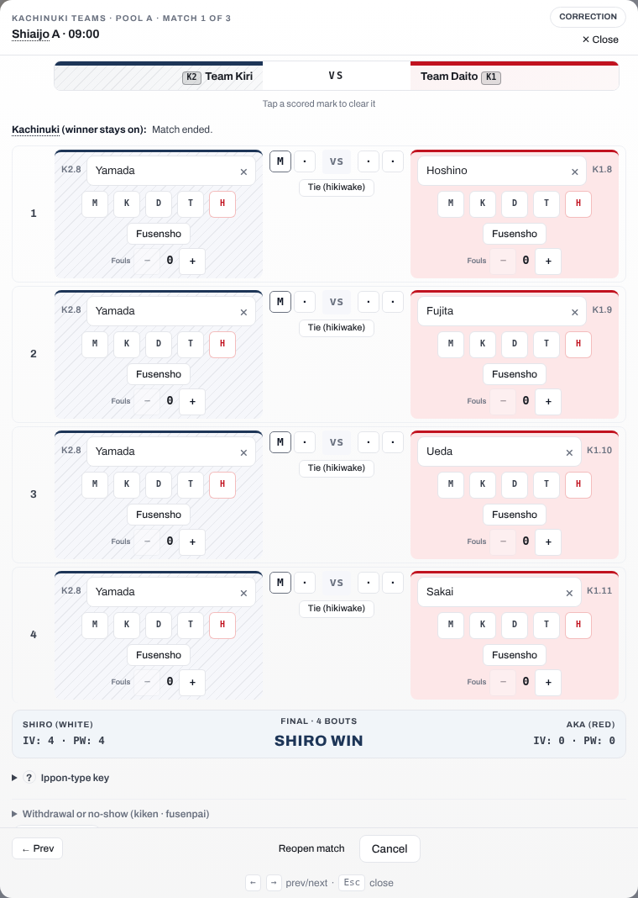
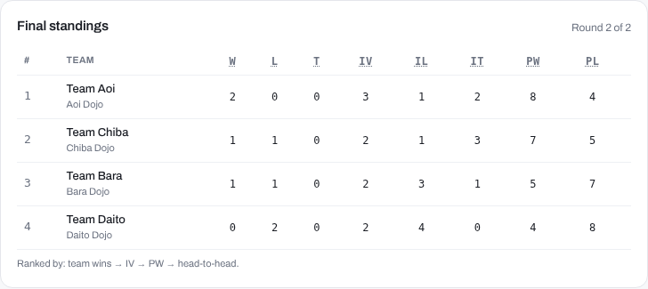

# Team tournaments

Team tournaments work with any of the four formats described in [Tournament formats](formats.md). The format controls how rounds and brackets are structured; the team setting changes how individual bouts are grouped into team encounters and how standings are calculated.

## Team lineups

Before each team encounter, set the fighting order for each team across the five positions: Senpo, Jiho, Chuken, Fukusho, and Taisho. Smaller teams use fewer positions.

Each team encounter has its own lineup. To carry over the same order from the previous encounter, use **Copy from previous match** at the top of the lineup panel.

### Incomplete and uneven teams

Team sizes are not fixed. A lineup can leave any position empty, teams in the same competition can field different numbers of fighters, and the app never blocks a save or disqualifies a team over a vacancy. Fill in as many positions as each team brings and save. You can edit a lineup at any time, including after the match has started, so you can complete or adjust the order as a round is running.

If your rules require a full team or set conditions on which positions may be left open, apply those off the app; the app treats the lineup you save as authoritative and scores against it.

Lineups appear on the viewer, the court display, and the streaming overlay, so competitors and spectators can follow the order in real time.

## How a team encounter is decided

This is how a **regular** team encounter, where every position plays its opposite number, is decided. Kachinuki encounters are decided bout by bout instead; see [Kachinuki (winner stays on)](#kachinuki-winner-stays-on) below.

Individual bouts are scored first. Once all bouts are done, the encounter result is determined in this order:

1. The team with the highest number of individual wins (victories) wins the encounter.
2. If wins are equal, the team with the highest points scored wins.
3. If both wins and points are equal, the encounter is a draw in pools or league. In a knockout stage, the encounter goes to a representative bout (daihyosen). See [Recording decisions](../court-operators/recording-decisions.md) for how daihyosen is handled.

## Kachinuki (winner stays on)

In kachinuki format, the winner of each bout remains on the court to face the next opponent from the opposing team. If a bout ends in a hikiwake (draw), both fighters retire instead of one continuing, and the next pair takes the court. Kachinuki is run under one of two rule sets, described below. Because only the shiaijo operator knows which rule set governs a match, and because team sizes are flexible, the app never decides on its own when a kachinuki encounter is over: the court operator does, using the buttons in the score editor.

### Kachinuki modes

Which mode governs a match comes from your tournament rules, and it can differ between rounds of the same competition: for example, plain exhaustion in the pools and the taisho rule in the final rounds. The app has no mode setting. You apply the mode through the scoring buttons, and the app follows your lead.

**Exhaustion (plain winner stays on).** A win eliminates the loser; a tie eliminates both fighters. The encounter ends when one team has no fighters left, and that team loses. If the two Taisho meet and draw, both teams are out at the same time and the encounter is drawn. A drawn encounter is a legal result in pools and leagues; in a knockout the bracket needs a winner, so the final pair fights on in overtime (encho) instead.

**The taisho must be defeated.** A tie or a win still eliminates every other fighter, but a Taisho is only eliminated by being beaten. A Taisho who draws stays on the court: the tied opponent retires, and the opponent's next fighter comes up against the same Taisho. The encounter only ends when one Taisho is defeated, so it is always decisive, whatever the stage. When Taisho meets Taisho and the bout is tied, neither can retire on the tie: the pair fights on in encho until one takes a point.

How each situation plays out at the table:

| The bout just ended with | Exhaustion | Taisho must be defeated |
|---|---|---|
| A winner | **Record bout**: the winner stays on against the loser's next team-mate. If the losing team has nobody left, **End match** instead: their team has lost. | Same, and if the beaten fighter was a Taisho, **End match**: their team has lost. |
| A tie between two ordinary fighters | Mark the **Tie**, then **Record bout**: both retire and the next pair comes up. | Same. |
| A tie involving one Taisho | The Taisho retires like anyone else. If their team now has nobody left, tap **Record bout**: the app adds the next bout, pairing the surviving team's next fighter with the fighter who just tied. Under this mode that fighter is out, so give the surviving fighter the walkover (**Fusensho**), then **End match** on that point. | The Taisho stays on. Tap **Record bout**: the app adds the next bout with the same Taisho against the opponent's next fighter. Nothing to re-type; score it as normal. |
| A tie between the two Taisho | **End match** records a drawn encounter in pools and leagues. In a knockout there are no drawn encounters, so End match is held back: use **Encho** until one Taisho scores, then **End match**. | **Encho**, in any stage: the same pair fights on until one takes a point, then **End match**. |

The clip below walks through the flows end to end, recorded from the score editor:

<video controls muted playsinline width="100%">
  <source src="../../../videos/kachinuki-demo.webm" type="video/webm">
  Your browser does not support the video tag.
</video>

1. **Winner stays on** (0:00): each win keeps the winner on to face the losing team's next fighter, and every fought bout reads **vs** in the centre.
2. **A knockout tie and Encho** (0:08): a knockout cannot end in a draw, so a tied bout holds **End match** back and offers **Encho**: the same pair fights on, marked **(E)**, until a point lands.
3. **A drawn encounter in a league** (0:15): the same tie in a league is simply ended as a draw, marked **X**.
4. **Reopen** (0:22): a completed encounter is reopened with all its bouts intact, then ended again, which asks for a reason.

### Choosing the team match format

When you create a team competition, pick the format under **Team match format**: **Regular** (every position plays its opposite number, the default) or **Kachinuki (winner stays on)**. The same control appears in the competition's **Settings** tab. It locks once the draw is generated: discard the draw to change it. Once the competition has started, the format can no longer be changed.

### Scoring a kachinuki encounter

Kachinuki encounters are scored one bout at a time. Score the current bout, then choose one of two actions:

- **Record bout** keeps the encounter going. The winner stays on and the app adds the next pairing; if the bout was a draw, both fighters retire and the next pair comes up. When the app cannot work out who fights next, for example when a team brings fighters it has not seen, use **Add next bout manually** and pick or type both players on the new row.
- **End match** finishes the encounter on the last scored bout. The winning team is the one that won that bout; you do not pick it, the app reads it from the score.

If the app adds a pairing you did not want, for example an extra bout after the encounter was really over, use **× Remove this bout** to take it back. It only removes a bout that has no score yet, so nothing you have recorded is lost. The bouts you have already fought stay on screen as read-only rows above the current bout, so the encounter reads like a regular team sheet and you can check the winner-stays-on order at a glance.

To fix a bout you have already recorded, without ending the encounter, tap its row. It reopens in place with the same scoring controls as the current bout, so you can adjust the points or change who won, and the change saves as you go. Each fought bout carries a black triangle in its number column: it points right when the bout is collapsed and down when it is open, so tapping it expands the bout to correct it and collapses it again when you are finished.

If your correction changes who won that bout, the bouts after it were fought on the old result, so the app flags them for you to check and put right. It never re-shuffles the later bouts on its own: only you, at the court, know how they actually went.

When the last bout is tied, the editor offers every legitimate way forward and you choose, according to the [kachinuki mode](#kachinuki-modes) in force; the app never decides it from the stage:

- **Record bout** retires both fighters and brings the next pair up.
- **Encho** keeps the same pair fighting on that bout until one of them takes a point. Use it whenever your rules say this pairing must have a result, in any stage.
- **End match** finishes the encounter on the tie. In pools and leagues this records a drawn encounter. In a knockout the bracket needs a winner, so End match is held back while the last bout is tied; continue with Record bout or Encho instead.

There is no representative bout (daihyosen) in kachinuki: a tied pairing that must produce a result is settled by encho on that same bout, not by a separate rep bout.

If you finish an encounter too early or record the wrong result, reopen it. Open the completed match and use **Reopen match**: a single tap returns the encounter to in progress with its bouts kept, so you can add or rescore bouts and end it again. Reopening discards a result that has already been recorded, so a reason is still kept with the result, but it is asked for when you end the match again rather than before you can get back in. That applies however you end it, whether you finish on a scored bout or record a withdrawal or a no-show. In a knockout, reopening also rolls back the next-round slot that this result had filled, as long as that later match has not started. If that later match has already started or been scored, the app refuses the reopen outright; sort out that later match first.

Reopening keeps every bout that was fought. The bout log is preserved in full, including who fought each bout, the points scored, and any overtime, so nothing you have already recorded is lost. What reopening clears is the finished-match verdict it is discarding: the winning team, the final score line, and any withdrawal or no-show recorded against the encounter.

Reopening is refused while another match is already running on the same court, because the reopened encounter would go back into play alongside it. Finish the running match, or send it back to the queue, and then reopen.

The results workbook (**Export & print**, then **Download results (.xlsx)**) includes a **Kachinuki Detail** sheet with the bout-by-bout record for every kachinuki encounter: who fought whom, scores, draws, and each fighter's lineup position.

## Team standings and tie-breaks

In pools, league, and Swiss, team standings are resolved in this order:

1. Team matches won
2. Team matches lost (fewer is better)
3. Draws in team matches
4. Individual winners across all bouts
5. Individual losses across all bouts (fewer is better)
6. Individual draws across all bouts
7. Points scored
8. Points lost (fewer is better)

In Swiss, two further tie-breaks apply after the eight criteria above:
head-to-head (the team that won the direct encounter ranks higher), then
name order as the final deterministic fallback.

!!! note
    When two or more teams remain tied after all eight criteria and the tie is consequential (it decides who advances or how they are seeded), what happens next depends on format:

    - **Mixed-format pools**: the app schedules a daihyosen automatically to break the tie.
    - **League**: the operator decides. From the League tab, either run a daihyosen among the tied teams or accept the shared ranks to finalise standings with the tie left in place. This choice is available for any tied position, including joint first, once every regular league match is complete.

    A tie that does not affect advancement is left as a shared rank with no extra bout. If a daihyosen still cannot separate the teams, it goes to chusen (drawing lots). See [Recording decisions](../court-operators/recording-decisions.md) for the procedures for both.
