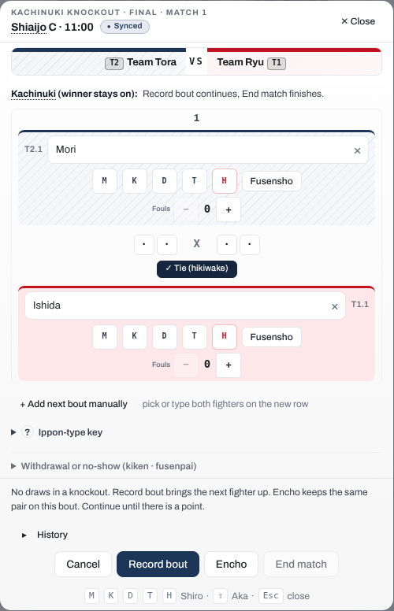
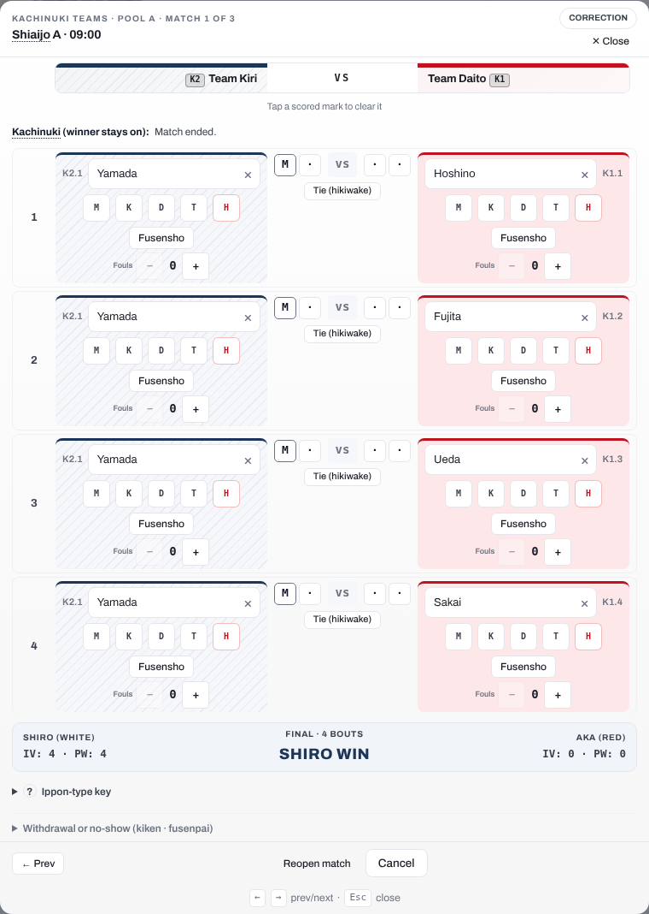
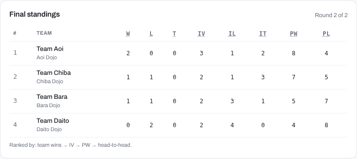

# Team tournaments

Team tournaments work with any of the four formats described in [Tournament formats](formats.md). The format controls how rounds and brackets are structured. The team setting changes how individual bouts are grouped into team encounters and how standings are calculated.

## Team lineups

A team's lineup is its fighting order across the five positions: Senpo, Jiho, Chuken, Fukusho, and Taisho. Smaller teams use fewer positions.

A team keeps the lineup of its previous team match unless you enter a new one for a match. The **Lineups** page sets each team's **Starting lineup**, which its first match uses unless that match has a lineup of its own, and it can set the lineup of any one of the team's matches. Pick the team, then choose **Starting lineup** or one of its matches in **Lineup for**. A lineup you enter for a match is used for that match and for every later match of the team, until you enter another. It never changes an earlier match. Changing a match's lineup also changes every later match of the team that carries it, including matches already played.

Matches count in their order: pool matches by their number in the pool, then the knockout by round, with the 3rd-place match last. **Lineup for** lists a team's matches in that order. In that order, the lineup a team fields in a match is the first of these that exists:

1. The lineup entered for that match.
2. The latest lineup the team had before it: one entered for an earlier match of the team, or its **Starting lineup**.

The lineup panel for a match says where the lineup it shows comes from: **Lineup for this match**, **Same as** the earlier match it is carried from, or **Starting lineup**. The score sheet, the viewer, the court display, the streaming overlay and the Kachinuki Detail sheet of the export all use the same lineup.

To go back to the previous match's lineup, choose **Use the previous match's lineup**, on the **Lineups** page or at the top of the lineup panel. It appears while the lineup shown is the match's own, asks first, and removes that lineup, so the match carries the team's previous lineup again. Every later match that has no lineup of its own follows it.

Saving a lineup writes only the positions you changed. If someone saves a change to another position of the same lineup from a different device, both changes are kept, whichever save arrives first, even when yours is sent later because this device was offline. If you both changed the same position, the save that arrives last is kept. A save made while this device is offline says "Not sent yet: saved on this device, and sent when the connection returns." and is sent once the connection is back.

Changes you make to a lineup and have not saved are kept in that browser tab, so a reload, going back, or closing the lineup panel does not lose them. When you open the same lineup again, on the **Lineups** page or in the lineup panel, it shows **Unsaved lineup changes restored** with a **Discard** button that puts the saved lineup back. Nothing is saved until you press **Save lineup**. If the lineup changed in the meantime, for example saved from another device, the kept changes are not applied, and a notice lists the names that were not restored.

Lineups that an earlier version of the app saved on the **Lineups** page for a round are converted when the app starts, so every match shows the lineup that version showed for it. Each match the team is seated in gets that lineup as its own, and a match the team reaches later, such as its next knockout match, gets it as soon as the team is seated there. You can change or remove any of these like any other match's lineup, and a lineup you remove stays removed. A team with no **Starting lineup** gets the lineup of its latest round as its **Starting lineup**, which is what that version showed before the team's first saved round. The round lineups themselves are removed once the competition is completed.

That version also used a lineup entered for a match for that match only. A team that had one is converted the same way, so each of its matches shows what that version showed there: the lineup entered for that match, else the team's **Starting lineup**, or no lineup when the team had none. A lineup you enter after the upgrade is carried to later matches as usual.

Discarding a draw removes the lineups of its matches, including those converted from an earlier version, since a new draw makes new matches. The new draw's matches are given the lineups converted from round lineups again, and each team's **Starting lineup** stays. Lineups that version entered for a match went with the old draw, so those teams carry their lineups like any other.

### Team members

A team's people are its members. A team starts with one position per fighter
the competition's team size defines, plus two reserve positions, each numbered
and waiting for a name. The **Lineups** page is the one place to name, rename,
add and clear a team's people. Build the list as you go, picking an existing
member for a position or typing a new name.

Every position a team has is offered, including the ones still waiting for a
name, so you can field a fighter by number first and fill the name in later. A
fighter picked that way counts in every format, winner-stays-on included.
Typing a name that already belongs to a member simply picks that member, with
nothing created and nothing to confirm. A new name instead names the position's
blank slot when one is free, and when none is left the app adds a new position
to the team in the same step. On the Lineups page it confirms both of those
first, so a mistyped name cannot quietly create a person nobody expected. The
match lineup panel and the score sheet apply the name when you save.

Nobody can be placed at two positions of the same lineup. Those pickers do not
offer a fighter who is already placed, and a name typed for one is refused with
the position they hold. A winner-stays-on bout after the first is not a lineup
position, so its list offers everyone: the fighter who stayed on is meant to
appear again.

Renaming a member keeps them attached to everything they have already done. A
bout they fought, and the winner-stays-on order, still refer to the same person
after the change. You can correct a spelling or switch to a full name mid
tournament without disturbing results already recorded. Rename from the **Team
members** list on the Lineups page, or from the match's lineup panel on the
court console
(the Rename control under the position), at any time. The corrected name shows
everywhere, including bouts already fought and the exported sheet.

Nobody is removed from a team. Instead, you can clear a name from the **Team
members** list on the Lineups page, which empties that position and keeps its
number.
You can only do that before the competition starts. Once it has started every
name stays, so a bout already fought always names the same person. An unused
member is harmless: they never appear in a lineup.

A team can hold more members than the number of positions a round has. Add the
replacements a team brings and field whichever of them you need in each
encounter. You can add a member after the competition has started, which is how
a team fields a replacement mid tournament.

Each member shows as the team's competitor number followed by their position in
the team, for example T10.1 and T10.2. These labels follow the team's number,
so if you change a competition's number prefix the labels change with it. A
label appears wherever the member's name does: the lineup panel, the score
sheet, the viewer, the court display, the streaming overlay, and the bout detail
sheet a winner-stays-on competition adds to its export.

Before the draw a team has no number yet, so the Lineups page labels each
position by its place in the order alone, Slot 1 upwards. A five-person team
runs to Slot 7, its five positions plus the two reserves. The numbered form
appears once the draw is generated.

### Incomplete and uneven teams

Team sizes are not fixed. A lineup can leave any position empty. Teams in the same competition can field different numbers of fighters, and the app never blocks a save or disqualifies a team over a vacancy. Fill in as many positions as each team brings and save. You can edit a lineup at any time, including after the match has started, so you can complete or adjust the order as a round is running. Every bout still needs a result or a decision. When only one team leaves a position empty, the court operator records a **Fusensho** for the team whose fighter is present. When both teams leave a position empty, the court operator records that bout as a **Tie**, which counts as an individual draw for both teams. An empty position also shows a box directly on its score sheet row, labelled with its own number, so you can name the fighter without leaving the bout you are scoring.

If your rules require a full team or set conditions on which positions may be left open, apply those off the app. The app treats the lineup you save as authoritative and scores against it.

Lineups appear on the viewer, the court display, and the streaming overlay, so competitors and spectators can follow the order in real time.

## How a team encounter is decided

This is how a **regular** team encounter, where every position plays its opposite number, is decided. Kachinuki encounters are decided bout by bout instead; refer to [Kachinuki (winner stays on)](#kachinuki-winner-stays-on).

Individual bouts are scored first. Once all bouts are done, the encounter result is determined in this order:

1. The team with the highest number of individual wins (victories) wins the encounter.
2. If wins are equal, the team with the highest points scored wins.
3. If both wins and points are equal, the encounter is a draw in pools or league. In a knockout stage, the encounter goes to a representative bout (daihyosen). Refer to [Recording decisions](../court-operators/recording-decisions.md) for how daihyosen is handled. The results workbook lists each representative bout on its own sheet, described under [Daihyosen](../court-operators/recording-decisions.md#daihyosen).

When the encounter itself ends on a kiken, fusenpai, or fusensho, every bout that has no result yet is also credited to the other team, 2-0 each: one individual victory and two points, on top of whatever was already fought before the withdrawal. This feeds straight into the criteria above and into [Team standings and tie-breaks](#team-standings-and-tie-breaks). Refer to [Fusenpai and fusensho](../court-operators/recording-decisions.md#fusenpai-and-fusensho) for the full rule.

Two fighters from opposing teams may share a name, so the app records who won each bout by identity rather than by the name on the sheet. You do not have to do anything for this, and bouts you score now are unaffected. The one exception is an encounter scored by a much older version. A bout there between two same-named fighters can show no individual win for either team, because the name it stored cannot say which of the two it meant. The points scored in that bout still count.

## Kachinuki (winner stays on)

In kachinuki format, the winner of each bout remains on the court to face the next opponent from the opposing team. If a bout ends in a hikiwake (draw), both fighters retire instead of one continuing, and the next pair takes the court. Kachinuki is run under one of two rule sets, described in [Kachinuki modes](#kachinuki-modes). Because only the shiai-jo operator knows which rule set governs a match, and because team sizes are flexible, the app never decides on its own when a kachinuki encounter is over. The court operator ends it, using the buttons in the score editor. A withdrawal or a no-show that ends a kachinuki encounter early does not credit any further bouts: unlike a regular team match, kachinuki has no fixed positions left to fill, so the encounter simply stands on the bouts already fought.

### Kachinuki modes

Which mode governs a match comes from your tournament rules. It can differ between rounds of the same competition, for example plain exhaustion in the pools and the taisho rule in the final rounds. The app has no mode setting. You apply the mode through the scoring buttons.

**Exhaustion (plain winner stays on).** A win eliminates the loser; a tie eliminates both fighters. The encounter ends when one team has no fighters left, and that team loses. If the two Taisho meet and draw, both teams are out at the same time and the encounter is drawn. A drawn encounter is a legal result in pools and leagues; in a knockout the bracket needs a winner, so the final pair fights on in overtime (encho) instead.

**The taisho must be defeated.** A tie or a win still eliminates every other fighter, but a Taisho is only eliminated by being beaten. A Taisho who draws stays on the court: the tied opponent retires, and the opponent's next fighter comes up against the same Taisho. The encounter only ends when one Taisho is defeated, so it is always decisive, whatever the stage. When Taisho meets Taisho and the bout is tied, neither can retire on the tie: the pair fights on in encho until one takes a point.

How each situation plays out at the table:

| The bout just ended with | Exhaustion | Taisho must be defeated |
|---|---|---|
| A winner | **Record bout**: the winner stays on against the loser's next team-mate. If the losing team has nobody left, **End match** instead: their team has lost. | Same, and if the beaten fighter was a Taisho, **End match**: their team has lost. |
| A tie between two ordinary fighters | Mark the **Tie**, then **Record bout**: both retire and the next pair comes up. | Same. |
| A tie involving one Taisho | The Taisho retires like anyone else. If their team now has nobody left, tap **Record bout**: the app adds the next bout, pairing the surviving team's next fighter with the fighter who just tied. Under this mode that fighter is out, so give the surviving fighter the walkover (**Fusensho**), then **End match** on that point. | The Taisho stays on. Tap **Record bout**: the app adds the next bout with the same Taisho against the opponent's next fighter. Nothing to re-type; score it as normal. |
| A tie between the two Taisho | **End match** records a drawn encounter in pools and leagues. In a knockout there are no drawn encounters, so End match is held back: use **Encho** until one Taisho scores, then **End match**. | **Encho**, in any stage: the same pair fights on until one takes a point, then **End match**. |

The following clip walks through the flows end to end, recorded from the score editor:

<video controls muted playsinline width="100%">
  <source src="../../../videos/kachinuki-demo.webm" type="video/webm">
  Your browser does not support the video tag.
</video>

1. **Winner stays on** (0:02): each win keeps the winner on to face the losing team's next fighter, and every fought bout reads **vs** in the centre.
2. **A knockout tie and Encho** (0:08): a knockout cannot end in a draw, so a tied bout holds **End match** back and offers **Encho**: the same pair fights on, marked **(E)**, until a point lands.
3. **A drawn encounter in a league** (0:15): the same tie in a league is simply ended as a draw, marked **X**.
4. **Reopen** (0:21): a completed encounter is reopened with all its bouts intact, then ended again.

### Choosing the team match format

When you create a team competition, pick the format under **Team match format**: **Regular** (every position plays its opposite number, the default) or **Kachinuki (winner stays on)**. The same control appears in the competition's **Settings** tab. It locks once the draw is generated: discard the draw to change it. Once the competition has started, the format can no longer be changed.

### Scoring a kachinuki encounter

Kachinuki encounters are scored one bout at a time. Score the current bout, then choose one of two actions:

- **Record bout** keeps the encounter going. The winner stays on and the app adds the next pairing; if the bout was a draw, both fighters retire and the next pair comes up. When the app cannot work out who fights next, for example when a team brings fighters it has not seen, use **Add next bout manually** and pick or type both players on the new row.
- **End match** finishes the encounter on the last scored bout. The winning team is the one that won that bout; you do not pick it, the app reads it from the score.

Just above the current bout, a short line shows each team's fighter on the shiai-jo, how many fighters its lineup has left after them, and who they are, the first in the brackets being next, for example "Shiro: T1.2 Ueda on, 1 left (T1.3 Sato) · Aka: T2.1 Kudo on, last fighter". Each fighter carries their team member number, as on the bout rows. The line is read from the lineup and the bouts recorded so far, the same reading the app pairs the next bout from. It is a guide only: it never ends the encounter or holds a button back, and you still decide when the encounter is over. A team with no lineup entered shows only its fighter on, and when neither team has one the line is not shown.

If the app adds a pairing you did not want, for example an extra bout after the encounter was really over, use **× Remove this bout** to take it back. It only removes a bout that has no score yet, so nothing you have recorded is lost. The bouts you have already fought stay on screen as read-only rows above the current bout. The encounter reads like a regular team sheet, and you can check the winner-stays-on order at a glance.

To fix a bout you have already recorded, without ending the encounter, tap its row. It reopens in place with the same scoring controls as the current bout. You can adjust the points or change who won, and the change saves as you go. Each fought bout carries a black triangle in its number column: it points right when the bout is collapsed and down when it is open. Tap it to expand the bout for a correction, and tap it again to collapse it when you are finished.

If your correction changes who won that bout, the bouts after it were fought on the old result. The app flags them for you to check and put right. It never re-shuffles the later bouts on its own: only you, at the court, know how they actually went.

When the last bout is tied, the editor offers every legitimate way forward and you choose, according to the [kachinuki mode](#kachinuki-modes) in force; the app never decides it from the stage:

- **Record bout** retires both fighters and brings the next pair up.
- **Encho** keeps the same pair fighting on that bout until one of them takes a point. It is offered on any tied bout: whether a pair fights on is your call, and the app records it. Use it whenever your rules say the pairing must have a result, in any stage. Tapped Encho by mistake, or twice? **Undo encho**, beside it, takes back one overtime period per tap while nothing has been scored in overtime; taking back the last one returns the bout to its tie. Its place beside Encho is kept empty until there is something to undo, so no button moves under your finger when it appears.
- **End match** finishes the encounter on the tie. In pools and leagues this records a drawn encounter. In a knockout the bracket needs a winner, so End match is held back while the last bout is tied; continue with Record bout or Encho instead.

There is no representative bout (daihyosen) in kachinuki: a tied pairing that must produce a result is settled by encho on that same bout, not by a separate rep bout.

If you finish an encounter too early or record the wrong result, reopen it. Open the completed match and use **Reopen match**. A single tap returns the encounter to in progress with its bouts kept, so you can add or rescore bouts and end it again. An encounter that ended with a withdrawal or a no-show shows **Clear kiken and reopen** or **Clear fusenpai and reopen** instead, because reopening it also makes the withdrawn team eligible again. It states that beside the button, and one tap reopens the encounter; refer to [Correcting a withdrawal recorded by mistake](../court-operators/recording-decisions.md#correcting-a-withdrawal-recorded-by-mistake). Neither button needs a reason, and nor does ending the encounter again, however you end it. In a knockout, reopening also rolls back the next-round slot that this result had filled. If that later match has already been played, the app names it and asks before going ahead; confirming reopens it too, so it is fought and scored again, and the editor names it once the reopen is done. A round after it that nobody has played yet stops showing its winner. If that later match is under way, the app refuses the reopen; finish it or send it back to the queue first. In a pool of a competition that ends in a knockout, reopening is never refused because of the knockout: ending the encounter again with a result that changes who qualifies is checked then, as described in [Correct a pool result after the knockout has started](../court-operators/scoring-a-match.md#correct-a-pool-result-after-the-knockout-has-started).

Reopening keeps every bout that was fought. The bout log is preserved in full, including who fought each bout, the points scored, and any overtime, so nothing you have already recorded is lost. Reopening clears the finished-match verdict it is discarding: the winning team, the final score line, and any withdrawal or no-show recorded against the encounter.

Reopening is refused while another match is already running on the same court, because the reopened encounter would go back into play alongside it. Finish the running match, or send it back to the queue, and then reopen.

The results workbook (**Export & print**, then **Download results (.xlsx)**) and the blank template (**Download blank template (.xlsx)**) include a **Kachinuki Detail** sheet with a section for every kachinuki encounter in the draw. Each section is titled with its match's name followed by (Kachinuki). A knockout section's name is the title of that match's block on the **Elimination Matches** sheet, so Round 2 - Match 3 there is Round 2 - Match 3 (Kachinuki) here, and a side that is not decided yet reads as the match it comes from, for example M 3. Each section is laid out like a match on the **Elimination Matches** sheet: White (Shiro) on the left and Red (Aka) on the right, matching the scoreboard, each over its own team's name. Each bout row shows the bout number with who fought it and their lineup position (the position in the lineup the team fielded in that encounter), each side's score, and a tie or overtime in the centre column. The result mark (Fus., Kiken) sits beside the fighter it names. An encounter with recorded bouts lists exactly those bouts. An encounter with none yet, such as every encounter in the blank template, gets empty numbered rows to fill in by hand: one for each bout the encounter can take, which is twice the team size less one (9 rows for teams of five).

The **Pool Matches** and **Elimination Matches** sheets give each kachinuki encounter the same number of bout rows, the 3rd-place match included. A result fills the bouts fought, in order, and leaves the rest empty. If an encounter fields reserves and runs to more bouts than that, those sheets show its first bouts and the Kachinuki Detail sheet lists them all.

## Team standings and tie-breaks

In pools, league, and Swiss, team standings are resolved in this order:

1. Team matches won
2. Team matches lost (fewer is better)
3. Draws in team matches
4. Individual winners across all bouts
5. Individual losses across all bouts (fewer is better)
6. Individual draws across all bouts
7. Points scored
8. Points lost (fewer is better)

In Swiss, two further tie-breaks apply after those eight criteria:
head-to-head (the team that won the direct encounter ranks higher), then
name order as the final deterministic fallback.

!!! note
    When two or more teams remain tied after all eight criteria and the tie is consequential (it decides who advances or how they are seeded), the next step depends on format:

    - **Pools + Knockout**: the app schedules a daihyosen automatically to break the tie.
    - **League**: the operator decides. From the League tab, either run a daihyosen among the tied teams or accept the shared ranks to finalise standings with the tie left in place. This choice is available for any tied position, including joint first, once every regular league match is complete.

    A tie that does not affect advancement is left as a shared rank with no extra bout. If a daihyosen still cannot separate the teams, it goes to chusen (drawing lots). Refer to [Recording decisions](../court-operators/recording-decisions.md) for the procedures for both.
