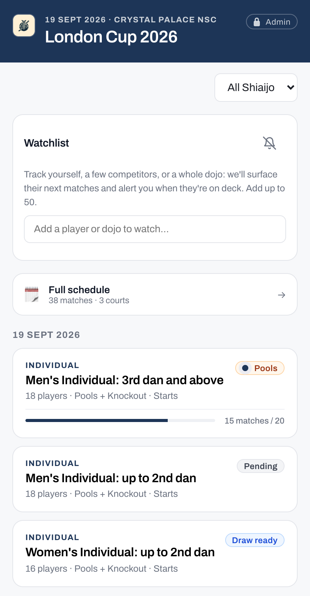
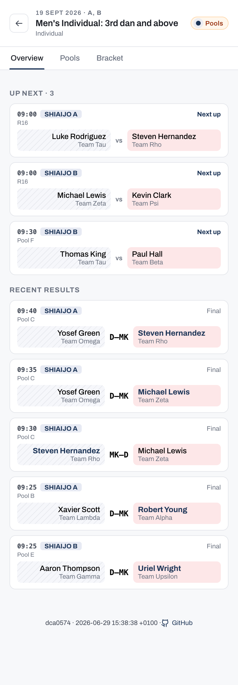
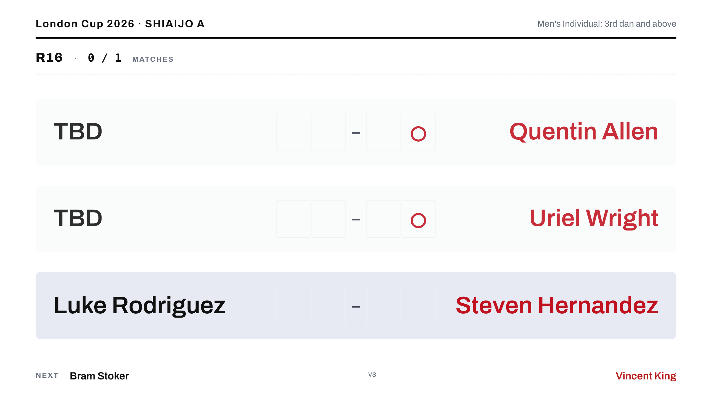
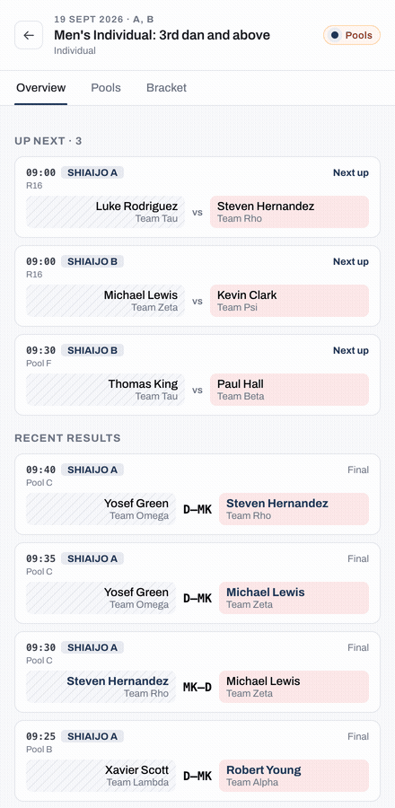

# Follow the tournament

The public viewer needs no password. It is the shared screen for competitors, coaches, and spectators. Open the tournament URL on any device on the same network and you see results as they happen, the standings, and the bracket as the day unfolds.

Not sure which role fits you? See [Choosing your setup](../start-here/choosing-your-setup.md) for a full guide.

## What the public viewer shows

The viewer brings together everything you need to follow the day in one place:

- A personal **Watchlist** so you can track yourself, specific competitors, or a whole dojo. As a watched match approaches, the viewer nudges you so players know when to warm up and coaches know when to be matside.
- The full match schedule across all shiai-jo, filterable by player or team. The free-text filter matches a competitor's name, their assigned number, or their tag (for example, "A1"), so you can jump straight to their bouts.
- Pool standings that update as scores are entered, with no page refresh needed.
- The elimination bracket filling in as matches are completed.

Tap a competition to drill into its schedule, standings, and bracket. Aka (red) and Shiro (white) sides are colour-coded throughout.

## Scoreboards and court displays

Each shiai-jo runs one digital scoreboard on a TV or projector: a court-scoped display with no password showing the score for the bout in progress. Referees, the two competitors, the scoring operator, and spectators at that court all read from the same screen.

The app provides three display URLs:

- `/display?court=A` shows a single court's current match, upcoming queue, and recent results.
- `/display?court=all` shows every court at once, for a lobby or overview screen.
- Add `&overlay=true` to a single-court URL (for example, `/display?court=A&overlay=true`) for a transparent variant you key into a video stream as a browser source (for example, OBS or vMix), so online viewers see player names and the current score over the video.

### Connection status

If the venue Wi-Fi drops, a court scoreboard keeps updating as long as the scoring tab for that court stays open on the same computer. The operator's entries reach the board directly over the local connection.

A small status dot appears only when the connection is degraded:

- **Amber**: the board is fed by the court's own scoring computer while the link to the server is down.
- **Red**: no updates are getting through, so the board may be out of date until the connection returns.

When everything is healthy, no dot appears.

## Real-time updates

Scores entered by the operator appear on the viewer immediately, across every connected device.

## QR codes on competitor tags

When the organiser sets the tournament public URL, each printed competitor tag includes a personal QR code. Scan it to open your own page on the viewer, showing your schedule and results directly.

!!! tip
    You do not need to set up a Watchlist if you use your tag's QR code. The personal page opens straight to your matches.

!!! note
    The QR code only works when the organiser has configured a public URL for the tournament. If the code does not open anything, ask the organiser for the tournament URL and use the Watchlist instead.
