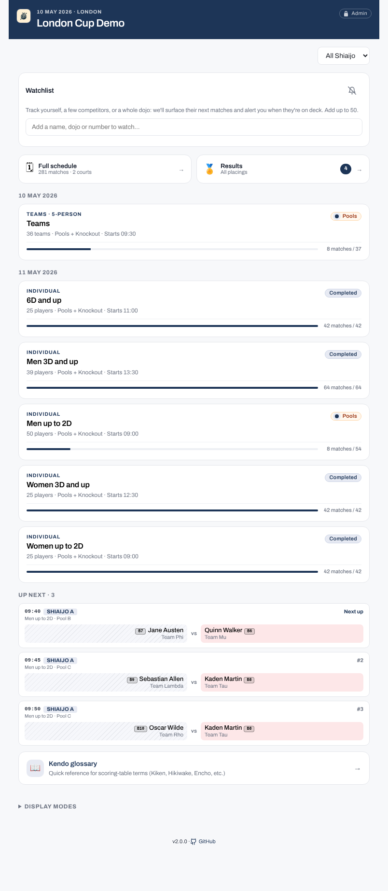
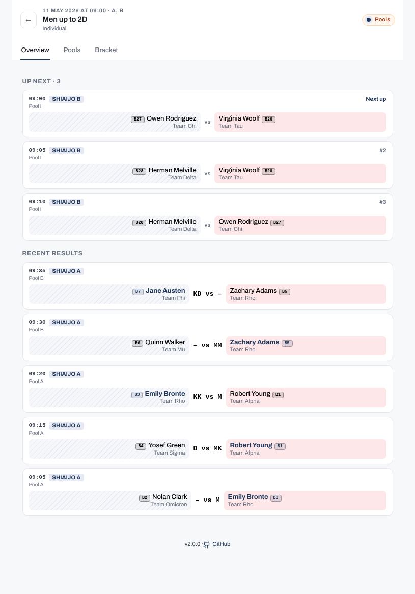
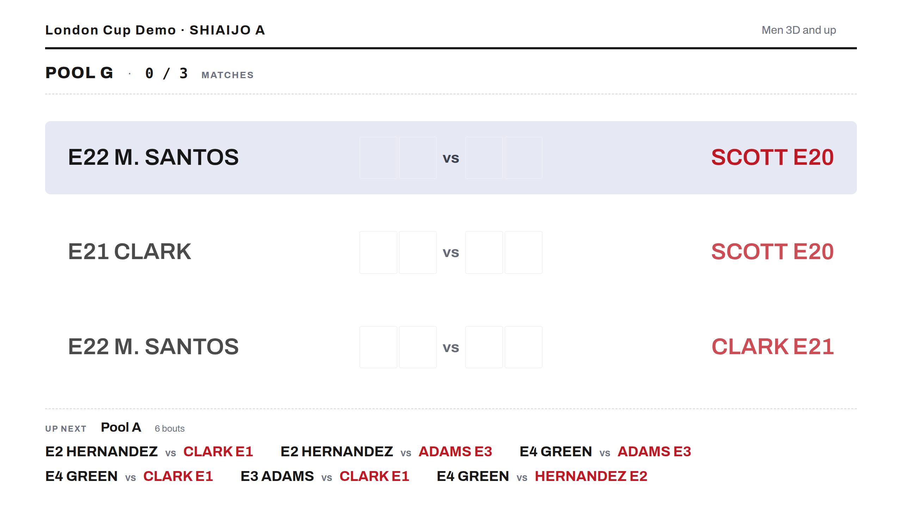

# Follow the tournament

The public viewer needs no password. It is the shared screen for competitors, coaches, and spectators. Open the tournament URL on any device on the same network and you see results as they happen, the standings, and the bracket as the day unfolds.

If you are not sure which role fits you, refer to [Choosing your setup](../start-here/choosing-your-setup.md) for a full guide.

## What the public viewer shows

The viewer brings together everything you need to follow the day in one place:

- A personal **Watchlist** so you can track yourself, specific competitors, or a whole dojo. As a watched match approaches, the viewer nudges you so competitors know when to warm up and coaches know when to be at the court. Once someone you watch has no match left to fight, their card shows their last result instead, so you can still see how they finished.
- The full match schedule across all shiai-jo, filterable by competitor or team. The free-text filter matches a competitor's name, their dojo, or their competitor number, so you can jump straight to their bouts. Refer to [Searching by competitor number](#searching-by-competitor-number) for how numbers are matched.
- Pool standings that update as scores are entered, with no page refresh needed.
- The elimination bracket filling in as matches are completed.

<figure class="bc-fig" markdown="span">
  { .bc-phone }
  <figcaption>The public home: the watchlist, the full schedule, and one card per competition.</figcaption>
</figure>

Tap a competition to see its schedule, standings, and bracket. Aka (red) and Shiro (white) sides are colour-coded throughout.

<figure class="bc-fig" markdown="span">
  { .bc-phone }
  <figcaption>A competition's page: upcoming matches and recent results with waza-level scores.</figcaption>
</figure>

### Searching by competitor number

Once the draw for a competition has run, its competitors are numbered. The number starts with a short prefix that belongs to that competition, so "K12" and "M12" are two different people in two different draws. Swiss competitions are the exception and use no numbers at all.

The same number identifies that competitor everywhere it appears: on their tag, on the pool or draw sheet, on the Names to Print cards, at the desk, and beside their name on screen in the viewer and on the venue's display boards. Type it the way it is printed, prefix included:

- **The prefix on its own** brings up that whole draw. Type "K" and every K number is listed, along with anyone whose name or dojo happens to contain a "k".
- **The prefix and the digits** finds that one competitor. "K12" finds K12, and not K120.
- **Digits on their own** find nobody by number. "12" is not a competitor number, because it does not say which competition it belongs to. As with the prefix on its own, anyone whose name or dojo happens to contain "12" is still listed.

Names and dojos still match on any part of what you type, so a surname fragment is enough for those. Only the number needs to be typed in full.

Refer to [QR codes on competitor tags](#qr-codes-on-competitor-tags): if you have the tag in your hand, scanning it opens that competitor directly, with no typing at all.

If someone is entered in more than one competition, they have a separate number in each one, and the filter lists them once per competition. Searching either number finds them, and each result tells you which competition it belongs to.

### Share your watchlist

Your watchlist is kept on the device you built it on. It is not tied to an account, so it does not follow you to a second phone or survive clearing your browser data. To move it, or to hand it to someone else, use **Share** at the top of the watchlist card.

The share sheet gives you a link, and a QR code when the list is short enough to fit in one. Anyone who opens the link gets those competitors **added** to their own watchlist. It never replaces what they are already watching, so a coach can send the same link to every parent without anyone losing their own list.

Share the link on the day of the tournament. Competitors are identified by their number where they have one, and numbers come from the draw, so a link created before a draw is regenerated can point at a different competitor afterwards.

## Scoreboards and court displays

Each shiai-jo runs one digital scoreboard on a TV or projector: a court-scoped display with no password showing the score for the bout in progress. Referees, the two competitors, the scoring operator, and spectators at that court all read from the same screen.

The app provides three display URLs:

- `/display?court=A` shows a single court's current match, upcoming queue, and recent results.
- `/display?court=all` shows every court at once, for a lobby or overview screen.
- Add `&overlay=true` to a single-court URL (for example, `/display?court=A&overlay=true`) for a transparent variant you key into a video stream as a browser source (for example, OBS or vMix), so online viewers see competitor names and the current score over the video.

### Connection status

If the venue Wi-Fi drops, a court scoreboard keeps updating as long as the scoring tab for that court stays open on the same computer. The operator's entries reach the board directly over the local connection.

A small status dot appears only when the connection is degraded:

- **Amber**: the board is fed by the court's own scoring computer while the link to the server is down.
- **Red**: no updates are getting through, so the board may be out of date until the connection returns.

When everything is healthy, no dot appears.

## Real-time updates

Scores entered by the operator appear on the viewer immediately, across every connected device.

<!-- Raw HTML is copied verbatim by MkDocs (only markdown image paths get
     rewritten), so this src must be relative to the BUILT page URL
     (/user-guide/spectators/following/): three levels up, not two. -->
<figure class="bc-fig">
  <video class="bc-phone" controls loop muted playsinline preload="metadata" width="440" height="900" aria-label="A scorer's result appears on the viewer in real time, with no refresh.">
    <source src="../../../screenshots/realtime-update.webm" type="video/webm">
  </video>
  <figcaption>A scorer's result appearing on the viewer in real time, with no refresh. Press play to watch.</figcaption>
</figure>

## QR codes on competitor tags

When the organiser sets the tournament public URL, each printed competitor tag includes a personal QR code. Scan it to open your own page on the viewer, showing your schedule and results directly.

!!! tip
    You do not need to set up a Watchlist if you use your tag's QR code: the personal page opens straight to your matches. The code only works once the organiser has configured a public URL for the tournament. If scanning your tag does not open anything, ask the organiser for the tournament URL and use the Watchlist instead.
