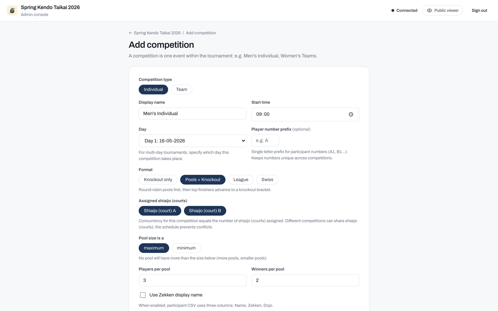
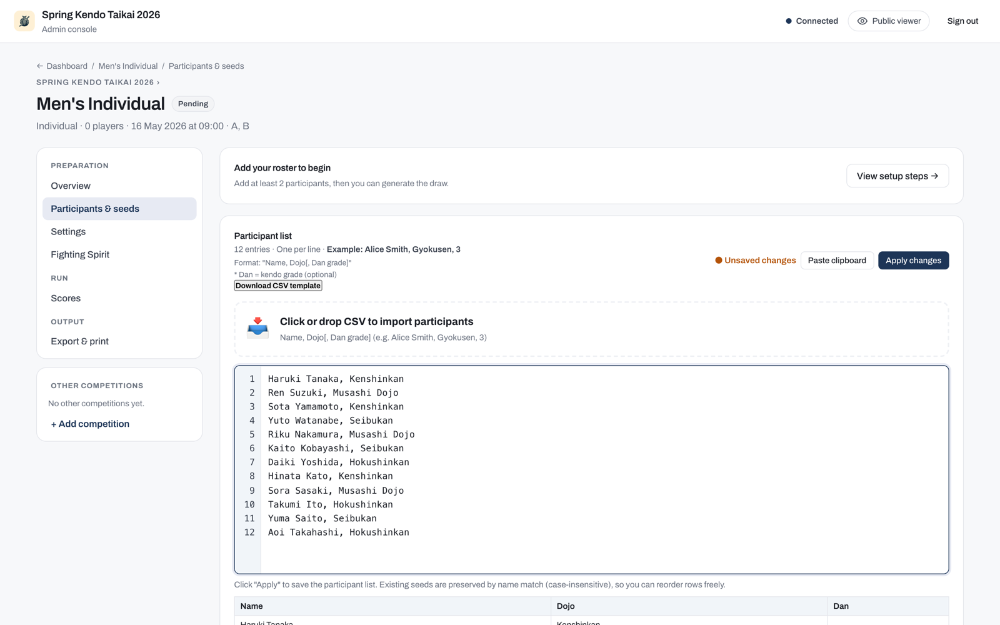
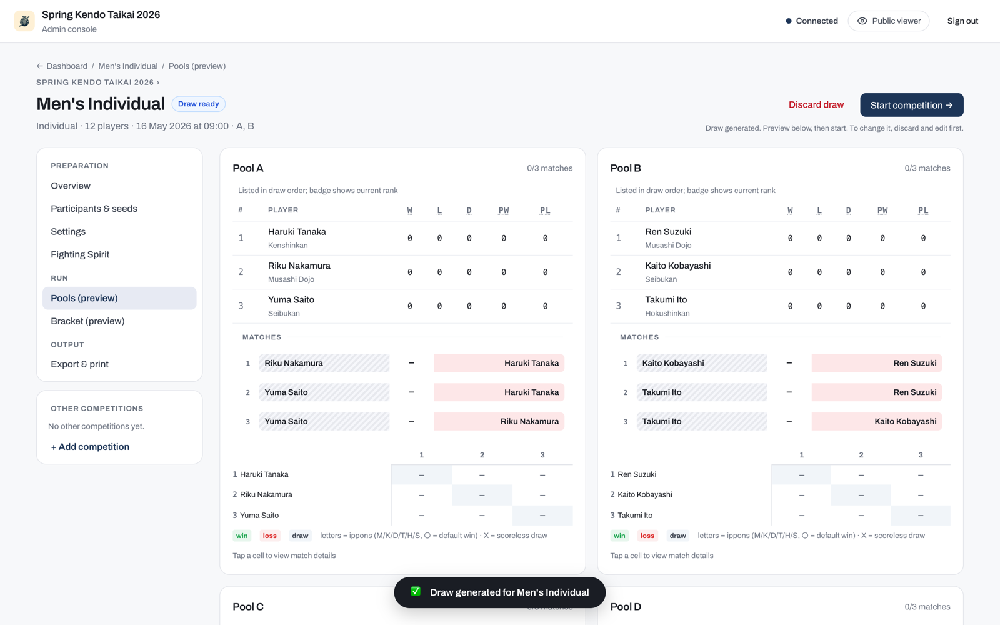

# Your first tournament

This page walks you through the fastest path from a running server to real-time results on a screen. Each step links to the full reference for that topic.

## 1. Install and start the server

Install the binary by following [Installation](../install/install.md), then start the tournament app:

```bash
bracket-creator mobile-app --folder ./tournament-data
```

Open `http://localhost:8080` in a browser. When the data folder is empty, the app prompts you to create a tournament. Fill in the name, date, venue, number of shiai-jo, and the admin password. Before you set the password, read [Operating modes](../organisers/operating-modes.md) to choose between officiated and self-run.

## 2. Create a competition

From the dashboard, click **+ Add competition**. Choose Individual or Team, then pick a format: **Knockout only**, **Pools + Knockout**, **League**, or **Swiss**. See [Formats](../organisers/formats.md) for a description of each format and when to use it.



## 3. Add competitors

Open the competition setup and paste a newline-separated roster into the participant panel, then click **Apply changes**. The [Run a tournament](../organisers/run-tournament.md) guide covers import options and roster management in full.



## 4. Generate the draw and start

Click **Generate draw** to build the pools and bracket. Review the preview, then click **Start competition**. Matches now appear to scorers and to the public viewer page.



## 5. Enter a score

Go to the **Scores** tab, open a match, and record the result. See [Scoring a match](../court-operators/scoring-a-match.md) for the full scoring workflow, including points, decisions, and team bouts.


!!! tip
    Open `http://localhost:8080` on a second screen (a scoreboard TV or a phone) with no password. Standings and brackets update in real time as a scorer records each result. See [Following a tournament](../spectators/following.md) for the full viewer experience.

## Next steps

For the complete organiser workflow, including pools, seeding, and competition settings, see [Run a tournament](../organisers/run-tournament.md). To generate print-ready brackets without the tournament app, see [Legacy Web UI](../organisers/web-ui.md) and the [create-pools command](../commands/create-pools.md).
